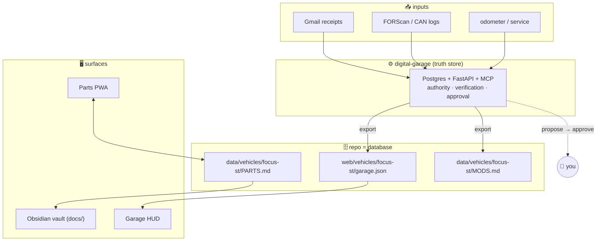

<div align="center">


<br>

**A single, self-hosted system of record for one car — a 2017 Ford Focus ST.**
Parts, mods, maintenance, diagnostics, and the entire knowledge base, wired together.

<br>

[](https://github.com/2smok3d/focus-st/actions/workflows/ci.yml)


**[◆ Enter the Garage](https://2smok3d.github.io/focus-st/web/index.html)** · **[◆ Focus ST Cockpit](https://2smok3d.github.io/focus-st/web/vehicles/focus-st/index.html)** · **[◆ Code Lookup](https://2smok3d.github.io/focus-st/web/tools/dtc.html)**

</div>

---

## What this is

A **digital garage platform** — one hub, many machines. The garage is the front
door: pick a vehicle to open its cockpit, or run a shared tool across the whole
fleet. Everything lives in this repo, and the repo *is* the database, so nothing
drifts.

| | Surface | What it does |
|---|---|---|
| 🏁 | **The Garage** (`web/index.html`) | The homepage. Vehicle picker (Focus ST active + more staged), shared tools, front-and-center code lookup, and live status pulled from the fleet. |
| 🖥️ | **Focus ST Cockpit** (`web/vehicles/focus-st/index.html`) | The vehicle screen — specs, projects, live engine bay, maintenance, recalls, and a searchable mechanic's manual. Hydrates from a live feed. |
| 🔧 | **Shared tools** (`web/tools/`) | Multi-vehicle utilities: an OBD-II/DTC **code lookup** (any code → causes + diagnostic path) and the **parts tracker** PWA that writes straight to the repo. |
| ⚙️ | **Digital Garage** (`digital-garage/`) | The truth store: Postgres + FastAPI + an MCP server, with evidence grading and a human-approval boundary on every write. |

Every surface speaks one design language (`web/assets/hud.css`) so it reads as a
single progression, not a pile of pages — and each new vehicle slots into the same
tools, logic, and look. All backed by an **Obsidian knowledge base** (`docs/`).

## Architecture



The **PWA** owns `data/vehicles/focus-st/PARTS.md` (hand-authored catalog + app-appended wishlist).
The **backend** owns structured facts and exports `web/vehicles/focus-st/garage.json`, which the
**dashboard** hydrates from. Every write that changes the car's record passes
through an approval queue — an agent can propose, but a human commits.

## Repository map

```
focus-st/
├── index.html              Landing → enter the garage
├── web/                    The platform (GitHub Pages serves these)
│   ├── index.html          THE GARAGE — hub: vehicle picker + tools + status
│   ├── assets/hud.css      Shared design system (one look everywhere)
│   ├── tools/              Shared, multi-vehicle tools
│   │   ├── dtc.html        OBD-II / DTC code lookup
│   │   └── parts.html      Parts tracker PWA (vehicle-aware via ?v=)
│   ├── vehicles/           Per-vehicle cockpit modules
│   │   └── focus-st/
│   │       ├── index.html  Focus ST cockpit (HUD dashboard)
│   │       └── garage.json Focus ST live feed  (generated)
│   ├── manifest.json  sw.js  icon.svg   PWA shell
│   └── serve.ps1           Local dev server
├── data/                   The database
│   ├── fleet.json          Vehicle registry (the garage bays)
│   ├── dtc-codes.json      DTC reference database
│   └── vehicles/focus-st/
│       ├── PARTS.md        Source of truth — catalog + wishlist
│       └── MODS.md         Changes-from-stock  (generated)
├── digital-garage/         Backend: Postgres · FastAPI · MCP · CLI
│   ├── app/                domain, parsers, analysis, service, API, MCP
│   ├── db/schema.sql       canonical DDL
│   └── tests/              33 unit tests
├── docs/                   Knowledge base (Obsidian vault)
│   ├── knowledge-base/     16 graded reference notes
│   ├── projects/           per-project build guides
│   └── automation/         Gmail→receipts script, compendium builder
├── assets/                 README imagery
└── .github/                CI (tests + garage.json validation)
```

## Quick start

**Use the platform** — nothing to install:

- The Garage → **https://2smok3d.github.io/focus-st/web/index.html**
- Focus ST cockpit → **https://2smok3d.github.io/focus-st/web/vehicles/focus-st/index.html**
- Code lookup → **https://2smok3d.github.io/focus-st/web/tools/dtc.html**

The parts tracker needs a fine-grained GitHub token (**Contents: read & write** on
`2smok3d/focus-st`) the first time — it's stored only in your browser.

**Run the backend** — one command:

```bash
cd digital-garage
cp .env.example .env
docker compose up --build          # Postgres + API at http://localhost:8000/docs
python -m app.cli due --miles 62000   # what's overdue right now?
```

See [`digital-garage/README.md`](digital-garage/README.md) for the full CLI, the
MCP tools, receipts, datalog analysis, the recall checker, and the approval flow.

**Local dev for the web app:**

```powershell
pwsh -File web/serve.ps1     # → http://localhost:3000  (serves web/index.html)
```

## The four pillars

### 📱 Parts PWA
Single-file vanilla app, no framework, no build. Three tabs — **Add** (append to the
wishlist), **Garage** (browse the catalog, tap a slot to install an upgrade),
**Mods** (everything that diverges from stock). Web Share Target: share a product
link from any app and it opens pre-filled. Writes are committed straight to the repo.

### 🖥️ Garage HUD
A live "digital twin" dashboard — vehicle spec sheet, 30 projects across 7 bundles,
an interactive top-down **engine bay**, maintenance status, **recall campaigns**, cost
rollups, and the full mechanic's manual with instant search. Hydrates from
`web/vehicles/focus-st/garage.json` when present, falls back to inline data offline.

### ⚙️ Digital Garage
A local-first truth store. **Postgres** for graded facts, **FastAPI** for local HTTP,
an **MCP server** so Claude can query the car — read-first, propose-only. Ingests
FORScan scans, CAN dumps, and Gmail receipts; computes maintenance-due and datalog
summaries; checks recalls against NHTSA; and refuses to let weak evidence overwrite
strong. One-tap approvals at `/ui`.

### 📚 Knowledge base
The `docs/` tree is an Obsidian vault: 16 reference notes (diagnostics, powertrain,
chassis, electronics, tuning…), seven per-project build guides, YAML frontmatter,
`[[wikilinks]]`, and source-authority grading throughout.

## Tech

| Layer | Stack |
|---|---|
| Frontend | Vanilla HTML/CSS/JS · PWA (service worker, Web Share Target) · zero dependencies |
| Backend | Python 3.12 · FastAPI · SQLAlchemy 2 · Postgres 16 · FastMCP · Docker |
| Data | Markdown-as-database · JSON feed · SHA-256 raw-preserving ingest |
| Knowledge | Obsidian vault · Mermaid · source-authority + verification grading |
| CI | GitHub Actions — 33 unit tests + `garage.json` schema validation |

## Conventions

- **The repo is the database.** `data/vehicles/focus-st/PARTS.md` is the source of truth; `data/vehicles/focus-st/MODS.md`
  and `web/vehicles/focus-st/garage.json` are generated — don't hand-edit them.
- **Design system:** black `#0a0a0b`, ST red `#e8000d`, Chakra Petch / IBM Plex Mono,
  mobile-first, safe-area aware. Web files are fully self-contained (no CDNs).
- **Evidence is graded.** Every claim carries a verification state
  (`UNVERIFIED → CORROBORATED → OEM_VERIFIED → VEHICLE_VERIFIED`); weaker evidence
  never silently overrides stronger.

<div align="center">
<br>
<sub>2017 Ford Focus ST · MK3 · Phoenix, AZ — built as one connected system.</sub>
</div>


## Operational reference (migrated from the former CLAUDE.md)

### The parts tracker (`web/tools/parts.html`) — three tabs
1. **Add** — form (name, category strip, subcategory strip, URL, notes).
   Submitting appends a line under `## Wishlist` in the vehicle's `PARTS.md`.
   ⚠️ **The category/subcategory pills are cosmetic**: `injectLine()` always
   appends to `## Wishlist`; the category is only saved to `localStorage` +
   shown in "Recent".
2. **Garage** — browses the `PARTS.md` catalog. Parses each
   `<details><summary><b>SECTION</b>` into slots (`#### Slot`); tapping a slot
   opens the upgrade sheet; confirming rewrites that slot's `**Installed:**`
   line, marks `<!-- MOD -->`.
3. **Mods** — filtered view of slots carrying `<!-- MOD -->`. Each install
   regenerates `MODS.md`.

Which vehicle's files it edits is chosen by `?v=<slug>` (default `focus-st`),
resolved against the `VEHICLES` map at the top of the `<script>`. All vehicles
live in the one repo, so a single PAT covers them.

### `PARTS.md` format (matters — the parser depends on it)

**Catalog** (hand-authored, drives Garage + Mods):
```markdown
<details>
<summary><b>SECTION NAME</b></summary>
<br>

#### Slot Name *(optional spec note in italics)*
**Installed:** [Part Name](url) — OEM · PART-NUM · ⚠️ unknown

<details>
<summary>Upgrade</summary>

| Tier | Part | # | ~Price | Notes |
|------|------|---|--------|-------|
| OEM | [Stock part](url) | PART-NUM | ~$15 | ... |
| Performance | [Upgrade](url) | — | ~$55 | ... |

</details>

---
</details>
```

Parser rules to preserve:
- Sections detected by `<summary><b>...</b></summary>`.
- Slots are `#### ` headings; base name is everything before ` *(`.
- `**Installed:**` line: a `[name](url)` link is extracted if present;
  condition is the first emoji among `✅` / `🔧` / else `⚠️`.
- `<!-- MOD -->` on the `**Installed:**` line = "changed from stock" (shows in
  Mods).
- Upgrade table's first column is the tier; a row whose tier is exactly `OEM`
  is the stock reference. Header rows (`Tier` / `Tool` / `Item`) are skipped.

**Wishlist** (app-appended): a `## Wishlist` section of
`- [ ] [name](url) — notes` lines.

### GitHub sync internals (parts PWA)
- Auth: `token` header with a PAT needing **Contents: read & write** on
  `2smok3d/focus-st`. `OWNER`/`REPO` and the per-vehicle `PARTS_PATH` /
  `MODS_PATH` (e.g. `data/vehicles/focus-st/PARTS.md`) come from the
  `VEHICLES` map + `?v=`.
- Reads/writes go through `ghGet` / `ghPut` (Contents API, base64).
- **SHA cache:** `localStorage` `{sha, content, ts}`, 5-min TTL. On `409` the
  cache clears, refetches, retries once.
- **Install flow** (`doInstallPart`): update PARTS.md slot → PUT → regenerate
  + PUT MODS.md (a MODS.md failure is non-fatal).

**localStorage keys:** `fst_tok` · `fst_cache` · `fst_hist` · `fst_cat` ·
`fst_sub`.

### Web Share Target
`web/manifest.json` registers a GET share target →
`tools/parts.html?url=…&text=…&title=…`. `cleanTitle()` strips retailer
boilerplate from the shared title.

### Service worker (`web/sw.js`)
Cache `fst-v4`, precaches the shell (hub, tools, the FOST cockpit,
`assets/hud.css`, manifest, icon), network-first with cache fallback,
**explicitly skips `api.github.com`**. Registered once by the hub (scope
`/web/` covers tools + vehicles). **Bump `CACHE` on shell changes.**

### `digital-garage` coupling
`python -m app.cli export` (and auto-export after any approval) writes, for
the Focus ST:
- `web/vehicles/focus-st/garage.json` — the cockpit's live feed
- `data/vehicles/focus-st/MODS.md` — human-readable changes-from-stock

If you move these paths, update `digital-garage/app/export.py` and
`.github/scripts/validate_garage_json.py` together.

### Adding a vehicle (the module pattern)
1. Add an entry to `data/fleet.json` (slug, name, specs, `accent`, `screen`,
   `feed`/`parts`/`mods` paths).
2. Create `web/vehicles/<slug>/index.html` (copy the FOST cockpit as a
   starting point) and `data/vehicles/<slug>/PARTS.md`.
3. Add the slug to the `VEHICLES` map in `web/tools/parts.html`.
4. It now appears as a garage bay and shares every tool automatically.

### Conventions
- Web files are single-file, no build, no npm; match the terse vanilla style.
- **Design system:** black `#0a0a0b`, ST red `#e8000d`, Chakra Petch / IBM
  Plex Mono (system fallbacks), mobile-first, safe-area aware. Self-contained
  — no CDNs. Pages may share `web/assets/hud.css` (same-origin, not a CDN).
- HTML injected via template strings is escaped with `esc()`.

### Dev server
```powershell
pwsh -File web/serve.ps1     # → http://localhost:3000 (serves web/index.html)
```
No build. (Web Share Target + installability need HTTPS, so those only fully
work on the deployed Pages site.)

### Deployment
GitHub Pages, `master` branch root serves the whole tree — the platform lives
at `/focus-st/web/…`, the landing at `/focus-st/`. Push to deploy; no build.
Bump `CACHE` in `web/sw.js` when changing shell files. The `digital-garage`
backend runs locally (Docker), not on Pages.
