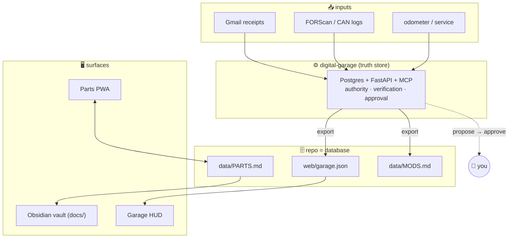

<div align="center">


<br>

**A single, self-hosted system of record for one car — a 2017 Ford Focus ST.**
Parts, mods, maintenance, diagnostics, and the entire knowledge base, wired together.

<br>

[](https://github.com/2smok3d/focus-st/actions/workflows/ci.yml)


**[◆ Enter the Garage](https://2smok3d.github.io/focus-st/web/index.html)** · **[◆ Focus ST Cockpit](https://2smok3d.github.io/focus-st/web/garage.html)** · **[◆ Code Lookup](https://2smok3d.github.io/focus-st/web/tools/dtc.html)**

</div>

---

## What this is

A **digital garage platform** — one hub, many machines. The garage is the front
door: pick a vehicle to open its cockpit, or run a shared tool across the whole
fleet. Everything lives in this repo, and the repo *is* the database, so nothing
drifts.

| | Surface | What it does |
|---|---|---|
| 🏁 | **The Garage** (`web/index.html`) | The homepage. Vehicle picker (Focus ST active + more staged), shared tools, front-and-center code lookup, and live status pulled from the fleet. |
| 🖥️ | **Focus ST Cockpit** (`web/garage.html`) | The vehicle screen — specs, projects, live engine bay, maintenance, recalls, and a searchable mechanic's manual. Hydrates from a live feed. |
| 🔧 | **Shared tools** (`web/tools/`) | Multi-vehicle utilities: an OBD-II/DTC **code lookup** (any code → causes + diagnostic path) and the **parts tracker** PWA that writes straight to the repo. |
| ⚙️ | **Digital Garage** (`digital-garage/`) | The truth store: Postgres + FastAPI + an MCP server, with evidence grading and a human-approval boundary on every write. |

Every surface speaks one design language (`web/assets/hud.css`) so it reads as a
single progression, not a pile of pages — and each new vehicle slots into the same
tools, logic, and look. All backed by an **Obsidian knowledge base** (`docs/`).

## Architecture



The **PWA** owns `data/PARTS.md` (hand-authored catalog + app-appended wishlist).
The **backend** owns structured facts and exports `web/garage.json`, which the
**dashboard** hydrates from. Every write that changes the car's record passes
through an approval queue — an agent can propose, but a human commits.

## Repository map

```
focus-st/
├── index.html              Landing → enter the garage
├── web/                    The platform (GitHub Pages serves these)
│   ├── index.html          THE GARAGE — hub: vehicle picker + tools + status
│   ├── garage.html         Focus ST cockpit (vehicle screen)
│   ├── garage.json         Focus ST live feed  (generated)
│   ├── assets/hud.css      Shared design system (one look everywhere)
│   ├── tools/
│   │   ├── dtc.html        OBD-II / DTC code lookup  (multi-vehicle)
│   │   └── parts.html      Parts tracker PWA
│   ├── manifest.json  sw.js  icon.svg   PWA shell
│   └── serve.ps1           Local dev server
├── data/                   The database
│   ├── fleet.json          Vehicle registry (the garage bays)
│   ├── dtc-codes.json      DTC reference database
│   ├── PARTS.md            Source of truth — catalog + wishlist
│   └── MODS.md             Changes-from-stock  (generated)
├── digital-garage/         Backend: Postgres · FastAPI · MCP · CLI
│   ├── app/                domain, parsers, analysis, service, API, MCP
│   ├── db/schema.sql       canonical DDL
│   └── tests/              33 unit tests
├── docs/                   Knowledge base (Obsidian vault)
│   ├── knowledge-base/     16 graded reference notes
│   ├── projects/           per-project build guides
│   └── automation/         Gmail→receipts script, compendium builder
├── assets/                 README imagery
└── .github/                CI (tests + garage.json validation)
```

## Quick start

**Use the platform** — nothing to install:

- The Garage → **https://2smok3d.github.io/focus-st/web/index.html**
- Focus ST cockpit → **https://2smok3d.github.io/focus-st/web/garage.html**
- Code lookup → **https://2smok3d.github.io/focus-st/web/tools/dtc.html**

The parts tracker needs a fine-grained GitHub token (**Contents: read & write** on
`2smok3d/focus-st`) the first time — it's stored only in your browser.

**Run the backend** — one command:

```bash
cd digital-garage
cp .env.example .env
docker compose up --build          # Postgres + API at http://localhost:8000/docs
python -m app.cli due --miles 62000   # what's overdue right now?
```

See [`digital-garage/README.md`](digital-garage/README.md) for the full CLI, the
MCP tools, receipts, datalog analysis, the recall checker, and the approval flow.

**Local dev for the web app:**

```powershell
pwsh -File web/serve.ps1     # → http://localhost:3000  (serves web/index.html)
```

## The four pillars

### 📱 Parts PWA
Single-file vanilla app, no framework, no build. Three tabs — **Add** (append to the
wishlist), **Garage** (browse the catalog, tap a slot to install an upgrade),
**Mods** (everything that diverges from stock). Web Share Target: share a product
link from any app and it opens pre-filled. Writes are committed straight to the repo.

### 🖥️ Garage HUD
A live "digital twin" dashboard — vehicle spec sheet, 30 projects across 7 bundles,
an interactive top-down **engine bay**, maintenance status, **recall campaigns**, cost
rollups, and the full mechanic's manual with instant search. Hydrates from
`web/garage.json` when present, falls back to inline data offline.

### ⚙️ Digital Garage
A local-first truth store. **Postgres** for graded facts, **FastAPI** for local HTTP,
an **MCP server** so Claude can query the car — read-first, propose-only. Ingests
FORScan scans, CAN dumps, and Gmail receipts; computes maintenance-due and datalog
summaries; checks recalls against NHTSA; and refuses to let weak evidence overwrite
strong. One-tap approvals at `/ui`.

### 📚 Knowledge base
The `docs/` tree is an Obsidian vault: 16 reference notes (diagnostics, powertrain,
chassis, electronics, tuning…), seven per-project build guides, YAML frontmatter,
`[[wikilinks]]`, and source-authority grading throughout.

## Tech

| Layer | Stack |
|---|---|
| Frontend | Vanilla HTML/CSS/JS · PWA (service worker, Web Share Target) · zero dependencies |
| Backend | Python 3.12 · FastAPI · SQLAlchemy 2 · Postgres 16 · FastMCP · Docker |
| Data | Markdown-as-database · JSON feed · SHA-256 raw-preserving ingest |
| Knowledge | Obsidian vault · Mermaid · source-authority + verification grading |
| CI | GitHub Actions — 33 unit tests + `garage.json` schema validation |

## Conventions

- **The repo is the database.** `data/PARTS.md` is the source of truth; `data/MODS.md`
  and `web/garage.json` are generated — don't hand-edit them.
- **Design system:** black `#0a0a0b`, ST red `#e8000d`, Chakra Petch / IBM Plex Mono,
  mobile-first, safe-area aware. Web files are fully self-contained (no CDNs).
- **Evidence is graded.** Every claim carries a verification state
  (`UNVERIFIED → CORROBORATED → OEM_VERIFIED → VEHICLE_VERIFIED`); weaker evidence
  never silently overrides stronger.

<div align="center">
<br>
<sub>2017 Ford Focus ST · MK3 · Phoenix, AZ — built as one connected system.</sub>
</div>
