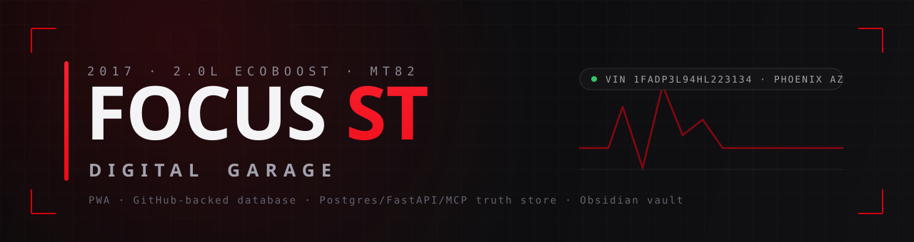
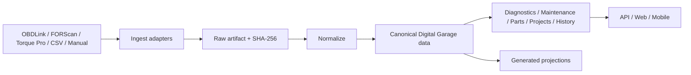

<div align="center">



<br>

**Digital Garage — a vehicle-agnostic automotive intelligence platform.**
This repository is being evolved from the original Focus ST system into a shared platform where every vehicle is a first-class, deeply modeled domain.

<br>

[](https://github.com/2smok3d/focus-st/actions/workflows/ci.yml)


**[◆ Enter the Garage](https://2smok3d.github.io/focus-st/web/index.html)** · **[◆ Focus ST](https://2smok3d.github.io/focus-st/web/vehicles/focus-st/index.html)** · **[◆ Code Lookup](https://2smok3d.github.io/focus-st/web/tools/dtc.html)** · **[◆ Architecture](ARCHITECTURE.md)**

</div>

---

## What this is

**Digital Garage** is the target product and architecture for this repository: one platform, many deeply modeled vehicles. It combines vehicle configuration, systems, components, parts, maintenance, repairs, diagnostics, telemetry, projects, documents, evidence, and history into one connected system designed for an eventual mobile/web app.

The current codebase grew around the 2017 Ford Focus ST, so the repository still contains legacy Focus-ST naming and several generations of implementation. The redesign is intentionally additive and non-destructive: we are consolidating and migrating the existing system rather than throwing it away.

**Start with [`ARCHITECTURE.md`](ARCHITECTURE.md)** for the target model, canonical-data rules, diagnostic intelligence, external-tool ingestion, and migration strategy.

## Current platform surfaces

| Surface | Purpose |
|---|---|
| 🏠 **Garage** (`web/index.html`) | Shared vehicle hub and entry point. |
| 🚗 **Vehicle cockpits** (`web/vehicles/`) | Per-vehicle dashboards and digital-twin views. |
| 🔧 **Shared tools** (`web/tools/`) | DTC lookup, parts tooling, and intelligence views. |
| ⚙️ **Digital Garage core** (`digital-garage/`) | PostgreSQL truth store, API, MCP, diagnostics, telemetry, maintenance, and intelligence services. |
| 📚 **Knowledge** (`docs/`) | Human-facing reference and project material. |

## Vehicles

The current fleet model includes:

- Ford Focus ST
- Kawasaki ZZR600
- Yamaha RZ350
- Yamaha TZ250
- 1986 Toyota Pickup (22RE)

Every vehicle is intended to use the same core model while retaining machine-specific systems and capabilities.

## Data flow



Raw external data is preserved so improved parsers can reprocess it later. The canonical model is the source for application views and generated outputs.

## Development direction

The repository is moving toward:

```text
Digital Garage
├── Universal vehicle model
├── Deep vehicle domains
├── Evidence + provenance
├── Diagnostic reasoning
├── Telemetry + data ingestion
├── Maintenance + workshop engine
├── Parts + fitment
├── Projects
├── Universal search
├── Web / mobile application layer
└── GitHub Actions automation
```

The migration is staged. Existing working functionality remains available while the architecture is consolidated.

## Quick start

### Web app

```text
https://2smok3d.github.io/focus-st/web/index.html
```

### Backend

```bash
cd digital-garage
cp .env.example .env
docker compose up --build
python -m app.cli init
```

See [`digital-garage/README.md`](digital-garage/README.md) for the current backend setup and commands.

### Local web development

```powershell
pwsh -File web/serve.ps1
```

## Design rules

- One canonical fact; multiple projections.
- Every vehicle is first-class.
- Preserve raw source artifacts and provenance.
- Separate reference knowledge from actual machine state.
- Diagnostics recommend tests before repairs when evidence is incomplete.
- AI may analyze and propose; humans approve vehicle-changing writes.
- Generated files are rebuildable and never authoritative.

## Documentation map

- [`ARCHITECTURE.md`](ARCHITECTURE.md) — target Digital Garage architecture and migration blueprint.
- [`CLAUDE.md`](CLAUDE.md) — project operating rules.
- [`DECISIONS.md`](DECISIONS.md) — durable architectural decisions and reconciliation history.
- [`digital-garage/docs/BUILD-PLAN.md`](digital-garage/docs/BUILD-PLAN.md) — current implementation/build history.
- [`digital-garage/docs/V2-ARCHITECTURE.md`](digital-garage/docs/V2-ARCHITECTURE.md) — historical V2 design and migration record.

> **Migration status:** architecture first. File/data consolidation comes next after the existing repository has been mapped against the new model.
