# 📕 FOST — Complete Compendium

> **100% of the vault in one place.** Auto-generated from every note by `scratchpad/build_compendium.py` — do not hand-edit; edit the source notes and rebuild.
> 2017 Ford Focus ST · VIN 1FADP3L94HL223134 · Phoenix, AZ. Home: [[INDEX]].

## Table of contents
1. [Vehicle Master Spec](#01-vehicle-master-spec)
2. [KB · Vault Overview](#02-kb-vault-overview)
3. [KB · Command Center](#03-kb-command-center)
4. [KB · Vehicle Record & Baseline](#04-kb-vehicle-record-baseline)
5. [KB · Maintenance Master](#05-kb-maintenance-master)
6. [KB · OEM Specifications](#06-kb-oem-specifications)
7. [KB · Spec Correction](#07-kb-spec-correction)
8. [KB · Recalls & TSBs](#08-kb-recalls-tsbs)
9. [KB · Diagnostics & DTC](#09-kb-diagnostics-dtc)
10. [KB · Powertrain Manual](#10-kb-powertrain-manual)
11. [KB · Chassis Manual](#11-kb-chassis-manual)
12. [KB · Electronics & Interior](#12-kb-electronics-interior)
13. [KB · Mods & Tuning](#13-kb-mods-tuning)
14. [KB · Forum Consensus](#14-kb-forum-consensus)
15. [KB · Build Roadmap](#15-kb-build-roadmap)
16. [KB · Project Database](#16-kb-project-database)
17. [KB · Sources & Changelog](#17-kb-sources-changelog)
18. [Maintenance & Service Log](#18-maintenance-service-log)
19. [Projects Index & Build Map](#19-projects-index-build-map)
20. [Build · Cooling & Oil-Leak Service](#20-build-cooling-oil-leak-service)
21. [Build · Exterior Lighting](#21-build-exterior-lighting)
22. [Build · Cockpit Electronics + RR2](#22-build-cockpit-electronics-rr2)
23. [Build · FORScan Session](#23-build-forscan-session)
24. [Build · Handling & Brakes](#24-build-handling-brakes)
25. [Build · Key Fob & Security](#25-build-key-fob-security)
26. [Build · Powertrain / Performance](#26-build-powertrain-performance)
27. [Reference · FORScan Master Reference](#27-reference-forscan-master-reference)
28. [Setup · Connections & Data Flow](#28-setup-connections-data-flow)
29. [Appendix · FOST Drive Cleanup Map](#29-appendix-fost-drive-cleanup-map)
30. [Appendix · Obsidian Vault Setup](#30-appendix-obsidian-vault-setup)


---

<a id="01-vehicle-master-spec"></a>

# 01 · Vehicle Master Spec

## Vehicle Master Spec — 2017 Ford Focus ST

> Single source of truth for the car. Everything else (projects, parts, maintenance) references this file.
> Legend: ✅ verified · ⚠️ unverified / needs check · 🔧 needs attention · ❌ removed / not present
>
> **Authoring model:** this repo is the authoring layer (version-controlled, feeds the PWA, holds the wiring diagrams + streamlined bundles). The **FFST "mechanic vault"** in Google Drive (FOST → *FFST Knowledge Base*, 16 docs) is the deep reference for OEM specs, diagnostics, recalls and forum-graded knowledge. On any spec conflict, the vault's Grade-A (Ford/NHTSA) values win — reconciled here.

Full index of everything (repo + Drive + sheets): **[INDEX.md](INDEX.md)**.

---

### Systems at a glance

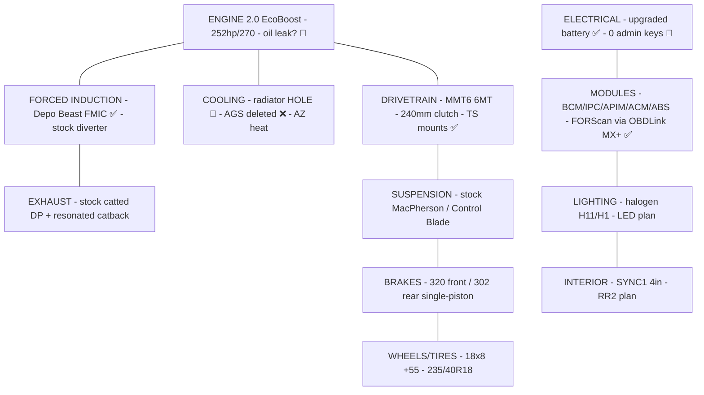

Legend: ✅ good/done · 🔧 needs attention · ❌ removed. Details per system below.

---

### 1. Identity

| Field | Value | Source |
|-------|-------|--------|
| Vehicle | 2017 Ford Focus ST (5-door hatch) | Title / insurance |
| Trim | **ST1** (cloth Recaro, 4.2" non-touch display, halogen headlights) | LED research doc |
| Platform | MK3.5 facelift · global C-platform · **Central Configuration (CC)** car | FORScan master ref |
| Engine | 2.0 L EcoBoost I4 turbo (GTDI, "R9DA/R9Dx") | Ford spec |
| Rated output | ~252 hp / 270 lb-ft (crank, factory) · ⚠️ PARTS.md lists 247 hp — treat 252/270 as canonical | Ford spec |
| Transmission | **Getrag-Ford MMT6** 6-speed manual · ⚠️ earlier `PARTS.md` said "MT82" — MMT6 is correct per FFST vault research; **verify at car** (they take different fluid) | FFST vault / insurance |
| Drive | FWD | — |
| Color | Black | Purchase order |
| VIN | **1FADP3L94HL223134** | Title / insurance / PO |
| Owner | Brandon Berault · Phoenix, AZ 85032 | Records |
| Start system | Push-to-start / Intelligent Access (M3N5WY8609 fob) | PARTS.md |

#### VIN decode (1FADP3L94HL223134)
`1FA` Ford USA · `DP3L9` Focus ST hatch, 2.0 EcoBoost · `4` check digit · `H` = 2017 · `L` = Wayne, MI plant · `223134` sequence.

---

### 2. Ownership & Records

| Item | Detail |
|------|--------|
| Purchased | ~June 2026 from **Trucks and More LLC**, 4505 W Glendale Ave #B, Glendale AZ (602-686-2570) |
| Odometer at purchase | **86,390 mi** |
| Price | $12,995 sale · $14,500 total (tax $1,195.54, title/reg $200, doc $109.46) |
| Sale type | Used, AS-IS (15-day/500-mi implied warranty), ex-auction |
| Keys | ⚠️ **0 admin keys / 3 MyKeys** (auction car — see Security project) |
| Insurance | Kemper / Response Insurance Co · policy **10269650001** · 06/12/2026–12/12/2026 · liability 25/50/25 · $1,000 comp/coll deductible |
| Garaging | 16819 N 45th Pl, Phoenix AZ 85032 |

> Insurance card, purchase order, and loan docs are archived in FOST (`2017-Ford-Focus-ST/` → `_Archive/records/`). These contain PII (SSNs, DOBs) — keep access private.

---

### 3. Drivetrain & Chassis Reference

| System | Spec |
|--------|------|
| Engine internals | Bore×stroke 87.5×83.1 mm · CR 9.3:1 · **firing order 1-3-4-2** · rev limit ~6,500 (6,800 for 3 s) |
| Oil | 5W-30 full synthetic · **5.7 qt** w/ filter · Ford WSS-M2C946-A |
| Oil filter | Motorcraft FL-910S |
| Coolant | Motorcraft VC-3-B orange (50/50) · **~5.3 qt** · thermostat 78 °C · service coolant WSS-M97B57-A2 (Yellow) is Ford-compatible |
| Trans fluid | ⚠️ **MMT6 → WSS-M2C200-D2 / Motorcraft XT-11-QDC · ~1.8 qt** (NOT the XTM5-QS listed for MT82 in PARTS.md — confirm transmission variant before buying) |
| Spark plugs | Motorcraft SP-537 (AGSF32PM) · OEM gap **0.027–0.031"** · tuned ~0.025–0.026" on high boost |
| Clutch | **240 mm** single dry disc w/ dual-mass flywheel · holds ~280 lb-ft stock |
| Gear ratios | 1: 3.23 · 2: 1.95 · 3: 1.32 · 4: **1.03** · 5: 1.13 · 6: 0.94 · R: 4.60 · finals 4.063 / 2.955 |
| Diff | Open (factory) — Quaife/Wavetrac ATB is the top handling mod |
| Front brakes | 320 × 25 mm vented · single-piston sliding |
| Rear brakes | 302 × 10 mm solid |
| Brake fluid | DOT 4 LV (WSS-M6C65-A2) |
| Suspension | MacPherson front / Control Blade rear · front bar 22 mm · rear bar 21.7 mm |
| Wheels | **18 × 8" · 5×108 · ET55 (+55 mm)** · 63.3 mm bore · lug M12×1.5 / 17 mm hex · **100 lb-ft** · ✅ verified (was wrongly 18×7.5/ET52.5 in PARTS.md) |
| Tires | 235/40R18 |
| Battery | Group 96R · 590 CCA min |

---

### 4. Lighting Bulb Chart (ST1-specific — verified against ST1 LED research)

| Position | Bulb | Notes |
|----------|------|-------|
| Headlight low | **H11** halogen | true reflector housing — **do not** LED-retrofit (scatter/glare/inspection). Upgrade = Osram Night Breaker halogen |
| Headlight high | **H1** halogen | same reasoning |
| Fog | **verify at car (H8 / H11)** | ⚠️ sources conflict — aggregators say H8, your ST1 research says H11, PARTS.md said H16. Pull the bulb before ordering |
| Front turn/park | **7440** (7440A amber) | ST1-specific — *not* 3157 up front |
| Rear tail/turn/brake | **3157** (check CK vs non-CK socket) | CANbus/anti-hyperflash bulbs required |
| Interior dome/map/door | **194 / T10 / W5W** | any error-free T10 |
| Reverse | **194 / T10** | not flasher-monitored |
| Trunk/cargo | **2825** | niche size |

---

### 5. Electronic Modules (FORScan targets)

CC platform — configure via FORScan **Module Configuration** dropdowns, *not* raw As-Built hex (the circulated "FORScan Codes for 2017 Focus ST" sheet was copied from a Super Duty and is largely unverified for the ST).

| Module | Addr | What it controls / common edits |
|--------|------|--------------------------------|
| BdyCM / BCM | **726** | Lighting (Bambi mode, DRL, cornering fogs), windows global open/close, double-honk delete, MyKey reset |
| IPC (cluster) | **720** | Shift-light disable, gauge sweep, TPMS→DDS or threshold |
| APIM (SYNC) | **7D0** | SYNC 3 boot splash, features |
| ACM (audio) | **727** | Audio config |
| ABS | **760** | ABS/traction options |
| PATS | — | **Add Key** (2nd IA key w/ 1 existing key, no dealer) |

Requires: OBDLink adapter (owned: **OBDLink MX+**) + FORScan **Extended License** (free 2-month trial, renewable; ~$12/yr paid). Keep battery > 11.6 V, back up every module (.abt) before edits, one change at a time.

---

### 6. Installed Mods (as received / done)

| Mod | System | Status | Notes |
|-----|--------|--------|-------|
| Injen cold air intake | Intake | ✅ installed | by PO |
| Ram-air / hood-scoop feed | Intake | ✅ installed | hood scoops feed intake |
| Depo Racing "The Beast" FMIC | Forced induction | ✅ installed | 28×8.25×5.5 core · **pressure-tested OK to 15 psi** |
| Torque Solutions rear motor mount | Drivetrain | ✅ installed | more NVH than stock |
| Torque Solutions passenger motor mount | Drivetrain | ✅ installed | — |
| Hood scoops | Exterior | ✅ installed | — |
| Upgraded battery | Electrical | ✅ installed | larger than stock |
| Trunk storage box | Interior | ✅ installed | 3M Dual Lock |
| Active Grille Shutters (AGS) | Cooling | ❌ **removed by PO** | motor/actuator gone, not just blades — affects warm-up/aero; note for cooling work |
| OBDLink MX+ | Tools | ✅ owned | full MS-CAN + HS-CAN |
| FORScan Extended License | Tools | ✅ active | ~$12/yr |

---

### 7. Known Issues / Open Items 🔧

| Issue | Status | Detail |
|-------|--------|--------|
| **Radiator cracked → hole** | 🔧 needs replacement | front-left corner of aluminum core; worsened to full hole, too damaged to patch. Decision: **Mishimoto** (over budget CSF 3805). See `projects/cooling-oil-service.md` |
| **Possible oil leak** | ⚠️ investigating | noticed after aggressive driving. Suspects: valve cover gasket, turbo oil feed/return, oil filter housing adapter gasket, oil pan (RTV). Keep gasket kits on hand |
| Floating/uncapped vacuum line at intake | ⚠️ monitoring | traced to EVAP/emissions; **no CEL codes**. Original connection unknown (possibly old airbox) |
| No BOV/bypass valve | note | running stock diverter |
| MT82 cold-crunch risk | preventive | fix with XTM5-QS fluid |
| 0 admin keys / 3 MyKeys | 🔧 security | program 2nd key + MyKey reset via FORScan PATS |

---

### 8. Environment Notes

- **Phoenix, AZ heat** is a first-order design constraint — prioritize cooling (radiator, oil temp), fluids rated for heat, and AGS-delete implications. Factor into every thermal decision.
- Parts sourcing preference: **open to budget/generic aftermarket** (not OEM-only) where reliability allows — noted per project.

---

---

### 9. Fact-check log (2026-08-11)

Verified against external sources; corrections applied above.

| Fact | Verdict | Source |
|------|---------|--------|
| Transmission = **Getrag MMT6** (not MT82) | ✅ corrected | Ford owner manual, Mountune, Jacks Transmissions (Ford #CV6Z-7002-B) |
| Wheels **18×8 · ET55 · 5×108 · 235/40R18** (not 18×7.5/ET52.5) | ✅ corrected | MAPerformance, Wheel-Size.com, Fitment Industries |
| **252 hp / 270 lb-ft** (not 247) | ✅ confirmed | automobile-catalog, US News, Edmunds |
| Recall **18S32 / NHTSA 18V735** purge valve → tank deformation → stall (2012–18 Focus, ~1.28M) | ✅ confirmed | CarComplaints, NHTSA RCLRPT-18V735, oemdtc |
| 2026 re-recall **26S40 / 26V369** (incorrect prior remedy) | ✅ confirmed | Ford Authority (Jun 2026), NHTSA 26V369 |
| Firing order **1-3-4-2** | ✅ per vault Grade-A | Ford engine spec (FFST vault 03) |
| MMT6 4th gear **1.03** (not 1.321) | ✅ per vault correction | Ford NA transmission spec |
| **Fog bulb** H8 vs H11 vs H16 | ⚠️ unresolved — **pull bulb at car** | aggregators H8; ST1 research H11; PARTS.md H16 |
| Headlight **H11 low / H1 high** | ⚠️ verify high beam | ST1 research (aggregators unreliable on high) |

*Maintained in the repo; mirrored to FOST. Update this file first when a fact about the car changes.*

---

<a id="02-kb-vault-overview"></a>

# 02 · KB · Vault Overview

## 00 · Vault Overview (FFST Mechanic Vault)

> Permanent technical/maintenance/diagnostic/mod record for this ST. Full version → [Google Doc](https://docs.google.com/document/d/1YHRrnIKs38urxkOrf0uVs2F5LXQTaYI6OJH1kPnOYHc). Index → [[_KB-Home|KB Home]].

**Authority grades:** A Ford/NHTSA/workshop · B manufacturer/tuner · C owner consensus · D single report · X disputed.

### Non-negotiable rules
1. Check VIN before marking a recall complete. 2. Capture evidence before clearing codes. 3. Don't diagnose by replacing parts. 4. Keep OEM specs and tune advice separate. 5. No high-load low-RPM in a tall gear. 6. One change at a time. 7. Back up modules before coding. 8. No unverified safety-critical torque. 9. Inspect after every major mod. 10. Log everything.

### Related
[[_KB-Home|KB Home]] · [[00 Command Center]] · [[VEHICLE]]

---

<a id="03-kb-command-center"></a>

# 03 · KB · Command Center

## 00 · Command Center

> Operating dashboard. Full version → [Google Doc](https://docs.google.com/document/d/1huJidL-UIzL_PSUyC630Mxdsgl0FpL1QuKUFRc4N_Ew). Working home → [[INDEX]].

### Status system
- **RED (stop driving hard):** oil-pressure warning, overheat, fuel leak, brake fault, severe misfire, flashing MIL, uncontrolled boost, knock, clutch failure, tire/bearing defect.
- **AMBER (diagnose before mods):** unknown tune, incomplete recall, recurring DTC, oil/coolant loss, EVAP/refuel symptom, boost leak, worn plugs, mount failure, clutch slip, uneven wear.
- **GREEN (mod-ready):** no unresolved codes, stable fluids, passed baseline, verified tune/fuel, sound brakes/tires.

### Tune decision gate
recall documented · no fuel/EVAP/misfire/boost/rail code · plugs correct+gapped · charge pipes/IC pass · repeatable fuel · oil stable · cooling OK · brakes/tires match power · tuner has full hardware list · stock/recovery map + battery-support plan.

### Fast triage
Stumble after fill → purge/campaign/tank vacuum (not injectors). Misfire under boost → plug/coil/fuel/charge leak/rail. Low boost → charge connections/IC/BPV/wastegate. Hard shift → fluid/cable/bushings/mounts (not synchros first).

### Related
[[00 Vault Overview]] · [[05 Diagnostics & DTC]] · [[11 Build Roadmap]] · [[_KB-Home|KB Home]]

---

<a id="04-kb-vehicle-record-baseline"></a>

# 04 · KB · Vehicle Record & Baseline

## 01 · Vehicle Record and Baseline Inspection

> Full text (merged from the FFST vault). Working spec → [[VEHICLE]].

### Identity
- Model year: 2017 · Model: Ford Focus ST · Trim: ST1
- VIN: 1FADP3L94HL223134
- Engine: 2.0L GTDI EcoBoost inline-four
- Transmission: Getrag-Ford MMT6 six-speed manual
- Known mileage when vault created: ~86,000 miles
- Ownership history reported: one prior owner, no reported accidents, documented maintenance through ~60,000 miles

### Existing equipment and modifications to verify
| Area | Known/observed | Verification required |
|---|---|---|
| Infotainment | 4" SYNC 1; Bluetooth media works | Record APIM/ACM config + firmware before replacement |
| Intake | Large aftermarket intake | Brand, filter size, MAF housing diameter, mounting, heat shielding, tune requirement |
| Mount | Torque Solutions branding observed | Exact location, part number, bushing durometer, damage, NVH |
| ECU | Unknown | Confirm factory/custom calibration and whether an Accessport is married |
| Exhaust/downpipe | Unknown | Photograph turbo outlet rearward; identify catalysts and sensors |
| Intercooler | Unknown | Measure core, identify end tanks/branding |
| Suspension | Unknown | Springs, dampers, bars, end links, spacers, ride height |
| Wheels/tires | Unknown current set | Size, offset, spacer, load/speed rating, date codes, tread depth |

### Baseline inspection procedure

#### 1. Documentation
- Photograph VIN labels, emissions label, option labels, odometer.
- Save recall results from both Ford and NHTSA.
- Obtain all receipts, tune files, Accessport serial info, key count, radio security/integration docs.
- Photograph every non-stock wire splice, add-a-fuse, ground point, control box.

#### 2. Full electronic scan (OBDLink MX+ + FORScan)
- Scan every module, not only the PCM.
- Save all continuous, pending, history and permanent DTCs.
- Save freeze frame for every powertrain code.
- Record battery voltage key-off, key-on, during cranking.
- Record PCM strategy/calibration identifiers.
- Do not clear codes until the report is saved.
- **Acceptance:** no unexplained current codes; battery + communication stable; stored history assigned to a case.

#### 3. Engine mechanical condition
- Cold-start: crank time, timing-chain/tensioner noise, smoke, idle quality, fuel odor.
- Hot-idle: oil-pressure warning, misfire counters, vacuum behavior, cooling-fan operation.
- Inspect engine oil for level, fuel-dilution odor, coolant contamination, metallic debris.
- Inspect coolant cold for level, oil contamination, rust/deposits, mixed incompatible coolant.
- Inspect valve cover, timing cover, vacuum-pump area, turbo oil/coolant lines, oil pan, filter area for leakage.
- Inspect crankcase-ventilation hoses and fittings.
- Inspect coolant reservoir, cap, hoses, thermostat housing/water outlet, radiator end tanks.
- If tune history unknown or symptoms exist: dry compression test (battery supported); leakdown on any low/uneven cylinder; borescope if oil consumption, detonation evidence, or abnormal plug deposits. Don't judge from a single absolute compression number — cylinder consistency + leakdown location matter more.

#### 4. Ignition and fuel
Remove plugs only on a suitably cool engine. Per cylinder record: brand/part number; measured gap before adjustment; electrode wear; insulator color/deposits; oil/fuel/coolant evidence; torque/removal feel + thread condition. Inspect coils for tracking, torn boots, corrosion, oil intrusion. Swap-test coils only after recording counters. Inspect injector balance via trims/misfire before condemning injectors.

#### 5. EVAP and fuel-tank system
Ask/test for: rough running/stalling after refueling; difficult filling or pump shutoff; fuel-gauge irregularity; excessive vacuum when opening filler; tank deformation; P0456/P144A/P1450/P2196 or related. Check VIN campaign completion + PCM calibration before replacing components. A stuck purge valve can create multiple symptoms + secondary codes. → [[04 Recalls & TSBs]]

#### 6. Turbo and charge-air system
Inspect compressor inlet, intake clamps, PCV connections. Check turbo shaft with correct technique (slight oil film ≠ failure). Inspect compressor outlet, hot-side pipe, intercooler, cold-side pipe, throttle-body connection, all O-rings/clamps. Look for witness marks. Inspect bypass valve, boost-control solenoid, wastegate linkage/plumbing. Regulated smoke/pressure test (don't exceed safe pressure). Compare commanded vs actual boost in a controlled log after mechanical integrity confirmed.

#### 7. Cooling and thermal system
Pressure-test to correct cap/system spec. Confirm no coolant smell after shutdown. Verify fan stages via scan tool. Check radiator/condenser blockage, bent fins, debris between heat exchangers. Inspect undertray + ducting (missing ducting reduces thermal performance — note AGS delete).

#### 8. MMT6, clutch, shifter
Clutch engagement height, slip under controlled load, chatter, dual-mass flywheel noise, release-bearing noise. Inspect shared brake/clutch reservoir. Inspect clutch master, pedal area, hydraulic line, bellhousing drain for leaks. Check every gear cold + hot, stationary + moving. Note 1–2 / 2–3 resistance, reverse engagement, whether double-clutching changes symptoms. Inspect shifter cable ends, bracket bushings, cable adjustment, mounts before blaming synchros. Check case + axle seals.

#### 9. Mounts and driveline
Inspect passenger engine mount for fluid leakage/collapse, transmission mount for cracking, rear motor mount for torn/stiff bushings. Identify all aftermarket mounts. Check axles/CV boots, intermediate shaft support, wheel bearings, driveline clunk.

#### 10. Brakes, suspension, steering
Measure pad thickness inner + outer. Measure rotor thickness/runout if pulsation. Check brake/clutch fluid moisture/age. Inspect hoses, calipers, slider operation, parking brake, ABS wiring. Inspect struts/shocks for leakage, springs, top mounts, ball joints, control-arm bushings, tie rods, end links, sway-bar bushings. Check steering play/noise/return-to-center. Record ride height at repeatable body points.

#### 11. Wheels and tires
Record wheel size, offset, load rating, spacers. Inspect hub-centric engagement, stud/thread condition. Torque U.S. M12×1.5 nuts to **100 lb-ft / 135 N·m** on clean dry undamaged threads. Record tire size/model/date code, tread at three points, wear pattern. Use the driver's B-pillar placard as the primary cold-pressure reference.

#### 12. Body and interior electrical
Inspect hatch wiring loom, water intrusion, spare well, battery tray, grounds, fuse additions. Test every light, switch, window, lock, wiper, HVAC mode, USB/12V outlet, steering control, speaker. Record any airbag/SRS warning before interior disassembly. Check under-seat connectors before seat modifications.

### Baseline approval criteria
Approved for staged modification only when: all safety-critical defects repaired; open recalls resolved or documented with a Ford plan; no active severe misfire, fuel-pressure, overboost, overheating or brake fault; fluid condition/service age established; tune + installed hardware identified; tires/brakes suitable for intended use; all unknown aftermarket wiring mapped + fused correctly.

### Related
[[VEHICLE]] · [[02 Maintenance Master]] · [[05 Diagnostics & DTC]] · [[00 Command Center]] · [[_KB-Home|KB Home]]

---

<a id="05-kb-maintenance-master"></a>

# 05 · KB · Maintenance Master

## 02 · Maintenance Master

> Full text (merged from the FFST vault). Working log → [[MAINTENANCE]].

Two standards: **Ford minimum** (published NA schedule for an unmodified car) and the **FFST reliability schedule** (conservative plan for an 86k turbo car in AZ heat, possibly custom-tuned). The FFST schedule never changes the required fluid spec — it shortens intervals where heat, age, tuning or uncertain history justify it.

### Immediate age-and-history reset
Perform unless a recent dated receipt proves completion:
| Priority | Service | Acceptance |
|---|---|---|
| 1 | Engine oil + filter | correct 5W-30; inspect drained oil/filter; no fuel/coolant contamination or debris |
| 1 | Full module scan + battery/charging test | report saved; battery stable during crank/scan; no unexplained codes |
| 1 | Brake + clutch hydraulic fluid | clear fluid, acceptable moisture/boil test; flush if age unknown |
| 1 | Coolant condition + history | correct compatible coolant, no mixing/sludge, pressure integrity; service now if original/unknown |
| 1 | Spark-plug inspection | part number, gap, cylinder condition documented; replace if worn/wrong for tune |
| 1 | Tire/brake inspection | safe date codes, tread, pressure, pad/rotor, lug torque |
| 2 | MMT6 fluid | replace if history unknown; verified compatible fluid + correct fill |
| 2 | Engine + cabin air filters | replace if dirty/unknown; verify airbox/intake sealing |
| 2 | EVAP/purge + VIN campaign | no post-refuel stumble, tank deformation, hard fill, related DTC |
| 2 | Charge-air leak inspection | all pipes seated/retained; no oil-saturated loose connections or smoke-test leak |
| 3 | Alignment + suspension | wear pattern explained; no damaged bushings/bearings/leaking dampers |

### Repeating FFST reliability schedule
**Every fuel stop (until consumption characterized):** oil level (level ground, consistent method); coolant reservoir when cool; look underneath for fluid; note fuel consumption/smell/smoke/post-refuel behavior. Then monthly + before long/high-load trips.

**Every month:** tire cold pressures + damage; oil + coolant; brake-fluid reservoir; exterior lights + wipers; battery terminals/corrosion; intercooler/charge-pipe connections; review scan-tool warnings/pending codes.

**Every 5,000 mi or 6 mo:** oil + filter; tire rotation; brake pad/rotor visual; tread inner/center/outer; suspension/steering/CV-boot visual; engine/trans mount visual; leak inspection; intake-filter inspection; review consumption log. For short trips, severe heat, track use, fuel dilution, aggressive tune, or frequent high-load: shorten oil service to **~3,000–4,000 mi** (FFST strategy, not Ford-required).

**Every 10,000 mi:** the 5k inspection; plug gap/condition if tuned/ethanol/misfire; coil boots + plug wells; PCV + vacuum hoses; exhaust hangers/clamps/heat shields/O2 wiring; charge-air clamps/O-rings/witness marks; battery health before AZ summer.

#### Spark plugs
- **Ford normal interval:** ~100,000 mi on an unmodified car.
- **FFST stock strategy:** inspect now (incomplete history); after baseline inspect ~20,000–30,000 mi, replace on wear/gap/symptoms/deposits.
- **Tuned:** inspect every oil service initially; many ST tuners replace ~15,000–20,000 mi and use a tighter gap ~0.025–0.026" for boost. Follow the exact tuner + plug-manufacturer instruction; never go colder just because it's marketed as an upgrade. OEM gap ~**0.027–0.031"**.

#### MMT6 transmission fluid
Baseline replacement now if undocumented; repeat ~**30,000–50,000 mi**, shortened for track/contamination/shifting deterioration/heat. Verify fluid spec + fill procedure. Capacity ~**1.8 US qt / 1.7 L**; period Ford spec **WSS-M2C200-D2**, Motorcraft **XT-11-QDC**. Inspect magnetic drain material; record quantity/appearance. Final level follows procedure, not a blind pour.

#### Brake and clutch hydraulic fluid
Shared reservoir. Flush every **2 years** street (or earlier by moisture/boil test); before + after demanding track use. Use fluid meeting Ford **DOT 4 LV** unless a performance fluid is deliberately chosen for the full system/climate. Never mix DOT 5 silicone. Any level loss → leak diagnosis at brakes, lines, clutch master, hydraulic line, concentric slave/bellhousing.

#### Coolant
Ford period schedule: initial **100,000 mi / 6 yr**, then **50,000 mi / 3 yr**. Undocumented coolant is due by time even below 100k. Original fill Motorcraft Orange **WSS-M97B44-D2**; Motorcraft Yellow **WSS-M97B57-A2** is Ford-identified compatible for service. Don't add generic universal coolant/chemical flush without documented compatibility. Record exactly what is installed.

#### Air/cabin filters, battery, tires, wheels, brakes
- Engine air filter: inspect every 10k, more in dust; don't over-oil aftermarket filters; allow full cure; verify no collapse/rub/hot-air ingestion; verify no contact with brake/clutch lines or wiring.
- Cabin filter: at least annually; AZ dust may justify 6–12 mo; confirm airflow direction + clear cowl/drain.
- Battery: load/conductance test before AZ summer + on undervoltage; record date; clean/tighten terminals to verified values; regulated support during programming.
- Tires: B-pillar placard authority; check monthly + before high speed; rotate 5,000–7,500 mi; record inner/center/outer tread; replace on condition/heat cycles/age; re-align after suspension changes/impacts/uneven wear.
- Wheel nuts: M12×1.5, **100 lb-ft / 135 N·m**, clean dry threads; don't lubricate + reuse damaged fasteners.
- Brakes at every tire service: inner/outer pad; slider + dust boots; rotor cracking/lip/heat-check/rust + thickness; hose flex + ABS wiring; clean hub mating.

#### Direct-injection intake-valve deposits
Don't clean by mileage alone. Verify ignition/fueling/compression/vacuum-boost leaks/purge first; borescope if symptoms remain; mechanically controlled cleaning by a competent shop when confirmed; prevent debris entering cylinders. A catch can is not a substitute for diagnosis.

### Post-modification service rules
- **After intake/charge-pipe/intercooler:** inspect at install, after first heat cycle, after 100–250 mi; review fuel trims + commanded/actual boost; check rubbing/clamp migration/oil mist.
- **After a tune revision:** verify fuel before flashing; maintain battery voltage; complete tuner-prescribed idle/cruise/WOT logs safely; inspect plugs/fluids more often; stop high-load testing for misfire, knock outside guidance, fuel-pressure drop, boost-control error, overheating, or mechanical noise.
- **After suspension/wheel changes:** verify clearance at full lock + compression; align; inspect tire-to-strut/fender/liner; verify hub engagement + fasteners.
- **After brake work:** bedding per manufacturer; check pedal before moving; inspect leaks; verify fastener torque; recheck fluid + rotor/caliper temperature balance after testing.

### Prohibited shortcuts
No universal coolant by color; no additive as a repair substitute; no plug gap adjusted by striking the electrode; no pressure-washing connectors/coil wells/intake; no clearing DTCs before freeze-frame; no high-load low-RPM "test" of a tune; no repeated limiter/launch/flat-shift abuse as diagnostic; no unverified torque values from other Focus generations or European manuals.

### Related
[[01 Vehicle Record & Baseline]] · [[06 Powertrain]] · [[03 OEM Specifications]] · [[MAINTENANCE]] · [[_KB-Home|KB Home]]

---

<a id="06-kb-oem-specifications"></a>

# 06 · KB · OEM Specifications

## 03 · OEM Specifications (North American)

> Verified NA spec. Full version → [Google Doc](https://docs.google.com/document/d/1q0wj7-nw1z1KK84CIv0Nz10VqQg33KnzfDeMr9vimB4). Working spec → [[VEHICLE]]. 4th-gear fix → [[03 Spec Correction]].

| Item | Spec |
|------|------|
| Engine | 2.0 GTDI · 1,999 cc · 87.5×83.1 mm · CR 9.3:1 · firing order **1-3-4-2** |
| Output | **252 hp / 270 lb-ft** (93 oct); 243 hp (87) |
| Rev limit | ~6,500 (6,800 for 3 s) |
| Oil | 5W-30 WSS-M2C946-A · 5.7 qt |
| Coolant | ~5.3 qt · orange WSS-M97B44-D2 / yellow service |
| Trans | Getrag MMT6 · **1.8 qt** · WSS-M2C200-D2 / XT-11-QDC · clutch 240 mm + DMF |
| Brakes | front ~335 mm · DOT 4 LV shared reservoir |
| Chassis | front spring ~171 lb/in · rear ~183 · bars ~24/22 mm |
| Wheels | **18×8 · ET55 · 5×108 · 235/40R18** · lug 100 lb-ft |
| Gears | 3.23 / 1.95 / 1.32 / **1.03** / 1.13 / 0.94 · finals 4.063 / 2.955 |

> Torque-data control: never transfer torque from a regular Focus / RS / Fiesta ST / EU model. Verify safety-critical torque in current Ford data.

### Related
[[VEHICLE]] · [[03 Spec Correction]] · [[02 Maintenance Master]] · [[_KB-Home|KB Home]]

---

<a id="07-kb-spec-correction"></a>

# 07 · KB · Spec Correction

## 03 · Spec Correction — MMT6 4th gear

> Full version → [Google Doc](https://docs.google.com/document/d/1IX_SB4AVV53HsII3XJutlVssX3Yye3ZiNZTE3TiS214).

The active MMT6 **4th-gear ratio is 1.03** (Ford current NA spec), superseding an earlier extraction that duplicated **1.321** for 3rd/4th. Retained as an example of verifying primary sources before using extracted data.

| Gear | 1 | 2 | 3 | 4 | 5 | 6 | R |
|------|---|---|---|---|---|---|---|
| Ratio | 3.23 | 1.95 | 1.32 | **1.03** | 1.13 | 0.94 | 4.60 |

### Related
[[03 OEM Specifications]] · [[12 Sources]] · [[_KB-Home|KB Home]]

---

<a id="08-kb-recalls-tsbs"></a>

# 08 · KB · Recalls & TSBs

## 04 · Recalls, Campaigns & TSBs

> ⚠️ Model-year listing ≠ this VIN. Verify **both** Ford VIN lookup + [NHTSA](https://www.nhtsa.gov/recalls) and save the dated result. Full version → [Google Doc](https://docs.google.com/document/d/1ST38ruAag05CQjkV-UjVsY9rI00baosGt25MbHaM9_0).

### Highest priority — purge valve family
- **18S32 / NHTSA 18V735** (verified: Oct 2018, ~1.28M Focus 2.0 GDI/GTDI): canister purge valve stuck open → excessive tank vacuum → **plastic fuel tank deformation** → fluctuating gauge, stall, no-restart. Remedy: reprogram PCM + replace CPV/canister/tank as needed. **Interim: keep tank ≥ ½ full.**
- **2026 follow-up 26S40 / 26V369**: prior remedy may have used incorrect software → another PCM update. A "18S32 completed" receipt is NOT enough — verify 26S40.
- **TSB 17-0016**: MIL P0456/P1450/P144A → replace CPV + reprogram.

> [!warning] Cross-link — the car's uncapped/floating EVAP line (no codes) should be checked against this **by VIN before anything else**. → [[cooling-oil-service]], [[05 Diagnostics & DTC]].

### Other campaigns (VIN-check)
- **17C13 / 17V528** — left rear seatback weld (restraint).
- **16C13 / 16V698** — hatch latch may not unlatch (manual hatchbacks).
- Block-heater campaigns (equipment-specific) · **26S43 / 26V376** clutch prior-remedy (don't assume from year).

### Evidence standard
Ford VIN lookup + date, OR dealer OASIS, OR completed RO (campaign #, date, mileage, parts). Sticker/verbal insufficient.

### Related
[[cooling-oil-service]] · [[05 Diagnostics & DTC]] · [[VEHICLE]] · [[_KB-Home|KB Home]]

---

<a id="09-kb-diagnostics-dtc"></a>

# 09 · KB · Diagnostics & DTC

## 05 · Diagnostics & DTC Master

> Symptom-first, least-invasive checks. Full version → [Google Doc](https://docs.google.com/document/d/1wzPz1STptHvcklTQq1SKwp8MVegl0NOnv_348NzYO9A).

**Before touching parts:** battery/charging → scan all modules → save current/pending/permanent/history + freeze frames → record mileage/fuel/tune/conditions → prove fault before replacing.

| Code | System | First checks |
|------|--------|--------------|
| P0300–P0304 | Misfire | plug/gap/coil, fuel, compression, charge leak, tune |
| P0087/P0191 | Rail pressure | low-side, commanded vs actual, HPFP, tune demand |
| P0234 | Overboost | wastegate/solenoid/plumbing, sensor, tune |
| P0299 | Underboost | charge leaks, pipe retention, IC, BPV, wastegate |
| P0456/P144A/P1450 | EVAP/purge | **purge valve, [[04 Recalls & TSBs\|recall]], tank vacuum** |
| P0420 | Catalyst | exhaust leak, O2, cat, downpipe/tune, misfire/purge |
| P2196 | O2 rich | purge stuck, injector, rail, O2, tune |
| U-codes | Network | battery V, grounds, recent radio/FORScan work |

**Case closure:** root cause documented + part/cal numbers + retest under safe conditions + no code returns + collateral inspected + trackers updated.

### Related
[[00 Command Center]] · [[06 Powertrain]] · [[04 Recalls & TSBs]] · [[_KB-Home|KB Home]]

---

<a id="10-kb-powertrain-manual"></a>

# 10 · KB · Powertrain Manual

## 06 · Powertrain Master Manual

> Diagnose the 2.0 GTDI as one system. Full version → [Google Doc](https://docs.google.com/document/d/1_9b-292YFsUR6J2Oi32-kgsxP4KZqGHlvERMlB38SBI). Build path → [[powertrain]].

**Air:** filter→compressor→hot pipe→intercooler→cold pipe→TB→manifold. **Fuel:** tank→HPFP→rail→DI injectors. **Torque:** engine→DMF→**240 mm clutch**→MMT6→diff→axles.

### Rules
- **LSPI:** no full-load pull **< ~3,000 rpm** in a tall gear — downshift before boost.
- Intercooler **before** aggressive tune (stock heat-soaks even tuned) — done ("Beast").
- Don't touch wastegate rod as "free power." A pipe that blew off once → replace seals/clamps, pressure-test, witness-mark.
- Oil pressure pod = trend only; a true drop is a **shutdown**.

### Ignition
Stock gap 0.027–0.031"; tuned ~0.025–0.026" / 1-step colder per tuner, inspect ~15–20k.

### Fuel/ethanol
Custom 91 calibrated as 91 (not 93). E30 = fixed-blend, **not** flex fuel — measure ethanol, calc blend, log rail pressure/trims; never full E85 on stock fueling. Stock DI ceiling ~mid-300 whp; aux/HPFP near ~400.

### MMT6 shift-quality order
technique → fluid → cable ends/bushings → alignment → mounts → clutch hydraulics → clutch/DMF → internal synchros. Short shifter ≠ fix for drag/synchros.

### Related
[[powertrain]] · [[09 Mods & Tuning]] · [[05 Diagnostics & DTC]] · [[02 Maintenance Master]] · [[_KB-Home|KB Home]]

---

<a id="11-kb-chassis-manual"></a>

# 11 · KB · Chassis Manual

## 07 · Chassis, Brakes, Wheels & Alignment

> Order: baseline → tires+pressures → alignment → brake fluid/pads → dampers/springs/bushings → roll stiffness → coilovers/diff. Full version → [Google Doc](https://docs.google.com/document/d/1JC2wLA4wX-8M0iVYaPP0YuNkO4VG_BIIeibqI-MImKw). Build → [[handling-brakes]].

**Factory (verified):** front MacPherson w/ ST knuckle · rear control-blade multilink · wheel **18×8 ET55 5×108** · **235/40R18** · front bar ~24 mm · rear ~22 mm · lug 100 lb-ft.

### Wheel fitment (any non-OEM)
Compare width+offset vs 18×8 +55; inner/outer clearance at **full lock + full compression, loaded**; **RS Brembo caliper clearance** (spoke profile); tire measured width/dia; hub-centric + correct seat type; no stacked spacers.

### Alignment starting targets (NOT Ford spec)
| Use | F camber | R camber | F toe | R toe |
|-----|----------|----------|-------|-------|
| Daily | -1.0/-1.5 | -1.3/-1.8 | ~0/in | in |
| Fast street | -1.5/-2.2 | -1.3/-1.8 | ~0 | in |
| Track | -2.2/-3.0 | -1.5/-2.0 | 0/out | in |

### Brakes
Bleed farthest-first (RR→LR→RF→LF; verify ABS proc). Street: OEM-size rotors + street-perf pads + DOT 4 LV. Track: temp-matched pads + high-boil fluid + ducting. BBK only for real heat/consumable needs.

### Related
[[handling-brakes]] · [[VEHICLE]] · [[10 Forum Consensus]] · [[_KB-Home|KB Home]]

---

<a id="12-kb-electronics-interior"></a>

# 12 · KB · Electronics & Interior

## 08 · Electronics, Infotainment & Interior

> Reversible, serviceable 2030 cabin without network faults. Full version → [Google Doc](https://docs.google.com/document/d/1yD_tvzCRSEhMDMYUTIB9jesPTTHVZ5c6v3wePrqOr50). Build → [[cockpit-electronics]].

Start: 4" SYNC 1, factory steering controls + gauge pod, OBDLink MX+. Planned: head unit + **iDatalink Maestro RR2**, wireless Android Auto, blue ambient, wireless charging, spare-well sub.

### Electrical rules
Record DTCs/as-built before disconnecting · regulated supply for programming · never probe SRS w/ test light · fuse every added circuit at source · size wire for current/length/heat · one engineered ground · label both ends · document every fuse/splice.

### RR2 integration
Retains steering controls/chimes/vehicle info + OBD gauges (radio/firmware dependent). **Build from iDatalink's Focus RR2 compatibility list for the exact radio.** Bench-program RR2 first; verify sleep-draw + full module scan after.

### Wireless charger / ambient / audio
Qi at phone's coil location, switched fused 12V, ventilation (AZ heat), wired USB-C backup. Blue = accent only, dimmable, no bare LEDs, no SRS interference. Audio: diagnose→treat→front speakers→DSP/amp→spare-well sub (heat/water/cargo/roadside plan).

### Ergonomics (user ~6ft/215lb)
Optimize seat/wheel first; retained-airbag wheel only if clearance stays poor; never resistor-mask a restraint fault.

### Related
[[cockpit-electronics]] · [[exterior-lighting]] · [[forscan-master-reference]] · [[_KB-Home|KB Home]]

---

<a id="13-kb-mods-tuning"></a>

# 13 · KB · Mods & Tuning

## 09 · Modifications & Tuning Master Plan

> Improve repeatability/response/comfort before peak dyno. Every mod answers: problem solved? supporting parts? tradeoff? validation? reversibility? Full version → [Google Doc](https://docs.google.com/document/d/1TLBMIhU1LI8r6QUabcQg7v3GyJFe9IkRAxWrYhik5N0). Build → [[powertrain]].

### Stages
- **R0** health+evidence (recalls, scan, fluids, plugs, EVAP, charge-air) → gain none, prevents disaster.
- **R1** intercooler (done) + fresh plugs + clean airflow + conservative 91.
- **P1** stock-turbo pump-gas ~mid-250s–270s whp; torque higher.
- **P2** E30 ~upper-200s–300 whp (measured blend, never full E85).
- **P3** full bolt-on; stock turbo best < ~300 whp (~280 strong target).
- **BT1/BT2** big turbo = full system; ~400 whp practical stock-engine ceiling (not a guarantee).

### Calibration
Custom pump-gas first (91 as 91). Off-the-shelf only if hardware matches (COBB Stage 2 needs upgraded IC). Most "E30" tunes are fixed-blend, not flex.

### Datalog
Channels: RPM/throttle, commanded/actual boost, load, wastegate duty, lambda/trims, commanded/actual rail pressure, timing/corrections, coolant/charge temp, misfire. **Abort:** flashing MIL, rail pressure below target, overboost, abnormal knock, overheat, noise. Never repeat WOT "to see if it clears."

### Ranking
service+recalls → tires → intercooler → conservative tune → plugs → brake fluid/pads → alignment → feel/quality (bushings, RMM, sound, RR2) → conditional (intake/exhaust/downpipe/catch can) → avoid (crackle, launch abuse, eBay parts).

### Related
[[powertrain]] · [[06 Powertrain]] · [[10 Forum Consensus]] · [[12 Sources]] · [[_KB-Home|KB Home]]

---

<a id="14-kb-forum-consensus"></a>

# 14 · KB · Forum Consensus

## 10 · Forum & Long-Term Owner Knowledge

> Graded owner/tech experience. Full version → [Google Doc](https://docs.google.com/document/d/1Y_nUsxnhkBx-EDaMUIyuq9Cqt3Vam4ylbVCq3La4lJo). Classes: **C1** strong consensus · **C2** config-dependent · **D** lead · **X** disputed.

### Strong (C1)
- Intercooler before aggressive stock-turbo tuning (heat soak).
- Don't floor at low RPM in a tall gear (LSPI).
- Tuned cars need closer plug attention (~0.025–0.026", shorter intervals).
- **Purge-valve faults masquerade as unrelated drivability problems** → [[04 Recalls & TSBs]].
- RMM changes feel but adds NVH; identify existing TS mount first.
- Shift bushings/cable alignment improve feel but don't fix synchros.
- Charge pipes separate w/ wrong clamps/seals/alignment.
- E30 ≠ flex fuel.

### Myths (X)
"Stage 3 = one parts list" (no) · "block safe to exactly 400 whp" (no fixed number) · "negative ign correction = failing" (not alone) · "BOV adds power" (sound) · "colder thermostat fixes overheating" (no) · "short shifter fixes hard engagement" (geometry only) · "universal coolant fine if color matches" (no) · "any online wheel torque is right" (US=100 lb-ft) · "paste FORScan values from another car" (no).

### Related
[[06 Powertrain]] · [[09 Mods & Tuning]] · [[07 Chassis]] · [[_KB-Home|KB Home]]

---

<a id="15-kb-build-roadmap"></a>

# 15 · KB · Build Roadmap

## 11 · Build Roadmap

> Reliable → modern → calibrated. Full version → [Google Doc](https://docs.google.com/document/d/1Wb5i-sSK0vyvD_wqhcb9TkvMZL6oEJ8EyS9NtC5FyeE). Working roadmap → [[PROJECTS]].

- **P0 Establish truth** — VIN campaigns, full scan, mod inventory, mechanical baseline.
- **P1 Overdue service** — fluids, ignition, purge/EVAP, charge-air integrity.
- **P2 Chassis/usability** — tires, brakes, alignment, shifter/mounts.
- **P3 Thermal/power** — intercooler (done), custom 91, optional E30.
- **P4 Infotainment** — head unit + RR2, wireless charging, ambient, sound + spare-well sub.
- **P5 Ergonomics/finish** — driver fit, blue trim, seats.
- **P6 Optional power** — big turbo only as a full system with a set whp budget.

**PO priority:** consumables/fluids → plugs → tires/brakes → intercooler → tune → RR2 → wiring → audio → cosmetic → power.

### Related
[[PROJECTS]] · [[09 Mods & Tuning]] · [[11 Project Database]] · [[_KB-Home|KB Home]]

---

<a id="16-kb-project-database"></a>

# 16 · KB · Project Database

## 11 · Project Database

> Structured task/service/mod/cost/risk records. Live version → [Google Sheet](https://docs.google.com/spreadsheets/d/1BtUsEbBBVEgUd3inNjzy0rFFrfN56IX0jO6Ia8_F5bs). Also in the [[SETUP|Master Tracker]] Projects tab.

Record types: **TASK** (VIN checks, scan, identify intake/mount/tune) · **SERVICE** (oil/coolant/MMT6/brake-clutch/plugs) · **DIAGNOSTIC** (EVAP, charge-pipe, compression) · **MOD** (intercooler, tune, E30, RR2, charger, ambient, sub, shifter, tires) · **PART** (OBDLink MX+, RR2, sub) · **COST** · **RISK** (LSPI, FORScan, emissions).

Key open: TASK-001 VIN recalls (BLOCKED) · MOD-001 intercooler · MOD-002 custom 91 tune · MOD-004 RR2 · DIAG-001 purge.

### Related
[[11 Build Roadmap]] · [[PROJECTS]] · [[SETUP]] · [[_KB-Home|KB Home]]

---

<a id="17-kb-sources-changelog"></a>

# 17 · KB · Sources & Changelog

## 12 · Sources, Evidence Register & Changelog

> Full version → [Google Doc](https://docs.google.com/document/d/1ZexXVRjY8EnHkaJAU7X4Bi03t1CXx1_YHtwjYq_QuQM).

**Hierarchy:** Ford/Ford Performance → NHTSA → component manufacturers → established ST tuners (Stratified, Edge, JST, Mountune, Panda, COBB) → repeated owner findings → single forum reports (leads only).

**Grade-A anchors:** Ford ST supplement + engine/MMT6 specs (firing order 1-3-4-2, gap 0.027–0.031, 4th gear 1.03) · [NHTSA recalls](https://www.nhtsa.gov/recalls) · [26V369 report](https://static.nhtsa.gov/odi/rcl/2026/RCLRPT-26V369-6344.pdf) · iDatalink Maestro.

**Not treated as fixed spec:** "safe" whp, stock-fuel limit, universal alignment, universal plug gap/heat, ethanol recipe, forum FORScan hex, cross-model torque.

**Changelog:** Release 1.0 built the vault; corrected MMT6 4th gear to 1.03. Vault-repo fact-check (2026-08-11) confirmed 18×8/ET55, 252 hp, recall 18S32/26S40 → [[VEHICLE#9. Fact-check log]].

### Related
[[03 OEM Specifications]] · [[04 Recalls & TSBs]] · [[10 Forum Consensus]] · [[_KB-Home|KB Home]]

---

<a id="18-maintenance-service-log"></a>

# 18 · Maintenance & Service Log

## Maintenance & Service Log — 2017 Focus ST

> Chronological record of every service, repair, and mod. Append newest at top. Mirror each entry to the **Maintenance Log** tab of the master Sheet in FOST. Tie receipts to entries by date.
> Vehicle: [VEHICLE.md](VEHICLE.md)

### Log

| Date | Odometer | Type | Item | Parts / P/N | Cost | Notes |
|------|----------|------|------|-------------|------|-------|
| 2026-06 | 86,390 | Acquisition | Purchased | — | $14,500 | From Trucks & More LLC, Glendale AZ. Ex-auction, 0 admin keys / 3 MyKeys |
| _prior (PO)_ | — | Mod | Injen CAI + ram-air + hood scoops | — | — | installed by previous owner |
| _prior (PO)_ | — | Mod | Depo "Beast" FMIC | 28×8.25×5.5 core | — | pressure-tested OK to 15 psi |
| _prior (PO)_ | — | Mod | Torque Solutions rear + passenger motor mounts | — | — | installed by PO |
| _prior (PO)_ | — | Mod | Upgraded battery, trunk storage box | — | — | box on 3M Dual Lock |
| _prior (PO)_ | — | Delete | Active Grille Shutters removed | — | — | motor/actuator gone |

### Open work orders (see project docs)
- 🔧 **Radiator replacement (Mishimoto)** — hole in core → [cooling-oil-service](projects/cooling-oil-service.md)
- ⚠️ **Oil leak diagnosis** — valve cover / turbo lines / filter housing / pan
- ⚠️ **Cap floating vacuum line** (EVAP, no codes)
- 🔧 **Program 2nd key + MyKey reset** → [forscan-session](projects/forscan-session.md)

### Cadence at a glance

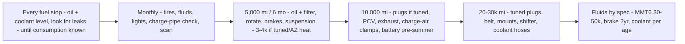

> AZ heat + turbo + unknown history → run the shorter end of every interval until the car's baseline is established (see the *Immediate age-and-history reset* in FFST vault doc 02).

### Service intervals (reference)
| Item | Interval |
|------|----------|
| Oil + filter (5.7 qt 5W-30) | 5,000–7,500 mi (turbo, AZ heat → shorter end) |
| Air filter | 15,000–30,000 mi |
| Cabin filter | annually |
| Trans fluid (MMT6 · WSS-M2C200-D2 / XT-11-QDC · ~1.8 qt) | baseline now if undocumented, then ~30–50k mi |
| Brake fluid (DOT 4 LV) | 2 yr / annually if tracked |
| Coolant | ~100,000 mi / after any service |
| Spark plugs | ~60,000 mi (sooner if tuned) |
| Serpentine belt | inspect 60k, replace ~100k |

*Every row here should have a matching receipt filed in FOST → `_Archive/receipts/YYYY/` and a line in the Sheet's Receipts tab.*

---

<a id="19-projects-index-build-map"></a>

# 19 · Projects Index & Build Map

## Project Index & Build Map — Focus ST

> Every planned project, grouped into **streamlined bundles** (jobs that share teardown, tools, or a service session so you do them once, not five times).
> Each project links to its own full build doc under [`projects/`](projects/).
> Status: 🟢 done · 🟡 in progress · 🔵 planned/decided · ⚪ researching · 🔴 blocked

---

### How this is organized

Individual mods are cheap to *plan* and expensive to *repeat* — every job that opens the same panel, drains the same fluid, or needs the same laptop should happen in one sitting. Projects below are therefore bundled by **shared access**, then sequenced by dependency (e.g. wheels before Brembos, alignment after suspension).

Each build doc follows the same standard: **Overview → Parts list (linked, costed) → Tools → Time & difficulty → Wiring / system diagram → Step-by-step → Verification → Notes/risks.**

---

### Priority & sequence at a glance

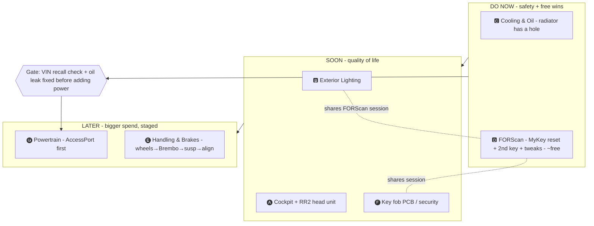

> The one hard gate: **resolve the oil leak and run the VIN recall check before any power adds** (🅖).

### Streamlined bundles (recommended routes)

#### 🅰 Cockpit Electronics & Trim — *one dash/console teardown*
[`projects/cockpit-electronics.md`](projects/cockpit-electronics.md)
Center console tray (3D print) · **INBAY Qi wireless charger** (slot below stereo) · interior LED swap · shift knob · (optional) head-unit/CarPlay upgrade · SYNC S23 text sync. All share center-stack / console access — pull the trim once.

#### 🅱 Exterior Lighting — *one evening, minimal teardown*
[`projects/exterior-lighting.md`](projects/exterior-lighting.md)
Rear 3157 LED · front 7440 LED · fog H11 · reverse/trunk LED · headlight halogen upgrade (Osram). Pair with a **FORScan** session (Bambi mode, shift-light, DRL) since you're already in the lighting/electrical mindset.

#### 🅲 Cooling & Oil-Leak Service — *one coolant drain, AZ-heat priority*
[`projects/cooling-oil-service.md`](projects/cooling-oil-service.md)
**Radiator (Mishimoto)** · coolant flush · valve-cover gasket + oil-leak fix · oil change (drain anyway) · cap floating vacuum line · thermostat inspect. This is the **first priority** — radiator has a hole.

#### 🅳 FORScan / Digital Session — *laptop + OBDLink, no hand tools*
[`projects/forscan-session.md`](projects/forscan-session.md)
Extended License · full `.abt` module backups · starter-pack tweaks · **program 2nd IA key (PATS)** · **MyKey reset** (clear the 3 auction MyKeys) · TPMS config. Pure software.

#### 🅴 Handling & Brakes — *big spend, corner access, alignment after*
[`projects/handling-brakes.md`](projects/handling-brakes.md)
Wheels/tires → **RS→ST Brembo swap (M-2300-W)** → sway bars + endlinks → springs/coilovers → Quaife diff. Strict sequence: wheels first (Brembo clearance), alignment last.

#### 🅵 Key Fob & Security — *bench + FORScan*
[`projects/key-fob-security.md`](projects/key-fob-security.md)
Key-fob PCB transplant to slim shell (Thingiverse 2638706) · 2nd key programming (overlaps 🅳).

#### 🅶 Powertrain / Performance — *tune-gated path*
[`projects/powertrain.md`](projects/powertrain.md)
Cobb AccessPort → charge pipes / BOV → downpipe → catback → clutch (when it slips). Sequenced so the tune lands after supporting hardware.

---

### Master cost & time roll-up

| Bundle | Core spend (budget→nice) | Shop time | Priority |
|--------|--------------------------|-----------|----------|
| 🅲 Cooling & Oil Service | $350 → $600 | 4–6 h | **1 — do first** (radiator hole) |
| 🅳 FORScan session | $0 → $12/yr | 2–3 h | 2 — free wins + keys/security |
| 🅱 Exterior Lighting | $120 → $260 | 2–4 h | 3 |
| 🅐 Cockpit Electronics & Trim | $150 → $600 | 3–5 h | 4 |
| 🅕 Key Fob & Security | $30 → $70 | 1–2 h | 5 (pairs w/ 🅳) |
| 🅔 Handling & Brakes | $900 → $4,000+ | 8–14 h | later — biggest spend |
| 🅖 Powertrain | $650 → $3,000+ | phased | ongoing |

> Numbers are hardware only; see each doc for line items and the master Sheet in FOST for live cost tracking against real receipts.

---

### Full project inventory (flat list)

| # | Project | Bundle | Status | Doc |
|---|---------|--------|--------|-----|
| 1 | Radiator replacement (Mishimoto) | 🅲 | 🔵 decided | cooling-oil-service |
| 2 | Coolant flush | 🅲 | 🔵 | cooling-oil-service |
| 3 | Valve-cover gasket / oil-leak fix | 🅲 | ⚪ diagnosing | cooling-oil-service |
| 4 | Oil change | 🅲 | 🔵 | cooling-oil-service |
| 5 | Cap floating vacuum line / EVAP | 🅲 | ⚪ | cooling-oil-service |
| 6 | Rear 3157 LED | 🅱 | 🔵 researched | exterior-lighting |
| 7 | Front 7440 LED | 🅱 | 🔵 | exterior-lighting |
| 8 | Fog H11 LED | 🅱 | 🔵 | exterior-lighting |
| 9 | Reverse/trunk LED | 🅱 | 🔵 | exterior-lighting |
| 10 | Headlight halogen upgrade (Osram) | 🅱 | 🔵 | exterior-lighting |
| 11 | Interior LED swap | 🅐 | 🔵 | cockpit-electronics |
| 12 | INBAY Qi wireless charger | 🅐 | ⚪ researched | cockpit-electronics |
| 13 | Center console tray (3D print) | 🅐 | ⚪ | cockpit-electronics |
| 14 | Shift knob | 🅐 | ⚪ | cockpit-electronics |
| 15 | Head unit / CarPlay upgrade | 🅐 | ⚪ optional | cockpit-electronics |
| 16 | SYNC ↔ Galaxy S23 text sync | 🅐 | 🟡 in progress | cockpit-electronics |
| 17 | FORScan starter-pack tweaks | 🅳 | 🔵 | forscan-session |
| 18 | Program 2nd IA key (PATS) | 🅳/🅕 | 🔵 | forscan-session |
| 19 | MyKey reset (clear auction keys) | 🅳 | 🔵 | forscan-session |
| 20 | Key-fob PCB → slim shell | 🅕 | ⚪ fit unconfirmed | key-fob-security |
| 21 | Wheels / tires | 🅔 | ⚪ | handling-brakes |
| 22 | RS→ST Brembo swap (M-2300-W) | 🅔 | ⚪ | handling-brakes |
| 23 | Sway bars + endlinks | 🅔 | ⚪ | handling-brakes |
| 24 | Springs / coilovers | 🅔 | ⚪ | handling-brakes |
| 25 | Quaife/Wavetrac ATB diff | 🅔 | ⚪ | handling-brakes |
| 26 | Cobb AccessPort tune | 🅖 | ⚪ | powertrain |
| 27 | Charge pipes / BOV | 🅖 | ⚪ | powertrain |
| 28 | Downpipe | 🅖 | ⚪ | powertrain |
| 29 | Catback exhaust | 🅖 | ⚪ | powertrain |
| 30 | Clutch upgrade | 🅖 | ⚪ future | powertrain |

*Status here mirrors the Projects tab of the master Sheet in FOST. Update both when a project moves.*

---

<a id="20-build-cooling-oil-leak-service"></a>

# 20 · Build · Cooling & Oil-Leak Service

## 🅲 Cooling & Oil-Leak Service

> **Priority 1.** The radiator has a through-hole in the front-left corner of the core. While the cooling system is drained, batch every job that needs the front end open or the same fluids. Phoenix heat makes this the highest-value session on the car.
> Vehicle: [2017 Focus ST · see VEHICLE.md](../VEHICLE.md)

**Bundles:** radiator replacement · coolant flush · valve-cover gasket + oil-leak diagnosis · oil change · cap floating vacuum line · thermostat inspect
**Difficulty:** ●●●○○ (intermediate) · **Time:** 4–6 h · **Coolant capacity:** ~7.4 qt · **Oil:** 5.7 qt

---

### Why bundle these

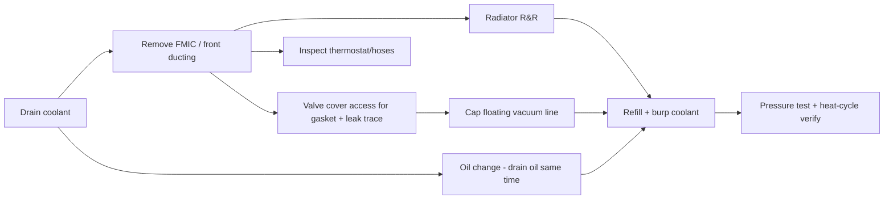

You're already draining coolant and pulling front ducting for the radiator — that same access gets you the thermostat, hoses, oil-leak inspection, and the uncapped vacuum line. Doing them separately means three more teardowns.

---

### Parts list

| Job | Part | Part # | ~Price | Link |
|-----|------|--------|--------|------|
| **Radiator (decided)** | Mishimoto Aluminum Radiator | MMRAD-FST-13 | ~$350 | [mishimoto](https://www.mishimoto.com/ford-focus-st-aluminum-radiator.html) |
| Radiator (budget alt) | CSF 3805 | 3805 | ~$200 | [CSF](https://www.csfrace.com) |
| Coolant | Motorcraft VC-3-B orange (2 gal) | VC-3-B | ~$36 | [search](https://www.amazon.com/s?k=Motorcraft+VC-3-B) |
| Coolant (alt) | Zerex G-05 | — | ~$16/gal | [search](https://www.amazon.com/s?k=Zerex+G-05+orange) |
| **Valve cover gasket** | Ford OEM VC gasket kit | CJ5Z-6079-K | ~$60 | [search](https://www.amazon.com/s?k=CJ5Z-6079-K) |
| VC gasket (alt top) | Reinz FD722 | FD722 | ~$45 | [search](https://www.amazon.com/s?k=Reinz+FD722) |
| VC gasket (alt bottom) | Reinz FD725 | FD725 | ~$45 | [search](https://www.amazon.com/s?k=Reinz+FD725) |
| Oil | Motorcraft 5W-30 full syn (6 qt) | XO-5W30-QSP | ~$48 | [search](https://www.amazon.com/s?k=Motorcraft+5W-30+full+synthetic) |
| Oil (AZ-heat alt) | Motul 8100 X-clean+ 5W-30 | — | ~$12/qt | [search](https://www.amazon.com/s?k=Motul+8100+X-clean+5W-30) |
| Oil filter | Motorcraft FL-910S | FL-910S | ~$8 | [search](https://www.amazon.com/s?k=Motorcraft+FL-910S) |
| Thermostat (if replacing) | Motorcraft RT-1274 | RT-1274 | ~$20 | [search](https://www.amazon.com/s?k=Motorcraft+RT-1274) |
| Vacuum line cap / hose | assorted silicone caps + clamps | — | ~$10 | [search](https://www.amazon.com/s?k=silicone+vacuum+cap+assortment) |
| Turbo oil lines (if leak) | feed/return lines + gaskets | — | ~$80 | verify source first |
| Oil filter housing gasket | if that's the leak | — | ~$15 | verify source first |

**Session cost:** ~$350 (radiator) + ~$100 (fluids/filter) + ~$60–140 (gaskets, if the leak is confirmed there) = **~$500–600.**

> **AGS is deleted** on this car (motor + blades gone). Nothing to reconnect at the front, but expect slightly slower warm-up and marginally different high-speed cooling airflow — fine for AZ, relevant if you ever track it.

---

### Tools

Torque wrench (0–150 lb-ft), metric sockets/wrenches, T30 Torx, coolant drain pan + oil drain pan (8 qt), funnel + spill-free coolant funnel (for burping), jack + **4 jack stands**, pliers for spring clamps, shop rags, UV dye + light (optional, best oil-leak tracer), gloves.

**Torque:** oil drain plug **20 lb-ft** · wheels **100 lb-ft** · valve cover bolts to spec (small, ~7 lb-ft — don't overtighten, warps cover).

---

### Cooling system map

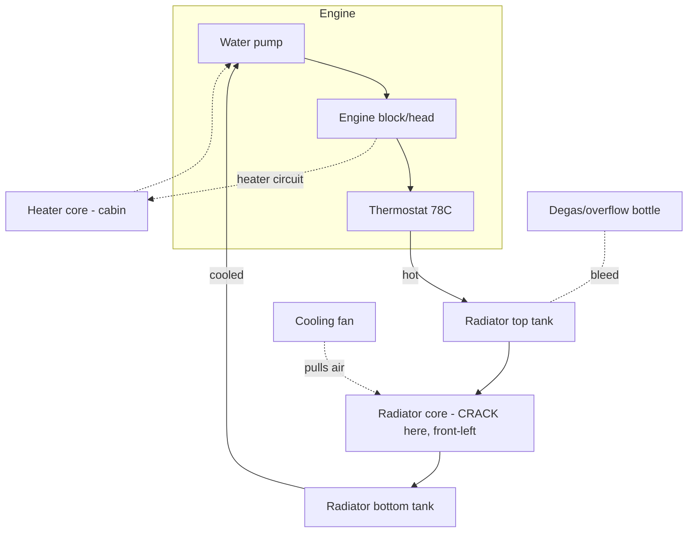

The failure is at the **front-left of the core** — impact when the car crept forward in gear after shutoff. Aluminum core, not repairable. New radiator drops into the same mounts; transfer the fan shroud if the Mishimoto doesn't include one (it uses the OEM fan).

---

### Step-by-step

#### A. Setup
1. Cold engine. Disconnect battery negative (you'll be near electrical + doing an oil-leak trace).
2. Front on jack stands, undertray off.
3. Place both drain pans.

#### B. Drain
4. Open the degas bottle cap. Open the radiator lower drain (or pull the lower hose) — catch ~7 qt coolant.
5. While it drains, pull the oil drain plug and drain oil into the second pan. Remove FL-910S filter.

#### C. Radiator R&R
6. Remove the FMIC ducting / slam panel as needed for clearance (the Depo "Beast" FMIC is top-mount-clear on this platform; note routing as you go — phone photos).
7. Disconnect upper + lower radiator hoses, fan connector, and fan shroud bolts.
8. Lift out the OEM radiator. **Inspect the old core** and photograph the hole for records.
9. Transfer fan/shroud if needed; drop in the Mishimoto; reconnect hoses with fresh clamps.

#### D. Oil-leak inspection (engine bay open — do it now)
10. With the top end accessible, clean the suspected areas and inspect in priority order:
    - **Valve cover gasket** (most common ST oil-weep) → if wet/hardened, replace with CJ5Z-6079-K.
    - **Turbo oil feed/return lines** → check unions for weeping.
    - **Oil filter housing adapter gasket.**
    - **Oil pan** (RTV, not a gasket — last resort).
11. If unclear, add UV dye to the fresh oil and re-inspect after a heat cycle (see verification).
12. Reinstall valve cover to spec if opened — even torque, don't crush the gasket.

#### E. Floating vacuum line
13. Trace the uncapped line to its EVAP/emissions origin. If it's a dead leg from the removed OEM airbox, **cap it** with a silicone cap + clamp. No CEL currently, but an open EVAP reference can cause long-term fuel-trim drift — note the routing in MAINTENANCE.md.

#### F. Refill & burp
14. New oil filter, refill **5.7 qt** 5W-30.
15. Refill coolant with the spill-free funnel; run the Ford burp procedure: engine to temp with funnel open, heater on max, let thermostat cycle, top off, squeeze upper hose to purge air.
16. Cap degas bottle, remove funnel.

---

### Verification
- **Pressure-test** the cooling system to ~15 psi cold — hold 10 min, zero drop.
- Heat-cycle to full temp, fans should cycle; recheck level cold next day.
- Re-scan for oil weep after the heat cycle (UV light if dye used).
- Confirm no new CEL after capping the vacuum line (OBDLink MX+).
- Log fluids, part numbers, mileage, and cost in MAINTENANCE.md + the master Sheet.

### Notes / risks
- Don't reuse tired spring clamps — worm clamps are fine and re-serviceable.
- Overfilling coolant just pushes to the degas bottle; overfilling oil is worse — measure.
- If the leak turns out to be the oil pan RTV, that's a bigger job (subframe drop on some routes) — get a second opinion before committing; it may be worth a shop.

---

<a id="21-build-exterior-lighting"></a>

# 21 · Build · Exterior Lighting

## 🅱 Exterior Lighting (LED conversion)

> ST1-specific, plug-and-play LED conversion. Bulb sizes verified against the ST1 research doc — **do not** use generic "Focus ST" listings (they blend ST2/ST3 specs). Headlights stay **halogen** on purpose (reflector housings scatter LED light — glare + inspection fail).
> Vehicle: [VEHICLE.md](../VEHICLE.md) · pair this with the [FORScan session](forscan-session.md).

**Difficulty:** ●●○○○ · **Time:** 2–4 h · **Tools:** trim picks, gloves (don't touch halogen glass)

---

### Parts list

| Position | Bulb size | Recommended | ~Price | Link |
|----------|-----------|-------------|--------|------|
| Rear tail/turn/brake | **3157** (verify CK vs non-CK socket) | LASFIT T3 CANbus 3157 | ~$25 | [lasfit](https://www.lasfit.com/products/3157-canbus-error-free-ck-socket-switchback-led-bulbs-t3-series) |
| " (alt) | 3157 | AUXITO / Syneticusa CANbus red | ~$18 | [search](https://www.amazon.com/s?k=3157+CANbus+red+LED+anti+hyperflash) |
| Front turn/park | **7440** (7440A amber) | AUXITO / LASFIT / SEALIGHT 7440 CANbus amber | ~$20 | [search](https://www.amazon.com/s?k=7440+LED+CANbus+amber+no+hyperflash) |
| Fog | **verify at car — H8 / H11** (sources conflict; PARTS.md said H16) | reputable LED in the confirmed size, "no scatter" projector reviews | ~$30 | [search](https://www.amazon.com/s?k=H8+H11+LED+fog+no+scatter) |
| Interior/dome/map/door | **194 / T10** 6000K | AUXITO 194 24-SMD | ~$12 | [search](https://www.amazon.com/s?k=AUXITO+194+LED+interior) |
| Reverse | **194 / T10** | any error-free T10 | ~$10 | [search](https://www.amazon.com/s?k=194+LED+reverse) |
| Trunk/cargo | **2825** | any 2825 LED | ~$8 | [search](https://www.amazon.com/s?k=2825+LED+bulb) |
| **Headlight low (upgrade, NOT LED)** | **H11** halogen | Osram Night Breaker Laser/200 | ~$30 | [search](https://www.amazon.com/s?k=Osram+Night+Breaker+H11) |
| **Headlight high (upgrade, NOT LED)** | **H1** halogen | Osram Night Breaker / Sylvania SilverStar | ~$25 | [search](https://www.amazon.com/s?k=Osram+Night+Breaker+H1) |

**Bundle cost:** ~$120 (rear+front+interior+reverse+trunk) → ~$210 with fogs + Osram headlight set → ~$260 nicer bulbs.

> Interior 194s overlap with the [Cockpit bundle](cockpit-electronics.md) — buy the 194 multipack once and do both.

---

### Why hyperflash happens (and why CANbus bulbs)

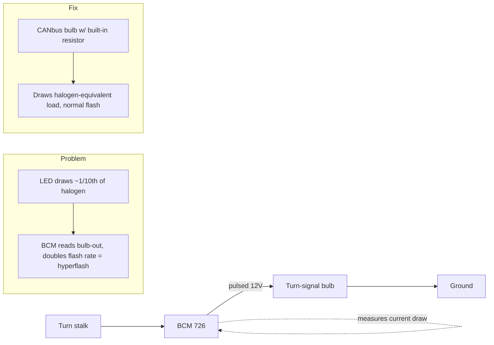

The BCM watches current on each turn circuit to detect a burnt bulb. An LED draws far less, so the BCM thinks the bulb is out and **hyperflashes**. Fix = load-resistor / CANbus bulbs (built-in), which is why every turn position above specifies CANbus. Interior/reverse/trunk aren't flasher-monitored, so plain error-free bulbs are fine.

---

### Bulb locations

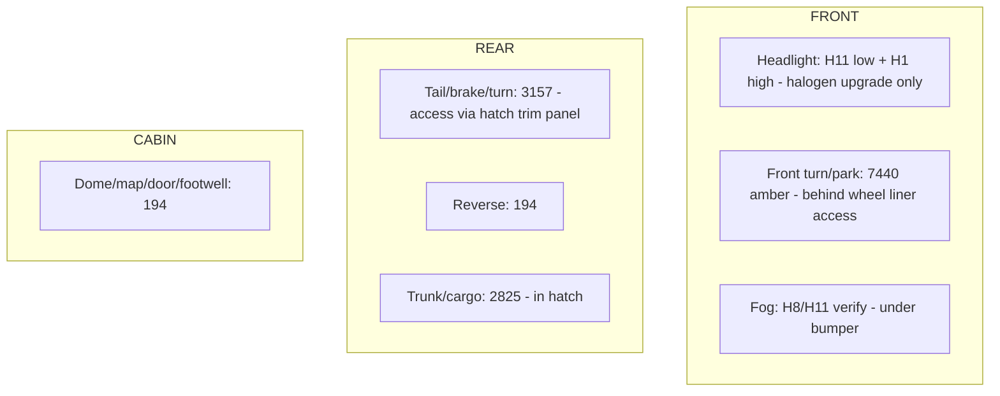

---

### Order of operations (biggest impact, lowest risk first)
1. **Rear 3157** (tail/turn/brake) — biggest visual gain, easiest access via the hatch-side trim panels.
2. **Front 7440** (turn/park) — access through the wheel-liner flap; twist-lock socket.
3. **Interior + reverse + trunk** (194/2825) — cheap, no functional risk.
4. **Fogs H11** — confirm bulb size at the car first.
5. **Headlights** — Osram halogen swap only; never LED in these reflectors.

### Step (each position)
1. Ignition off. Access the socket (hatch trim panel rear; wheel-liner flap front; twist bulb holders).
2. Twist out the holder, pull the halogen bulb, seat the LED. **Keep the OEM bulb** until verified.
3. For turn positions: test with ignition on — if it hyperflashes despite CANbus, the socket may be the other CK variant, or add an inline load resistor.
4. For 3157: if it doesn't seat or throws an error, check **CK vs non-CK** socket variant before assuming a bad bulb.
5. Reassemble.

### Verification
- Cycle every function: park, turn (both sides, front+rear), brake, reverse, hazards. **No hyperflash, no dash bulb-out warning.**
- Drive a full day, then recheck for intermittent errors (QC varies batch to batch).
- Fog beam: confirm no scatter into oncoming lanes.

### FORScan pairing (do in the same session — see 🅳)
- **Bambi mode** (fogs stay on with high beams), **DRL config**, **shift-light** — all BCM/IPC edits that make sense while you're already thinking about lights.

### Notes
- Keep every removed OEM bulb bagged/labeled in the trunk kit — instant roadside/inspection fallback.
- Log bulb brands + part numbers in the Sheet; note which socket variant the rear used so re-orders are painless.

---

<a id="22-build-cockpit-electronics-rr2"></a>

# 22 · Build · Cockpit Electronics + RR2

## 🅐 Cockpit Electronics & Trim — Head Unit + Maestro RR2

> The 2030-cabin build. One planned dash/console program: aftermarket head unit with **wireless Android Auto**, integrated through an **iDatalink Maestro RR2** so you keep steering controls, chimes, and vehicle/OBD data — plus the Qi charger, interior LEDs, blue ambient lighting, and shift knob while the dash is open.
> Vehicle: [VEHICLE.md](../VEHICLE.md) · deep reference: FOST → *FFST Knowledge Base* → "08 Electronics, Infotainment & Interior".

**Difficulty:** ●●●●○ (integration + wiring) · **Time:** 6–10 h incl. bench prep · **Reversibility:** high if you keep the OEM harness intact.

---

### Why RR2 (not a bare radio)

The ST1 runs **4" SYNC 1**. A plain aftermarket radio loses steering-wheel controls, warning chimes, and vehicle info. The **Maestro RR2** sits between the car and the new radio, translating the CAN data so those functions survive — and it can feed **OBD gauges** (boost, temps) onto the radio screen.

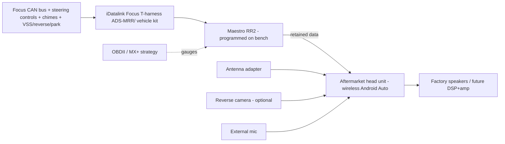

> ⚠️ **Build from the current iDatalink compatibility page for your exact radio model + firmware** — not a generic video. RR2 feature availability (which gauges, whether the OBD screen uses its own connection) is radio-, firmware-, and vehicle-specific.

---

### Parts list

| Job | Part | ~Price | Notes / link |
|-----|------|--------|--------------|
| Head unit | Wireless-Android-Auto DD unit (e.g. Kenwood DMX958XR / Pioneer DMH-WT/ Sony XAV) | ~$350–700 | pick one **on iDatalink's RR2 compatibility list** for Focus |
| Integration | **iDatalink Maestro RR2** | ~$130 | [idatalinkmaestro.com](https://www.idatalinkmaestro.com/en) |
| Vehicle harness/kit | iDatalink **Focus (2012–2018) T-harness + dash kit** | ~$100 | exact kit depends on chosen radio |
| Antenna adapter | Ford → aftermarket antenna adapter | ~$10 | |
| Backup camera (optional) | flush/plate cam | ~$40 | RR2 can retain/trigger |
| External mic | quality external microphone | ~$15 | call clarity |
| Wireless charger | INBAY Qi kit (below-stereo slot; phone envelope **164×81 mm**, S23 fits) | ~$60 | eBay/EU sourcing — measure slot first |
| 12V distribution | add-a-circuit fuse taps + inline fuses + Posi-taps + ground lug | ~$20 | one fused distribution, not many random taps |
| Interior LEDs | 194/T10 6000K multipack (shared w/ 🅱) | ~$12 | dome/map/door/footwell |
| Blue ambient | dimmable automotive LED accent kit | ~$40 | footwell/console/door — accent only |
| Shift knob | Cobb/Mishimoto weighted (M12×1.75) | ~$45 | |

**Bundle cost:** ~$530 (radio + RR2 + kit + charger + LEDs) → ~$800 with camera, ambient lighting, nicer radio.

---

### 12V power + data wiring

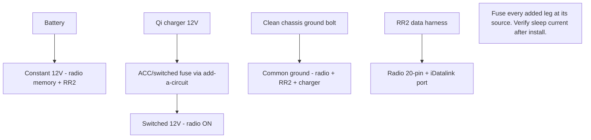

**Rules (from the vault's electrical standard):**
- Record all module DTCs + as-built **before** disconnecting power; use a battery support supply during RR2 programming.
- **Never** probe SRS/airbag circuits with a test light.
- Fuse every added circuit near its source; size wire for current/length/heat, not connector looks.
- One engineered chassis ground; label both ends of every added wire.
- Qi charger + any always-on accessory on a **switched** feed → no parasitic drain.

---

### Bench plan (do BEFORE dash teardown)
Lock these down first — a dash apart with a wrong harness is the classic failure:
1. Exact **radio model + firmware**; confirm on iDatalink RR2 compatibility for Focus.
2. RR2 **serial + firmware** (program/update on the bench via the Maestro app).
3. Exact **Focus T-harness/dash kit**, antenna adapter, USB retention/replacement.
4. Microphone location; backup-camera plan; speaker/amp architecture (now vs future DSP).
5. OBD strategy: does the radio use RR2's dedicated OBD connection, or share with the MX+? (Don't run two active adapters loading the bus.)
6. Steering-button assignment; which chimes/vehicle-info you want retained.

### Install sequence
1. Battery negative off (wait 5 min). Record DTCs/as-built first.
2. Program RR2 on the bench; label every harness branch.
3. Pull shift knob (CCW) + boot, console surround, then climate/stereo bezel.
4. Remove OEM SYNC unit; connect RR2 + T-harness; verify pin locks + grounds.
5. **Qi charger:** seat coil in below-stereo slot; switched-12V via add-a-circuit; chassis ground; route clear of shifter.
6. Interior LEDs + blue ambient while panels are off (accent zones, dimmable, no bare LEDs, no airbag/regulator interference).
7. Shift knob on (M12×1.75).
8. Dry-fit radio + USB routing; **connect and test before final assembly.**
9. Reconnect battery.

### Verification (the acceptance gate — from the vault)
- Key-on / start / shutdown + retained accessory power.
- **All steering buttons** (incl. long-press if programmed), chimes, vehicle info.
- Wireless Android Auto connect + reconnect; GPS/Wi-Fi/BT coexistence; mic/call quality.
- Reverse camera + trigger; dimmer/illumination.
- Qi charges the S23 **and powers off with the key** (clamp-meter parasitic check).
- **No new U-codes** — full module scan after install; car **sleeps** normally (measure draw after modules sleep vs baseline).
- No loose wiring / sharp attachment; every removed panel refits with no new rattle.

### Related (same cabin, separate docs/phases)
- **Sound treatment + spare-well subwoofer + DSP/amp** — vault "08"; sequence speakers/DSP first, then enclosure (heat/water/cargo/roadside plan). Track as its own project.
- **Seat/steering upgrades** — SRS/occupancy/buckle compatibility gates; never resistor-mask a restraint fault.

### Open items
- **Confirm INBAY kit fits the MK3.5 below-stereo slot** before buying (measure slot; 164×81 phone envelope).
- **Pick the radio off iDatalink's Focus RR2 list** before ordering the harness/dash kit — that choice drives every other part number here.

---

<a id="23-build-forscan-session"></a>

# 23 · Build · FORScan Session

## 🅳 FORScan / Digital Session

> Laptop + OBDLink, no hand tools. Batch every software change, key programming, and MyKey reset into one sitting with fresh module backups. Highest value-per-dollar work on the car.
> Vehicle: [VEHICLE.md](../VEHICLE.md) · adapter owned: **OBDLink MX+** · Reference: [FORScan Master Ref (FOST)](../reference/forscan-master-reference.md)

**Difficulty:** ●●○○○ (careful, not hard) · **Time:** 2–3 h · **Cost:** $0 (trial license) → ~$12/yr

---

### Prerequisites (do in order)

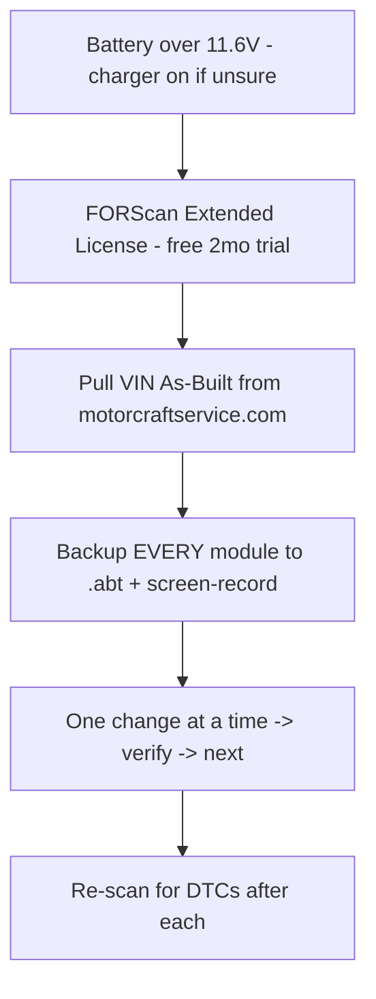

| Item | Detail |
|------|--------|
| Adapter | OBDLink MX+ (owned) — full MS-CAN + HS-CAN |
| License | FORScan **Extended** trial (2 months free, renewable); required for module writes |
| Voltage | keep > 11.6 V — low voltage aborts writes mid-flash (dangerous). Battery tender on. |
| Backups | Save `.abt` for **every** module before editing; screen-record as extra insurance |
| Discipline | **one change, verify, next** — never batch-write blind |

---

### Task list

#### 1. MyKey reset (clear the 3 auction MyKeys) — do first
`BdyCM (726) → Service Functions → MyKey Reset`. No admin key needed. Removes the previous owner's MyKey restrictions (speed limiter, volume cap, etc.). **Free.**

#### 2. Program a 2nd IA key (PATS) — pairs with 🅕 Key Fob
`PATS → Add Key`. Works with **1 existing key**, bypassing the 2-key dealer requirement. Have the new fob (M3N5WY8609) cut + in hand. See [key-fob-security.md](key-fob-security.md).

| Fob | Part # | ~Price |
|-----|--------|--------|
| Keyless2Go M3N5WY8609 | M3N5WY8609 | ~$30 |
| Strattec | 5921561 | ~$35 |
| Ilco | ILO-A2053 | ~$35 |

#### 3. Starter-pack tweaks (BCM 726 / IPC 720)
| Feature | Module | Confirmed on ST? | Notes |
|---------|--------|------------------|-------|
| Double-honk delete | BCM | yes | stops the double lock-honk |
| Global windows (open/close from fob) | BCM | yes | one-touch all windows |
| **Bambi mode** (fogs stay on w/ high beams) | BCM Main | **yes, facelift ST** | pairs with [lighting](exterior-lighting.md) |
| Cornering fogs | BCM Main | platform-confirmed | **engine must be running** to write |
| Shift-light disable | IPC 720 | yes | if you dislike the cluster shift light |
| TPMS → DDS or threshold change | IPC 720 | yes | ⚠️ tire-circumference edits can trigger stuck P160A/P2610 — see risks |
| SYNC 3 boot splash | APIM 7D0 | yes | ST splash on startup |

#### 4. Save + document
Export the final config, note every change (module, setting, old→new value) in MAINTENANCE.md + the master Sheet.

---

### Risks (from the FORScan master reference)
- **SBL (secondary bootloader) load** when opening `BdyCM Central Config (Main)` on 2017–2018 cars — proceed exactly per prompts; do not interrupt.
- **Tire size / circumference edit** can trigger a stuck **P160A / P2610** — avoid unless you know the fix.
- The circulated "FORScan Codes for 2017 Focus ST" Google Sheet was **copied from a Super Duty** — its raw As-Built hex is largely unverified for the ST. Prefer FORScan **Module Configuration dropdowns**; cross-reference RS "seniorgeek" values, not F-150 tricks.
- Powertrain/steering tuning is **not** FORScan-editable — that's a COBB/SCT job (see [powertrain.md](powertrain.md)).

### Verification
- After each write: clear + re-scan DTCs, confirm the feature works, confirm no new codes.
- Keep the `.abt` backups in FOST (`_Archive/forscan-backups/`) with the date.

---

<a id="24-build-handling-brakes"></a>

# 24 · Build · Handling & Brakes

## 🅔 Handling & Brakes — Full Build

> The biggest-spend bundle, grouped because it all needs corner access and shares one alignment at the end. Sequence is strict: **wheels → Brembos → sway bars → springs/coilovers → alignment**. Do not lower or align until worn parts are sorted.
> Vehicle: [VEHICLE.md](../VEHICLE.md) · deep reference: FOST → *FFST Knowledge Base* → "07 Chassis, Brakes, Wheels & Alignment".

**Difficulty:** ●●●●○ · **Total time:** 8–14 h across sub-jobs · **Alignment:** mandatory after any suspension change
**AZ note:** heat-cycle tires and brake fluid harder here — spec accordingly.

---

### Dependency order (why this sequence)

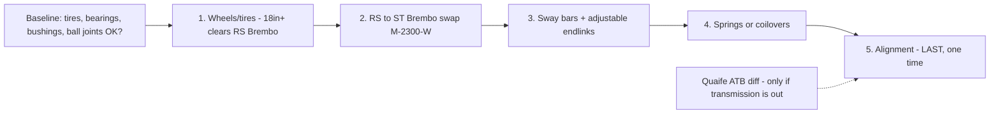

Wheels first because the RS Brembo caliper needs clearance a stock 18" spoke may not give. Alignment last because every suspension change moves camber/toe — pay for one alignment, not four.

---

### Master parts list

| Sub-job | Option (budget → premium) | Part # | ~Price | Link |
|---------|---------------------------|--------|--------|------|
| **Wheels (track)** | Enkei RPF1 17×8 +45 (16.2 lb) | 184-780-6545BK | ~$180 ea | [enkei](https://www.enkei.com) |
| Wheels (budget track) | Konig Hypergram 17×8 +45 | — | ~$130 ea | [konig](https://www.konigwheels.com) |
| Wheels (street) | BBS CH-R 18×8 | — | ~$400 ea | [bbs](https://www.bbs.com) |
| Tires (street/track) | Michelin PS4S 235/40R18 | — | ~$220 ea | [michelin](https://www.michelin.com) |
| Tires (autocross) | Falken RT660 / Bridgestone RE-71RS | — | ~$190–200 ea | — |
| **Brembo swap** | Ford Performance RS Brembo front kit | **M-2300-W** | verify price | [performanceparts.ford.com](https://performanceparts.ford.com) |
| Brake fluid | ATE SL.6 (street) / Motul RBF600 (track) | — | ~$15–20 | — |
| Braided lines | Goodridge stainless | FD0900-4P | ~$100 | [goodridge](https://www.goodridge.com) |
| **Front sway bar** | Whiteline 27 mm adjustable | BSF39Z | ~$200 | [whiteline](https://www.whiteline.com.au) |
| **Rear sway bar** | Whiteline 22 mm adjustable | BSR55XZ | ~$180 | [whiteline](https://www.whiteline.com.au) |
| Endlinks | Whiteline adjustable (required w/ upgraded bars) | KLC180 | ~$80 | [whiteline](https://www.whiteline.com.au) |
| **Springs (drop)** | Eibach Pro-Kit (~25 mm) | E10-35-007-04-22 | ~$250 | [eibach](https://www.eibach.com) |
| Coilover (value) | Fortune Auto 500 | — | ~$1,100 | [fortuneauto](https://www.fortuneauto.com) |
| Coilover (premium) | KW V3 (indep. comp/rebound) | 35220065 | ~$2,100 | [kw](https://www.kwsuspension.com) |
| **Diff** | Quaife ATB / Wavetrac | QDF11J | ~$1,000–1,100 | [quaife](https://www.quaife.co.uk/products/ford-focus-st-atb-differential) |

**Spend:** ~$900 (wheels + bars + springs, budget) → ~$4,000+ (premium coilovers + Brembo + diff).

---

### Tools & torque

Torque wrench (to 150 lb-ft), breaker bar, 32 mm socket (hub nut), T30 Torx (caliper slider), metric sockets/hex, spring compressor **only if reusing OEM struts** (not needed for assembled coilovers/spring kits done as strut-out), brake bleeder (pressure or vacuum) + fresh fluid, torque-to-yield bolts as required, jack + **4 stands**, thread locker where specified.

| Fastener | Torque | Note |
|----------|--------|------|
| Lug nuts | **100 lb-ft** | M12×1.5, clean dry threads |
| Front hub nut | verify Ford spec | often torque-to-yield — replace |
| Caliper bracket / carrier bolts | verify Ford/Brembo spec | safety-critical — do not guess |
| Sway-bar D-mount / endlink | per Whiteline sheet | tighten at ride height |

> ⚠️ Every safety-critical torque (hub, caliper, ball joint, subframe) must come from **current Ford service data or the part maker's sheet** — the vault deliberately does not publish guessed values. Verify before turning the wrench.

---

### 1 · Wheels & tires
1. Confirm fitment math before buying (see box below).
2. Mount/balance; torque lugs to **100 lb-ft** in a star pattern, re-torque after 50 mi.
3. Record size, offset, spacer, load rating, date codes, tread inner/center/outer in the tracker.

**Fitment math (do for any non-OEM wheel):** compare width + offset vs **18×8 +55**; compute inner clearance (strut/spring) and outer (fender/liner) at **full lock and full compression, loaded — not on the lift**; verify **RS Brembo caliper clearance** (spoke profile matters, not just diameter); confirm tire measured width + diameter (speedo/ABS); hub-centric with correct seat type (tapered vs ball); no stacked spacers.

### 2 · RS → ST Brembo swap (M-2300-W)
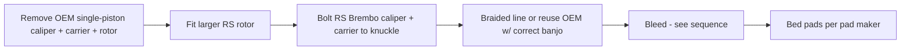
1. Front on stands, wheels off. Unbolt OEM caliper + carrier, remove rotor.
2. Fit RS rotor; bolt on Brembo carrier + caliper to knuckle at **verified torque**; confirm rotor-to-caliper centering and pad clearance.
3. Connect brake line (braided upgrade recommended); no kinks, correct banjo/crush washers.
4. Confirm the RS front changes front/rear brake **balance** — pair with a matching rear pad and verify ABS behavior in a safe first test.

**Bleed sequence (RWD-style farthest-first for shared reservoir — verify against Ford for ABS):**

Use fresh DOT 4 LV (or Motul RBF600 for track). Bleed until clean fluid + firm pedal; if ABS module trapped air, a FORScan/scan-tool ABS bleed cycle may be needed.

### 3 · Sway bars + endlinks
1. Install rear bar first, front second; use **adjustable endlinks** (required to preload correctly).
2. Set both bars to their **softest** useful hole initially.
3. Torque D-mounts/endlinks at **ride height** (not hanging) to avoid preloading bushings.

### 4 · Springs / coilovers
- **Springs:** verify damper travel/health first; a lowering spring on tired dampers rides badly. Check bump-stop clearance + tire-to-fender after.
- **Coilovers:** set ride height + corner-balance; keep bump travel; don't lower for looks past geometry limits.

### 5 · Alignment (starting targets — NOT Ford spec)
| Use | Front camber | Rear camber | Front toe | Rear toe |
|-----|-------------|-------------|-----------|----------|
| Daily | -1.0 to -1.5° | -1.3 to -1.8° | ~0 / slight in | slight in |
| Fast street/canyon | -1.5 to -2.2° | -1.3 to -1.8° | ~0 | slight in |
| Autocross/track | -2.2 to -3.0° | -1.5 to -2.0° | 0 to slight out | stable slight in |
Equalize side-to-side; save before/after printout with setup + pressures; review tire wear after 1,000 mi. Aggressive front toe-out → tramlining/wear; too much rear rotation → abrupt lift-off.

### Verification
- Lugs re-torqued (50 mi); no rubbing at full lock/compression, loaded.
- Brakes: firm pedal, no leaks, even pad-to-rotor, ABS normal, pads bedded, no pull; recheck fluid + rotor temps after a controlled stop test.
- Sway/suspension: no clunks/binding; ride height equal; alignment sheet on file.
- No new ABS/TPMS codes (OBDLink MX+).

### Notes / open decisions (bring back before ordering)
- **Ride:** street drop (Eibach) vs coilovers vs stay stock height?
- **Look/grip:** 17" track setup vs 18" street?
- **Priority:** Brembo now, or route that money to the [tune](powertrain.md) first? (Stock brakes are fine for street; RS Brembo shines on track/heavy use.)
- **Diff (Quaife):** best single handling mod (kills torque steer) but ~$1,100 + labor — only cost-effective while the transmission is already out.

---

<a id="25-build-key-fob-security"></a>

# 25 · Build · Key Fob & Security

## 🅕 Key Fob & Security

> Ex-auction car came with **0 admin keys / 3 MyKeys**. Get a working spare, clear the MyKeys, and (optional) transplant the fob PCB into a slimmer shell.
> Vehicle: [VEHICLE.md](../VEHICLE.md) · programming overlaps [🅳 FORScan session](forscan-session.md).

**Difficulty:** ●●○○○ · **Time:** 1–2 h · **Cost:** ~$30–70

---

### Tasks

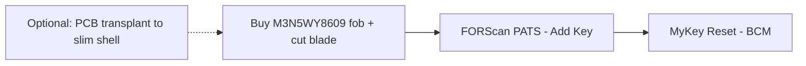

#### 1. Spare IA key (push-to-start)
| Fob | Part # | ~Price | Link |
|-----|--------|--------|------|
| Keyless2Go M3N5WY8609 | M3N5WY8609 | ~$30 | [search](https://www.amazon.com/s?k=M3N5WY8609+keyless2go) |
| Strattec | 5921561 | ~$35 | [search](https://www.amazon.com/s?k=Strattec+M3N5WY8609) |
| Ilco | ILO-A2053 | ~$35 | [search](https://www.amazon.com/s?k=Ilco+M3N5WY8609+focus) |
| Fob battery | CR2032 | ~$1 | [search](https://www.amazon.com/s?k=Panasonic+CR2032) |

Program via **FORScan PATS → Add Key** (works with your 1 existing key — no dealer, no 2-key requirement). Cut the emergency blade at a locksmith to the VIN.

#### 2. MyKey reset
`BCM → Service Functions → MyKey Reset` — clears the previous owner's restrictions. Free, no admin key. (Same session as key programming.)

#### 3. (Optional) Fob PCB transplant → slim shell
- Target shell: **Thingiverse thing:2638706** (Mustang GT 5-button slim, ~8 mm).
- ⚠️ **Fit onto the Focus ST PCB is NOT confirmed.** Verify PCB dimensions + button layout against the shell before committing. Print a test shell first; keep the OEM shell as fallback.

### Verification
- Both keys start the car and lock/unlock remotely.
- MyKey restrictions gone (no speed/volume limits).
- Log key part numbers + cut code in the Sheet (store securely — it's security info).

---

<a id="26-build-powertrain-performance"></a>

# 26 · Build · Powertrain / Performance

## 🅖 Powertrain / Performance — Full Build

> Tune-gated, reliability-first. The FMIC ("Beast") and intake are already on the car, so the next real gain is a **conservative custom tune** — then supporting hardware in the order that keeps the motor alive. This follows your vault's staged plan: health → thermal → calibrated power → (optional) more power.
> Vehicle: [VEHICLE.md](../VEHICLE.md) · deep reference: FOST → *FFST Knowledge Base* → "06 Powertrain" + "09 Mods & Tuning".

**Difficulty:** ●●●○○ (tune/datalog) → ●●●●○ (clutch/big turbo) · **Cost:** $650 → $3,000+ phased
**Hard gates:** oil leak resolved first · plugs correct · charge-air sealed · AZ-heat-safe calibration.

---

### Stage sequence

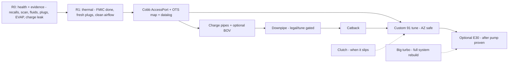

**Non-negotiable rule (LSPI):** no full-load pull **below ~3,000 rpm** in a tall gear — downshift before requesting boost. Turbo-DI engines pre-ignite when lugged. Shape the tune's low-RPM torque accordingly.

---

### Parts list

| Step | Part | Part # | ~Price | Link |
|------|------|--------|--------|------|
| Tune | Cobb AccessPort V3 | AP3-FOR-005 | ~$649 | [cobb](https://www.cobbtuning.com/products/ford-focus-st-accessport) |
| Charge pipe | Cobb / Mishimoto aluminum kit | — | ~$150–175 | [mishimoto](https://www.mishimoto.com) |
| BOV (optional) | Turbosmart Kompact / Forge RV | TS-0203-1061 / FMDV14T | ~$130–150 | — |
| Downpipe (street) | Cobb 3" catted | — | ~$500 | [cobb](https://www.cobbtuning.com) |
| Downpipe (track) | Cobb catless (off-road only) | — | ~$425 | [cobb](https://www.cobbtuning.com) |
| Catback | Mountune / Borla ATAK / Milltek | — | ~$700–1,100 | — |
| Plugs (tuned) | Motorcraft SP-537 gapped ~0.025–0.026" (or 1-step colder per tuner) | SP-537 | ~$8 ea | — |
| Clutch (when needed) | Exedy Stage 1 / Clutchmasters FX350 | — | ~$350–550 | — |
| Ethanol tester (E30) | handheld ethanol content tester | — | ~$25 | — |

**Spend:** ~$650 (AP only) → ~$1,500 (AP + pipes + downpipe + custom tune) → $3,000+ (catback + clutch + E30 path).

---

### Tools
Laptop (Windows) + **OBDLink MX+** for datalogging, AccessPort cable (included), basic metric sockets/hex + T-drivers for pipes/downpipe, O2-sensor socket, jack + stands, anti-seize for exhaust threads, torque wrench, battery tender (voltage-stable flashing).

| Fastener | Torque | Note |
|----------|--------|------|
| Spark plugs | ~10 lb-ft | don't over-torque alloy head |
| O2 sensor | per spec + anti-seize | |
| Downpipe / turbo outlet | verify Ford/maker spec | new gaskets, heat-cycle re-check |
| Charge-pipe clamps | per kit | witness-mark after first drive |

---

### 1 · Cobb AccessPort — install + datalog loop
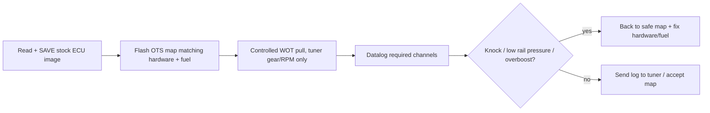
1. Plug in, **read and save the stock image first** (your recovery path).
2. Flash an **OTS map that matches your actual hardware + AZ pump fuel** (FMIC + intake done → an appropriate stage map; a stage label is not universal — match hardware).
3. Verify fuel level/octane twice; battery tender on during flash.
4. Do controlled pulls only in the tuner-prescribed gear/RPM band; datalog every pull.

**Datalog required channels:** RPM, throttle/pedal, commanded vs actual boost, load/torque request, wastegate duty, lambda + STFT/LTFT, commanded vs actual rail pressure, ignition timing + cylinder corrections, coolant + charge-air temp, misfire counters.

**Abort a pull immediately on:** flashing MIL/misfire, actual rail pressure materially below commanded, uncontrolled overboost, abnormal knock outside tuner guidance, overheating, mechanical noise/smoke/fluid warning, or unsafe traffic. **Never** re-run WOT "to see if it clears."

### 2 · Charge pipes + optional BOV
1. Replace OEM plastic charge pipes (known cracking/boost-leak points) with aluminum; fresh O-rings + clamps, aligned without preload.
2. Optional BOV/recirc: preserve correct metering/control behavior (a BOV is sound/response, not power). Plumb-back keeps fueling correct.
3. **Pressure-test** the charge-air tract after; add witness marks; recheck after first heat cycle + 100–250 mi.

### 3 · Downpipe (decision-gated)
- **Catted (street):** high-flow cat, reduces turbine-outlet restriction; still needs a tune + may trip P0420 on a bad cat.
- **Catless (track/off-road only):** emissions-illegal for street in AZ; CEL unless tuned; heat + odor.
- Fit new gaskets, anti-seize, re-torque after a heat cycle; verify O2 wiring clearance. **Define power target + legal status before buying.**

### 4 · Catback
Mostly sound/weight on a stock-turbo street car. Watch drone, hanger alignment, ground clearance, leaks. Buy for tone/packaging, not power.

### 5 · Custom 91 tune (the real target)
Give the tuner the **complete hardware + fuel + maintenance list**. Calibrate a **91-octane AZ-safe** map (calibrated as 91, not 93 assumptions), conservative low-RPM torque, stock-turbo thermal margin. Validate with datalogs before trusting it.

### 6 · Optional E30 (only after pump tune proven)
Fixed-blend E30 ≠ flex fuel. Buy an **ethanol tester**, measure both fuels, calculate the blend, log rail pressure + trims. Never load an E30 map on straight gas or fill full E85 on stock fueling. Stock DI fueling ceiling is commonly cited ~mid-300 whp; aux/HPFP fueling needed toward ~400 whp.

### 7 · Clutch (when it slips, not before)
Stock holds ~280 lb-ft; a Stage tune gets close. Symptoms: rpm rises without proportional acceleration (higher gears first), burning smell hot. Shared reservoir → rule out hydraulic/contamination first. Choose capacity with reasonable margin (drivability + pedal effort), inspect rear main seal while accessible.

### Verification (per stage)
- Stock image saved before any flash; recovery map on the AccessPort.
- Post-flash: clean datalog (no knock, rail pressure tracks command, boost controlled), no new DTCs.
- Charge-air pressure-test holds; no oil mist at joints; witness marks intact after drive.
- Downpipe/exhaust: no leaks, O2 reads correct, re-torqued after heat cycle; emissions-legal for street use if applicable.
- Fuel trims stable; charge-air temp recovers between pulls (AZ heat check).

### Notes / open decisions
- **AccessPort first** — biggest single gain + datalogging protects the motor in AZ heat. Run an OTS map on the existing FMIC + intake before spending on pipes/exhaust.
- **Resolve the oil leak (🅲) before adding power** — don't boost a weeping motor.
- **Street-legal vs track:** decide catted vs catless downpipe before ordering (AZ emissions).
- **Stop-and-think gate before a big turbo:** it's a full system (fuel, clutch, cooling, traction, calibration) — set a whp/response budget first, don't drift into it part-by-part.

---

<a id="27-reference-forscan-master-reference"></a>

# 27 · Reference · FORScan Master Reference

## FORScan Master Reference — 2017 Focus ST (MK3.5, US, Manual, ST1)

> Distilled, version-controlled reference. The **full long-form research doc** (all 9 categories, every As-Built value, all forum sources) lives in FOST → `2017-Ford-Focus-ST/`. This is the working cheat-sheet for the [🅳 FORScan session](../projects/forscan-session.md).

### TL;DR
- FORScan can reconfigure 5 modules: **BdyCM/BCM (726), IPC (720), APIM/SYNC (7D0), ACM (727), ABS (760)**.
- The ST is a **Central Configuration (CC)** car → use FORScan **Module Configuration dropdowns**, *not* raw As-Built hex the way F-150/Super Duty owners do.
- Powertrain/steering tuning is **NOT** FORScan-editable → use COBB/SCT.
- Two biggest risks: **SBL load** when opening `BdyCM Central Config (Main)` on 2017–18 cars, and **tire-circumference edits** that cause a stuck **P160A/P2610**.

### Module map

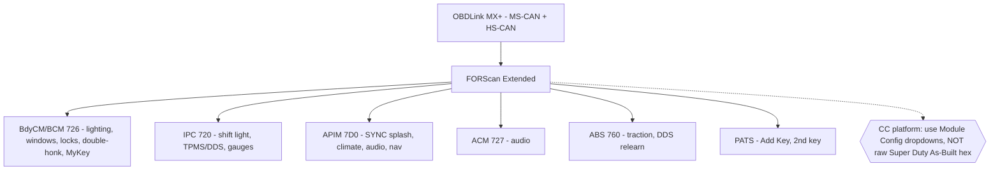

### Prereqs
- Adapter: OBDLink MX+ (owned) · License: FORScan **Extended** (free 2-mo trial, renewable).
- Battery **> 11.6 V** (charger on). Pull VIN As-Built from **motorcraftservice.com** + save `.abt` of every module. **One change → verify → next.**

### Standard Starter Pack (high value, low risk)
1. **Double-honk delete** — BdyCM As-Built `726-01-01`, subtract `0x80` from first slot. ✅ canonical ST method.
2. **Global windows open/close** — BdyCM Main → "Global Open/Close" (needs SBL). ✅ ST-confirmed.
3. **Bambi mode** (fogs w/ high beams) — BdyCM Main, remove fog restriction. ✅ facelift-ST confirmed.
4. **Shift-light disable** — IPC → "Shift Indication → Without". ✅ confirmed.
5. **TPMS → DDS** (or threshold change) — IPC + ABS relearn (4-step). ✅ confirmed on a 2017 ST.
6. **SYNC 3 ST boot splash** — APIM `7D0-02-01`, `1 → B`. ✅ confirmed.

**Taste-dependent (good):** climate controls on SYNC 3 (`7D0-01-02` `7→3`), disable Sony DSP processing (`7D0-01-02` first digit `A→2` — best audio fix), remove Sirius, auto-lock by speed, seatbelt/door chime off.

### MyKey & Keys (relevant — auction car)
- **MyKey Reset**: `BCM → Service Functions → MyKey Reset` — clears the 3 auction MyKeys, no admin key.
- **Add 2nd key**: `PATS → Add Key` works with 1 existing key. ⚠️ Do **not** attempt PATS with only one key present.

### DO-NOT-DO / Known-bad
| Don't | Why | Fix |
|-------|-----|-----|
| Tire circumference edit (`726-12-01`) | Stuck **P160A/P2610** CEL | revert to factory value; for real tire changes run PCM "Module init/relearn" |
| Open BdyCM Main unprepared (2017–18) | SBL load can fail (ABS light, DTC flood) | pre-download **GV6T-14C097-AA.vbf** to Calibration Files; battery >12 V; if buggy use FORScan 2.3.41 |
| FoCCCus on 2017–18 | doesn't work on MK3.5 facelift | use **FORScan** only |
| Blind Super Duty As-Built hex | wrong module architecture → write fails/DTCs | use CC dropdowns or RS-confirmed values |
| Write with engine running | false "accident" event | follow ACC power-cycle prompts |
| TPMS full delete (`726-02-01=0000…`) | "incompatible configuration" | use DDS conversion or threshold change |
| GT/Lincoln theme/country change | kills Sirius/nav-in-motion | leave APIM country alone |

### Recommended two-session plan
1. **Session 1 (no SBL):** license + backups, then IPC/APIM dropdowns — shift-light off, TPMS config, Sirius removal, Sony DSP off, ST splash, climate on SYNC 3.
2. **Session 2 (BdyCM Main, expect SBL prompt):** global windows + Bambi + auto-lock + double-honk delete. Ignore temporary dash warnings during writes.

### Key sources
- FocusST.org FORScan Mega Thread — https://www.focusst.org/threads/forscan-mega-thread.169995/
- Double-honk delete — https://www.focusst.org/threads/how-to-disable-the-double-honk.50574/
- Switching to DDS — https://www.focusst.org/threads/switching-to-dds-with-forscan.175121/
- FocusRS.org seniorgeek master (best MK3.5 cross-ref) — https://www.focusrs.org/threads/forscan-mods-changes-and-info.103801/
- SBL download guide — https://www.focusst.org/threads/how-to-download-sbl-second-bootloader-for-forscan-2022.170004/

> ⚠️ The circulated "FORScan Codes for 2017 Focus ST" Google Sheet is **Super Duty-derived** — treat its hex as unverified for the ST unless corroborated by the RS thread or an ST-forum report. Always pull your own As-Built baseline before editing; values vary by VIN/build date/SYNC version.

---

<a id="28-setup-connections-data-flow"></a>

# 28 · Setup · Connections & Data Flow

## Setup Guide — Connections, Tools & Data Flow

> How the whole system is wired together, what's already working, and the few things **only you can do** (authorizations + one Dropbox step). Read the checklist at the bottom.

---

### Architecture (where everything lives)

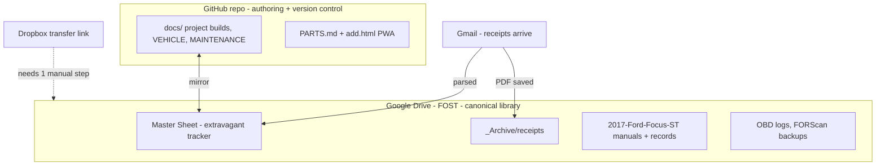

**Two homes, on purpose:**
- **GitHub repo** = where docs are authored (markdown + mermaid diagrams, diffable history, feeds the PWA).
- **FOST (Drive)** = the library you browse: the master Sheet, receipts, manuals, OBD/FORScan backups. Docs are mirrored here so "everything lives in FOST" holds true.

---

### Connector status

| Connector | Status | Used for |
|-----------|--------|----------|
| Google Drive | ✅ connected | FOST folder, master Sheet, manuals, receipts |
| Gmail | ✅ connected (authorized) | watching for receipts/order confirmations |
| Google Calendar | ✅ connected | service reminders (optional) |
| GitHub | ✅ connected | this repo, docs, PWA |
| IFTTT | ✅ connected | optional auto-append Gmail→Sheet automation |
| Dropbox | ⚠️ connected, but the link is a **Transfer** link | see blocker below |
| Spotify / others | ✅ connected | not used for the car system |

---

### ⚠️ The one blocker: the Dropbox link

The link stored in FOST (`dropbox.com/t/xaxFIuBwO6PGzvkd`) is a **Dropbox Transfer** link, not a shared folder. Transfer links:
- can't be read by the Dropbox connector (confirmed `SHARED_LINK_NOT_FOUND`), and
- are blocked by this environment's network proxy for direct download.

**So I can't pull those files from here.** Pick one (30 seconds):

1. **Best:** Open the transfer, click **"Save to Dropbox"** → it lands in your Dropbox account → tell me and I'll read/merge every file into FOST automatically.
2. **Or:** Download the transfer to your computer, then drag the files into the **FOST** folder in Google Drive → tell me and I'll organize + merge them.
3. **Or:** Re-share the same files as a normal Dropbox **shared link** (`/s/` or `/scl/`, not `/t/`) and paste it → I'll pull it directly.

Until then, everything else proceeds without it.

---

### Gmail → receipts pipeline

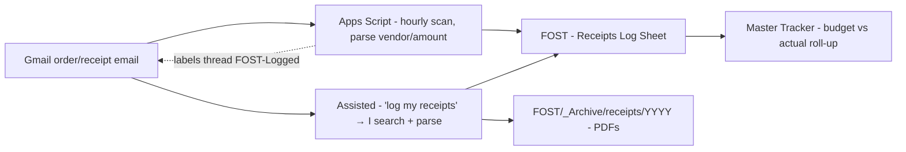

**Goal:** every parts order/receipt gets logged to the Sheet and the PDF filed in FOST, tied to the right project.

**How it works now (assisted):** when you say "log my latest receipts" (or on a schedule, if you want a recurring task), I search Gmail for order confirmations from the usual senders (Amazon, eBay, RockAuto, Mishimoto, COBB, Summit, FCP Euro, Tasca, etc.), extract vendor / item / price / date / order #, append them to the Sheet's **Receipts** tab, link them to a project, and save any attached PDF to `FOST/_Archive/receipts/YYYY/`.

**Fully-automatic (Google Apps Script — the working path):** IFTTT can't do this — its Gmail service exposes **no "new email" trigger** (retired), and Sheets isn't connected there. The native path is a Google Apps Script bound to the **FOST — Receipts Log** sheet: it scans Gmail hourly for order/receipt emails and appends them, labeling processed threads so it never double-logs. Script + 2-minute install: [`automation/gmail-receipts.gs`](automation/gmail-receipts.gs).

**Live receipts home:** `FOST — Receipts Log` (Google Sheet in FOST) — the shared target for both the script (auto) and my assisted logging. Already seeded with your first 3 receipts (FORScan license, eBay blue silicone hose kit, Mishimoto promo hat).

**What you do:** install the script once (or just say "log my receipts" and I do it). Keep receipts in bberault@gmail.com.

---

### The master Sheet (extravagant tracker)

One workbook in FOST consolidating the 5 fragmented `FFST -` sheets, with tabs:
- **Dashboard** — spend to date, by project/bundle, next actions.
- **Vehicle Info** — mirror of VEHICLE.md key facts.
- **Projects** — every project, bundle, status, budget vs actual (mirrors PROJECTS.md).
- **Parts & Costs** — line items with links, tier, qty, price.
- **Maintenance Log** — mirror of MAINTENANCE.md.
- **Receipts** — vendor/item/price/date/order#/project, fed by Gmail.
- **Mods Installed** — current state of the car.

Repo docs and the Sheet cross-reference each other; I keep them in sync.

---

### Tools you already have / need
| Tool | Status | For |
|------|--------|-----|
| OBDLink MX+ | ✅ owned | FORScan sessions |
| FORScan Extended License | ✅ active (~$12/yr) | module config, key programming |
| Laptop (Windows for FORScan) | assumed | FORScan runs on Windows |
| Torque wrench, jack + 4 stands, basic metric set | verify | every hands-on project |
| 3D printer access | ? | console tray + fob shell prints (or use a print service) |

---

### ✅ Your action checklist
1. **Dropbox:** do one of the 3 options above so I can merge those files. *(only true blocker)*
2. **Confirm the architecture** (repo + FOST mirror + Google Sheet) — or tell me if you'd rather it be Drive-only. See the decisions I'll post in chat.
3. **Head unit decision** (keep SYNC + do text-sync, or go CarPlay) — changes the Cockpit bundle.
4. **(Optional)** say yes to the IFTTT auto-receipt applet.
5. Everything else — I'm building.

---

<a id="29-appendix-fost-drive-cleanup-map"></a>

# 29 · Appendix · FOST Drive Cleanup Map

## 🧹 FOST Drive — Cleanup & Filing Map

> **Why this is a checklist, not done-for-you:** my Google Drive connector can only **create and copy** — it **cannot move, rename, or delete**. Reorganizing existing files requires drag-and-drop / delete, which only you can do. This map makes that ~10-minute job precise.

### What happened (the mess, explained)
FOST currently has **three competing organizations**:
1. **`FFST Knowledge Base/`** — my clean set (16 reference docs) + `FOST — Receipts Log`, `FOST — Master Tracker`, `FOST — START HERE`. ✅ populated, canonical.
2. **Root numbered folders** `00 – Command Center` … `11 – Project Development`, `99 – Archive` — a second scheme (likely an earlier ChatGPT pass).
3. **`DIGITAL GARAGE — OPENAI BUILD/`** — a ChatGPT run that **duplicated itself**: it contains two each of the `08 –`, `09 –`, `10 –`, `11 –`, `12 –`, `13 –`, `98 –`, `99 –` subfolders (created in repeated bursts). Mostly an empty skeleton.

Plus **loose files at the FOST root** (workshop manuals, FORScan installers, OBD logs, the Mishimoto radiator receipt, photos, duplicates).

### Recommended end state (pick ONE scheme)
Keep the **root numbered folders** (00–11, 99) as the canonical filing cabinet — they're sensibly named and already at root — and nest the knowledge + trackers inside them. Then delete the duplicated `DIGITAL GARAGE` tree.

```
FOST/
├── 00 – Command Center      → START HERE index, dashboards
├── 01 – Vehicle & Ownership → title, insurance, loan, purchase order
├── 02 – Diagnostics         → OBD logs, DTC/scan exports
├── 03 – Maintenance & Service
├── 04 – Mods & Build        → FFST Knowledge Base (nest here), LED/console-tray
├── 05 – Parts & Research
├── 06 – Costs & Receipts    → Receipts Log, Master Tracker, receipt PDFs
├── 08 – Manuals & Reference → workshop manuals, OBDLink QSG
├── 09 – Media & CAD         → photos, SVG zips, console-tray CAD
├── 10 – Software & Tools    → FORScan/OBDwiz installers, .py, ChatGPT setup
├── 11 – Project Development
└── 99 – Archive             → legacy FFST sheets, dropbox link, superseded
```

### Step 1 — delete duplicates (verify empty first)
- [ ] Open **`DIGITAL GARAGE — OPENAI BUILD/`**. If its numbered subfolders are empty skeletons (they appear to be), **delete the whole folder**. If any contain real files, drag those out first.
- [ ] Delete the **duplicate loose files** at root (one copy each — keep the newest):
  - `FFST-ChatGPT-Project-Setup.md` (2 copies) · `focus_st_*` zips (2 sets) · `Ford-Focus-Mk3-2012-2018-WSM.zip` (2) · `Helm Ford Focus … Shop Manual.rar` (2)

### Step 2 — file the loose root files
| Loose file(s) | → Folder |
|---------------|----------|
| `FOST — START HERE (Index)` | 00 – Command Center |
| `FOST — Receipts Log`, `FOST_Master_Tracker.xlsx`, `20260803_MMRAD-FOST-13.pdf` (Mishimoto radiator receipt) | 06 – Costs & Receipts |
| `ConfirmationStatement2026.pdf`, `Signature_Request_for_application_1330079.pdf` | 01 – Vehicle & Ownership |
| `DTC_…txt`, `Info_…txt`, `Log_…txt` (OBD exports) | 02 – Diagnostics |
| `Ford-Focus-Mk3-2012-2018-WSM.zip`, `Helm … Shop Manual.rar`, `obdlink_mxp_qsg-web…pdf` | 08 – Manuals & Reference |
| `focus_st_*` (svg/photo zips), `…contact_sheet…jpg`, `Ford Focus ST center console tray - 4566871.zip` | 09 – Media & CAD |
| `FORScanLiteNG….apk`, `FORScanSetup….exe`, `OBDwizSetup….exe`, `forscan_organizer.py`, `FFST-ChatGPT-Project-Setup.md` | 10 – Software & Tools |
| `focus-st1-led-conversion.md/.pdf` | 05 – Parts & Research |
| `FFST Knowledge Base/` (whole folder) | 04 – Mods & Build (or leave at root — it's self-contained) |
| `FFST - *` legacy sheets, `https://www.dro.txt` | 99 – Archive |

### Step 3 — collapse the old `2017-Ford-Focus-ST/` and `ODB/` folders
Their contents (insurance/PO/LED/FORScan ref/photos, and OBDLink settings) overlap the scheme above — drag their files into 01 / 08 / 09 / 10 as appropriate, then delete the empty shells.

---
**If you'd rather I do it by copying** (I'd duplicate files into the target folders and you delete the originals), say so and I'll batch it — but drag-and-drop is cleaner and avoids duplicate IDs. This map is also in Drive as **`FOST — CLEANUP PLAN`**.

---

<a id="30-appendix-obsidian-vault-setup"></a>

# 30 · Appendix · Obsidian Vault Setup

## 📓 Open this as an Obsidian vault

The `docs/` folder **is** the vault — every note is plain markdown with wikilinks, tags, and mermaid diagrams that Obsidian renders natively. Start at [[INDEX|🏠 Home]].

### Fastest way (auto-syncing, recommended)
Keep the vault in sync with GitHub automatically so edits on phone/laptop merge and nothing is lost.

1. Install **[Obsidian](https://obsidian.md)** (free, desktop + mobile).
2. Clone the repo and open its `docs/` folder as a vault:
   ```bash
   git clone https://github.com/2smok3d/focus-st.git
   # In Obsidian: "Open folder as vault" → choose focus-st/docs
   ```
3. Enable **Community plugins → Obsidian Git**. Settings:
   - *Vault backup interval*: 10 min · *Pull on startup*: on · *Commit-and-sync*: on.
   That's the automation: edits auto-commit + push, and pull on open. Your notes and the repo stay one thing.

> On mobile: Obsidian Git works on Android; on iOS use the **Working Copy** app to sync the repo, then open `docs` as a vault.

### Recommended community plugins
| Plugin | Why |
|--------|-----|
| **Obsidian Git** | auto pull/commit/push (the automation) |
| **Dataview** | turn tags/frontmatter into live tables (e.g. all `#project` notes, all open issues) |
| **Templater** | quick new service-log / receipt / project entries |
| **Kanban** | drag project bundles across Todo → Doing → Done |

### How it's wired
- **Home / MOC:** [[INDEX]] — set it as the Obsidian home note.
- **Wikilinks** connect every note; open **Graph view** (Ctrl/Cmd-G) to see the whole system.
- **Tags:** `#focus-st #project #kb #reference #automation #maintenance #spec #recall` — click to filter.
- **Frontmatter** on each note (title/aliases/tags) powers search + Dataview.
- **Mermaid** wiring/system diagrams render inline.

### Example Dataview snippets (paste into any note)
````markdown
```dataview
TABLE status, bundle FROM #project SORT priority ASC
```
```dataview
LIST FROM #recall
```
````

### Keeping the Google Drive side
The Drive **FFST Knowledge Base** (Google Docs) mirrors the KB for reading on any device; the vault here is the **editable source of truth**. Live sheets (Receipts Log, Master Tracker) stay in Drive — linked from [[INDEX]]. See [[SETUP]] for the full data-flow.
