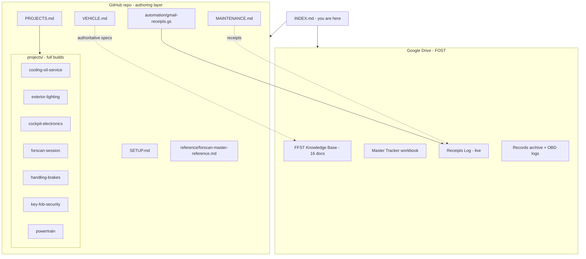

# 📇 Master Index — FOST / Focus ST System

> One place that indexes **everything**: repo docs, the FOST Google Drive vault, the tracker sheets, and the records archive. Start here.
> 2017 Ford Focus ST · VIN 1FADP3L94HL223134 · Phoenix, AZ

---

## Site map

---

## 1 · Repo docs (this folder)

| Doc | What it is | Visuals |
|-----|-----------|---------|
| [README.md](README.md) | Folder overview + doc standard | sitemap |
| [VEHICLE.md](VEHICLE.md) | Master spec — VIN, trim, drivetrain, bulbs, modules, mods, known issues | systems map |
| [PROJECTS.md](PROJECTS.md) | 30 projects → 7 bundles + cost/time roll-up | priority map |
| [MAINTENANCE.md](MAINTENANCE.md) | Service log + intervals | interval timeline |
| [SETUP.md](SETUP.md) | Connectors, data-flow, receipts pipeline | architecture + receipts flow |
| [reference/forscan-master-reference.md](reference/forscan-master-reference.md) | FORScan cheat-sheet | module map |
| [automation/gmail-receipts.gs](automation/gmail-receipts.gs) | Gmail→Receipts Apps Script | — |

### Project builds (`projects/`)
| # | Bundle | Doc | Diagrams |
|---|--------|-----|----------|
| 🅲 | Cooling & Oil-Leak Service *(priority 1)* | [cooling-oil-service.md](projects/cooling-oil-service.md) | bundle flow · cooling-system map |
| 🅱 | Exterior Lighting | [exterior-lighting.md](projects/exterior-lighting.md) | hyperflash/CANbus · bulb locations |
| 🅐 | Cockpit Electronics + Maestro RR2 | [cockpit-electronics.md](projects/cockpit-electronics.md) | RR2 data flow · 12V wiring |
| 🅳 | FORScan / Digital Session | [forscan-session.md](projects/forscan-session.md) | prereq flow |
| 🅔 | Handling & Brakes | [handling-brakes.md](projects/handling-brakes.md) | dependency order · Brembo · bleed sequence |
| 🅕 | Key Fob & Security | [key-fob-security.md](projects/key-fob-security.md) | task flow |
| 🅖 | Powertrain / Performance | [powertrain.md](projects/powertrain.md) | stage roadmap · datalog loop |

---

## 2 · FOST Google Drive — FFST Knowledge Base

📁 **[FFST Knowledge Base folder](https://drive.google.com/drive/folders/1dvFqDQr_ZuhvASjCp6e2EdX9AyC0AxOE)** (the deep, authoritative reference — mirrored from your Dropbox vault)

| # | Doc | Link |
|---|-----|------|
| 00 | README (Master Vault Overview) | [open](https://docs.google.com/document/d/1YHRrnIKs38urxkOrf0uVs2F5LXQTaYI6OJH1kPnOYHc) |
| 00 | Command Center Dashboard | [open](https://docs.google.com/document/d/1huJidL-UIzL_PSUyC630Mxdsgl0FpL1QuKUFRc4N_Ew) |
| 01 | Vehicle Record & Baseline Inspection | [open](https://docs.google.com/document/d/10awNBARgLI7gXAnDpx5c5tDYI73FJVzy9eszLQ06kz4) |
| 02 | Maintenance Master | [open](https://docs.google.com/document/d/101vmqJBHxNubTItKtKKMdRedJH6z2rEv6DaTXOjFI0Q) |
| 03 | OEM Specifications | [open](https://docs.google.com/document/d/1q0wj7-nw1z1KK84CIv0Nz10VqQg33KnzfDeMr9vimB4) |
| 03 | Spec Correction (4th-gear ratio) | [open](https://docs.google.com/document/d/1IX_SB4AVV53HsII3XJutlVssX3Yye3ZiNZTE3TiS214) |
| 04 | Recalls, Campaigns & TSBs | [open](https://docs.google.com/document/d/1ST38ruAag05CQjkV-UjVsY9rI00baosGt25MbHaM9_0) |
| 05 | Diagnostics & DTC Master | [open](https://docs.google.com/document/d/1wzPz1STptHvcklTQq1SKwp8MVegl0NOnv_348NzYO9A) |
| 06 | Powertrain Master Manual | [open](https://docs.google.com/document/d/1_9b-292YFsUR6J2Oi32-kgsxP4KZqGHlvERMlB38SBI) |
| 07 | Chassis, Brakes, Wheels & Alignment | [open](https://docs.google.com/document/d/1JC2wLA4wX-8M0iVYaPP0YuNkO4VG_BIIeibqI-MImKw) |
| 08 | Electronics, Infotainment & Interior | [open](https://docs.google.com/document/d/1yD_tvzCRSEhMDMYUTIB9jesPTTHVZ5c6v3wePrqOr50) |
| 09 | Modifications & Tuning Master Plan | [open](https://docs.google.com/document/d/1TLBMIhU1LI8r6QUabcQg7v3GyJFe9IkRAxWrYhik5N0) |
| 10 | Forum & Long-Term Owner Knowledge | [open](https://docs.google.com/document/d/1Y_nUsxnhkBx-EDaMUIyuq9Cqt3Vam4ylbVCq3La4lJo) |
| 11 | Build Roadmap | [open](https://docs.google.com/document/d/1Wb5i-sSK0vyvD_wqhcb9TkvMZL6oEJ8EyS9NtC5FyeE) |
| 11 | Project Database *(Sheet)* | [open](https://docs.google.com/spreadsheets/d/1BtUsEbBBVEgUd3inNjzy0rFFrfN56IX0jO6Ia8_F5bs) |
| 12 | Sources, Evidence Register & Changelog | [open](https://docs.google.com/document/d/1ZexXVRjY8EnHkaJAU7X4Bi03t1CXx1_YHtwjYq_QuQM) |

---

## 3 · Tracker sheets & records (FOST root)

📁 **[FOST folder](https://drive.google.com/drive/folders/1C5pRcsciobVaOl21OUuV7Vd3KQzxnh28)**

| Item | Type | Link |
|------|------|------|
| **FOST — Receipts Log** | live Sheet (auto + assisted) | [open](https://docs.google.com/spreadsheets/d/1Y5lDZIvOPDb0Lnn6e575NiTVaS0s_MPTd4s1nyWj_Bw) |
| **FOST — Master Tracker** | 7-tab workbook (delivered to you; drop into FOST → live Sheet) | *(local file → Drive)* |
| 2017-Ford-Focus-ST | 📁 records: insurance, purchase order, LED research, FORScan ref, photos | [open](https://drive.google.com/drive/folders/1_P_lbfcbVylhP29znTPjvSnH43hDMx85) |
| ODB | 📁 OBDLink Android settings (.stg) | [open](https://drive.google.com/drive/folders/1g1Fcvbjq6QLwBYYKP4WO4RwZJCXRRQ_C) |
| FORScan Codes for 2017 Focus ST | shortcut | [open](https://drive.google.com/file/d/16yckk8gHaVPdQMIoTnJO3Cqo9RrGTkka/view) |

### Legacy FFST spreadsheets (superseded by the tracker — kept for history)
| Sheet | Link |
|-------|------|
| FFST - Vehicle Info | [open](https://docs.google.com/spreadsheets/d/1SLvGax-x0B4dLmcN8VORA7vUPhDvcsEECcRFQAaBSXo) |
| FFST - Parts and Research Tracker | [open](https://docs.google.com/spreadsheets/d/1mmpOV9o_Tjia2VG92fY4az5C_kv-38rPxJWq3c-0YCk) |
| FFST - Maintenance and Issues Log | [open](https://docs.google.com/spreadsheets/d/1LUCMB22tILf_kGyXL83f28PElz3iadpC-A8idqObwOw) |
| FFST - Mods and Build Log | [open](https://docs.google.com/spreadsheets/d/1VP3AXP1mCczWAMfazRYuB8CVNdO-3rNE6p0bM7Q7XVk) |

> 🧹 **FOST has 3 competing folder structures** (mine + two ChatGPT passes, one duplicated). The connector can't move/delete, so see **[FOST-CLEANUP-MAP.md](FOST-CLEANUP-MAP.md)** (also in Drive as *FOST — CLEANUP PLAN*) for the ~10-min fix.
> ⏳ Still to fetch (blocked): the Dropbox **Transfer** link's files — needs one manual save (see [SETUP.md](SETUP.md)).

---

## 4 · Cross-reference matrix (project ↔ vault ↔ tracker)

| Repo build | FFST vault section | Tracker records |
|------------|--------------------|-----------------|
| 🅲 cooling-oil-service | 06 Powertrain · 02 Maintenance · 04 Recalls (purge) | DIAG-001, MOD-001, SERVICE-001/002 |
| 🅱 exterior-lighting | 08 Electronics · records → LED research | MOD (lighting) |
| 🅐 cockpit-electronics | 08 Electronics (RR2) | MOD-004/005/006/007, PART-002 |
| 🅳 forscan-session | 08 Electronics · reference (FORScan) | TASK-002, RISK-002 |
| 🅔 handling-brakes | 07 Chassis | MOD-008/009 |
| 🅕 key-fob-security | 01 Vehicle Record · reference (PATS) | — |
| 🅖 powertrain | 06 Powertrain · 09 Mods/Tuning · 10 Forum | MOD-001/002/003, RISK-001/003 |

*Kept in sync: when a project moves, update PROJECTS.md, the tracker's Projects tab, and this matrix.*
