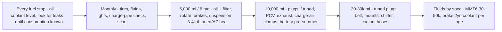

# Maintenance & Service Log — 2017 Focus ST

> Chronological record of every service, repair, and mod. Append newest at top. Mirror each entry to the **Maintenance Log** tab of the master Sheet in FOST. Tie receipts to entries by date.
> Vehicle: [VEHICLE.md](VEHICLE.md)

## Log

| Date | Odometer | Type | Item | Parts / P/N | Cost | Notes |
|------|----------|------|------|-------------|------|-------|
| 2026-06 | 86,390 | Acquisition | Purchased | — | $14,500 | From Trucks & More LLC, Glendale AZ. Ex-auction, 0 admin keys / 3 MyKeys |
| _prior (PO)_ | — | Mod | Injen CAI + ram-air + hood scoops | — | — | installed by previous owner |
| _prior (PO)_ | — | Mod | Depo "Beast" FMIC | 28×8.25×5.5 core | — | pressure-tested OK to 15 psi |
| _prior (PO)_ | — | Mod | Torque Solutions rear + passenger motor mounts | — | — | installed by PO |
| _prior (PO)_ | — | Mod | Upgraded battery, trunk storage box | — | — | box on 3M Dual Lock |
| _prior (PO)_ | — | Delete | Active Grille Shutters removed | — | — | motor/actuator gone |

## Open work orders (see project docs)
- 🔧 **Radiator replacement (Mishimoto)** — hole in core → [cooling-oil-service](projects/cooling-oil-service.md)
- ⚠️ **Oil leak diagnosis** — valve cover / turbo lines / filter housing / pan
- ⚠️ **Cap floating vacuum line** (EVAP, no codes)
- 🔧 **Program 2nd key + MyKey reset** → [forscan-session](projects/forscan-session.md)

## Cadence at a glance

> AZ heat + turbo + unknown history → run the shorter end of every interval until the car's baseline is established (see the *Immediate age-and-history reset* in FFST vault doc 02).

## Service intervals (reference)
| Item | Interval |
|------|----------|
| Oil + filter (5.7 qt 5W-30) | 5,000–7,500 mi (turbo, AZ heat → shorter end) |
| Air filter | 15,000–30,000 mi |
| Cabin filter | annually |
| Trans fluid (MMT6 · WSS-M2C200-D2 / XT-11-QDC · ~1.8 qt) | baseline now if undocumented, then ~30–50k mi |
| Brake fluid (DOT 4 LV) | 2 yr / annually if tracked |
| Coolant | ~100,000 mi / after any service |
| Spark plugs | ~60,000 mi (sooner if tuned) |
| Serpentine belt | inspect 60k, replace ~100k |

*Every row here should have a matching receipt filed in FOST → `_Archive/receipts/YYYY/` and a line in the Sheet's Receipts tab.*
