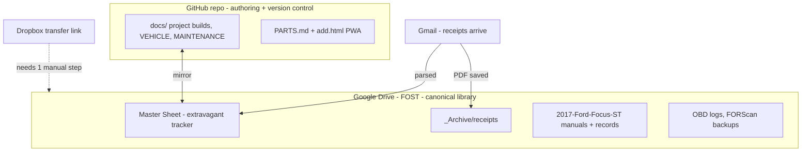

# Setup Guide — Connections, Tools & Data Flow

> How the whole system is wired together, what's already working, and the few things **only you can do** (authorizations + one Dropbox step). Read the checklist at the bottom.

---

## Architecture (where everything lives)

**Two homes, on purpose:**
- **GitHub repo** = where docs are authored (markdown + mermaid diagrams, diffable history, feeds the PWA).
- **FOST (Drive)** = the library you browse: the master Sheet, receipts, manuals, OBD/FORScan backups. Docs are mirrored here so "everything lives in FOST" holds true.

---

## Connector status

| Connector | Status | Used for |
|-----------|--------|----------|
| Google Drive | ✅ connected | FOST folder, master Sheet, manuals, receipts |
| Gmail | ✅ connected (authorized) | watching for receipts/order confirmations |
| Google Calendar | ✅ connected | service reminders (optional) |
| GitHub | ✅ connected | this repo, docs, PWA |
| IFTTT | ✅ connected | optional auto-append Gmail→Sheet automation |
| Dropbox | ⚠️ connected, but the link is a **Transfer** link | see blocker below |
| Spotify / others | ✅ connected | not used for the car system |

---

## ⚠️ The one blocker: the Dropbox link

The link stored in FOST (`dropbox.com/t/xaxFIuBwO6PGzvkd`) is a **Dropbox Transfer** link, not a shared folder. Transfer links:
- can't be read by the Dropbox connector (confirmed `SHARED_LINK_NOT_FOUND`), and
- are blocked by this environment's network proxy for direct download.

**So I can't pull those files from here.** Pick one (30 seconds):

1. **Best:** Open the transfer, click **"Save to Dropbox"** → it lands in your Dropbox account → tell me and I'll read/merge every file into FOST automatically.
2. **Or:** Download the transfer to your computer, then drag the files into the **FOST** folder in Google Drive → tell me and I'll organize + merge them.
3. **Or:** Re-share the same files as a normal Dropbox **shared link** (`/s/` or `/scl/`, not `/t/`) and paste it → I'll pull it directly.

Until then, everything else proceeds without it.

---

## Gmail → receipts pipeline

**Goal:** every parts order/receipt gets logged to the Sheet and the PDF filed in FOST, tied to the right project.

**How it works now (assisted):** when you say "log my latest receipts" (or on a schedule, if you want a recurring task), I search Gmail for order confirmations from the usual senders (Amazon, eBay, RockAuto, Mishimoto, COBB, Summit, FCP Euro, Tasca, etc.), extract vendor / item / price / date / order #, append them to the Sheet's **Receipts** tab, link them to a project, and save any attached PDF to `FOST/_Archive/receipts/YYYY/`.

**Optional fully-automatic (IFTTT):** an applet "New Gmail matching `subject:(order OR receipt OR invoice)` → append row to Google Sheet" can drop raw receipts into an inbox tab 24/7; I then reconcile + categorize them. Say the word and I'll set this up (it needs your OK to create the applet).

**What you do:** nothing beyond forwarding a receipt if it comes from an unusual address. Keep receipts in the same Gmail account (bberault@gmail.com).

---

## The master Sheet (extravagant tracker)

One workbook in FOST consolidating the 5 fragmented `FFST -` sheets, with tabs:
- **Dashboard** — spend to date, by project/bundle, next actions.
- **Vehicle Info** — mirror of VEHICLE.md key facts.
- **Projects** — every project, bundle, status, budget vs actual (mirrors PROJECTS.md).
- **Parts & Costs** — line items with links, tier, qty, price.
- **Maintenance Log** — mirror of MAINTENANCE.md.
- **Receipts** — vendor/item/price/date/order#/project, fed by Gmail.
- **Mods Installed** — current state of the car.

Repo docs and the Sheet cross-reference each other; I keep them in sync.

---

## Tools you already have / need
| Tool | Status | For |
|------|--------|-----|
| OBDLink MX+ | ✅ owned | FORScan sessions |
| FORScan Extended License | ✅ active (~$12/yr) | module config, key programming |
| Laptop (Windows for FORScan) | assumed | FORScan runs on Windows |
| Torque wrench, jack + 4 stands, basic metric set | verify | every hands-on project |
| 3D printer access | ? | console tray + fob shell prints (or use a print service) |

---

## ✅ Your action checklist
1. **Dropbox:** do one of the 3 options above so I can merge those files. *(only true blocker)*
2. **Confirm the architecture** (repo + FOST mirror + Google Sheet) — or tell me if you'd rather it be Drive-only. See the decisions I'll post in chat.
3. **Head unit decision** (keep SYNC + do text-sync, or go CarPlay) — changes the Cockpit bundle.
4. **(Optional)** say yes to the IFTTT auto-receipt applet.
5. Everything else — I'm building.
