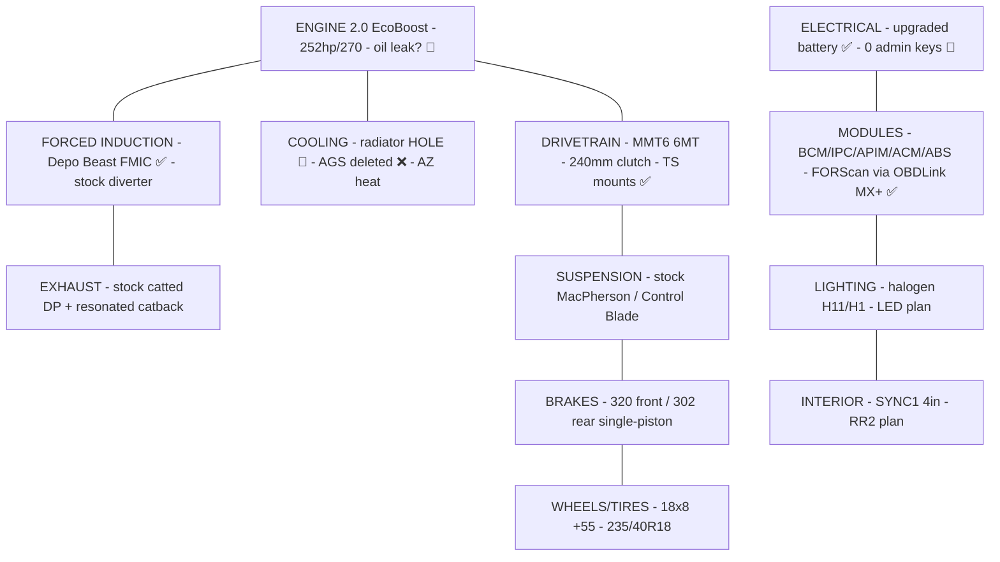

# Vehicle Master Spec — 2017 Ford Focus ST

> Single source of truth for the car. Everything else (projects, parts, maintenance) references this file.
> Legend: ✅ verified · ⚠️ unverified / needs check · 🔧 needs attention · ❌ removed / not present
>
> **Authoring model:** this repo is the authoring layer (version-controlled, feeds the PWA, holds the wiring diagrams + streamlined bundles). The **FFST "mechanic vault"** in Google Drive (FOST → *FFST Knowledge Base*, 16 docs) is the deep reference for OEM specs, diagnostics, recalls and forum-graded knowledge. On any spec conflict, the vault's Grade-A (Ford/NHTSA) values win — reconciled here.

Full index of everything (repo + Drive + sheets): **[INDEX.md](INDEX.md)**.

---

## Systems at a glance

Legend: ✅ good/done · 🔧 needs attention · ❌ removed. Details per system below.

---

## 1. Identity

| Field | Value | Source |
|-------|-------|--------|
| Vehicle | 2017 Ford Focus ST (5-door hatch) | Title / insurance |
| Trim | **ST1** (cloth Recaro, 4.2" non-touch display, halogen headlights) | LED research doc |
| Platform | MK3.5 facelift · global C-platform · **Central Configuration (CC)** car | FORScan master ref |
| Engine | 2.0 L EcoBoost I4 turbo (GTDI, "R9DA/R9Dx") | Ford spec |
| Rated output | ~252 hp / 270 lb-ft (crank, factory) · ⚠️ PARTS.md lists 247 hp — treat 252/270 as canonical | Ford spec |
| Transmission | **Getrag-Ford MMT6** 6-speed manual · ⚠️ earlier `PARTS.md` said "MT82" — MMT6 is correct per FFST vault research; **verify at car** (they take different fluid) | FFST vault / insurance |
| Drive | FWD | — |
| Color | Black | Purchase order |
| VIN | **1FADP3L94HL223134** | Title / insurance / PO |
| Owner | Brandon Berault · Phoenix, AZ 85032 | Records |
| Start system | Push-to-start / Intelligent Access (M3N5WY8609 fob) | PARTS.md |

### VIN decode (1FADP3L94HL223134)
`1FA` Ford USA · `DP3L9` Focus ST hatch, 2.0 EcoBoost · `4` check digit · `H` = 2017 · `L` = Wayne, MI plant · `223134` sequence.

---

## 2. Ownership & Records

| Item | Detail |
|------|--------|
| Purchased | ~June 2026 from **Trucks and More LLC**, 4505 W Glendale Ave #B, Glendale AZ (602-686-2570) |
| Odometer at purchase | **86,390 mi** |
| Price | $12,995 sale · $14,500 total (tax $1,195.54, title/reg $200, doc $109.46) |
| Sale type | Used, AS-IS (15-day/500-mi implied warranty), ex-auction |
| Keys | ⚠️ **0 admin keys / 3 MyKeys** (auction car — see Security project) |
| Insurance | Kemper / Response Insurance Co · policy **10269650001** · 06/12/2026–12/12/2026 · liability 25/50/25 · $1,000 comp/coll deductible |
| Garaging | 16819 N 45th Pl, Phoenix AZ 85032 |

> Insurance card, purchase order, and loan docs are archived in FOST (`2017-Ford-Focus-ST/` → `_Archive/records/`). These contain PII (SSNs, DOBs) — keep access private.

---

## 3. Drivetrain & Chassis Reference

| System | Spec |
|--------|------|
| Engine internals | Bore×stroke 87.5×83.1 mm · CR 9.3:1 · **firing order 1-3-4-2** · rev limit ~6,500 (6,800 for 3 s) |
| Oil | 5W-30 full synthetic · **5.7 qt** w/ filter · Ford WSS-M2C946-A |
| Oil filter | Motorcraft FL-910S |
| Coolant | Motorcraft VC-3-B orange (50/50) · **~5.3 qt** · thermostat 78 °C · service coolant WSS-M97B57-A2 (Yellow) is Ford-compatible |
| Trans fluid | ⚠️ **MMT6 → WSS-M2C200-D2 / Motorcraft XT-11-QDC · ~1.8 qt** (NOT the XTM5-QS listed for MT82 in PARTS.md — confirm transmission variant before buying) |
| Spark plugs | Motorcraft SP-537 (AGSF32PM) · OEM gap **0.027–0.031"** · tuned ~0.025–0.026" on high boost |
| Clutch | **240 mm** single dry disc w/ dual-mass flywheel · holds ~280 lb-ft stock |
| Gear ratios | 1: 3.23 · 2: 1.95 · 3: 1.32 · 4: **1.03** · 5: 1.13 · 6: 0.94 · R: 4.60 · finals 4.063 / 2.955 |
| Diff | Open (factory) — Quaife/Wavetrac ATB is the top handling mod |
| Front brakes | 320 × 25 mm vented · single-piston sliding |
| Rear brakes | 302 × 10 mm solid |
| Brake fluid | DOT 4 LV (WSS-M6C65-A2) |
| Suspension | MacPherson front / Control Blade rear · front bar 22 mm · rear bar 21.7 mm |
| Wheels | 18 × 7.5" · 5×108 · ET52.5 · 63.3 mm bore · lug M12×1.5 / 17 mm hex · **100 lb-ft** |
| Tires | 235/40R18 |
| Battery | Group 96R · 590 CCA min |

---

## 4. Lighting Bulb Chart (ST1-specific — verified against ST1 LED research)

| Position | Bulb | Notes |
|----------|------|-------|
| Headlight low | **H11** halogen | true reflector housing — **do not** LED-retrofit (scatter/glare/inspection). Upgrade = Osram Night Breaker halogen |
| Headlight high | **H1** halogen | same reasoning |
| Fog | **H11** | ⚠️ PARTS.md lists H16 — ST1 research says H11; verify at car before ordering |
| Front turn/park | **7440** (7440A amber) | ST1-specific — *not* 3157 up front |
| Rear tail/turn/brake | **3157** (check CK vs non-CK socket) | CANbus/anti-hyperflash bulbs required |
| Interior dome/map/door | **194 / T10 / W5W** | any error-free T10 |
| Reverse | **194 / T10** | not flasher-monitored |
| Trunk/cargo | **2825** | niche size |

---

## 5. Electronic Modules (FORScan targets)

CC platform — configure via FORScan **Module Configuration** dropdowns, *not* raw As-Built hex (the circulated "FORScan Codes for 2017 Focus ST" sheet was copied from a Super Duty and is largely unverified for the ST).

| Module | Addr | What it controls / common edits |
|--------|------|--------------------------------|
| BdyCM / BCM | **726** | Lighting (Bambi mode, DRL, cornering fogs), windows global open/close, double-honk delete, MyKey reset |
| IPC (cluster) | **720** | Shift-light disable, gauge sweep, TPMS→DDS or threshold |
| APIM (SYNC) | **7D0** | SYNC 3 boot splash, features |
| ACM (audio) | **727** | Audio config |
| ABS | **760** | ABS/traction options |
| PATS | — | **Add Key** (2nd IA key w/ 1 existing key, no dealer) |

Requires: OBDLink adapter (owned: **OBDLink MX+**) + FORScan **Extended License** (free 2-month trial, renewable; ~$12/yr paid). Keep battery > 11.6 V, back up every module (.abt) before edits, one change at a time.

---

## 6. Installed Mods (as received / done)

| Mod | System | Status | Notes |
|-----|--------|--------|-------|
| Injen cold air intake | Intake | ✅ installed | by PO |
| Ram-air / hood-scoop feed | Intake | ✅ installed | hood scoops feed intake |
| Depo Racing "The Beast" FMIC | Forced induction | ✅ installed | 28×8.25×5.5 core · **pressure-tested OK to 15 psi** |
| Torque Solutions rear motor mount | Drivetrain | ✅ installed | more NVH than stock |
| Torque Solutions passenger motor mount | Drivetrain | ✅ installed | — |
| Hood scoops | Exterior | ✅ installed | — |
| Upgraded battery | Electrical | ✅ installed | larger than stock |
| Trunk storage box | Interior | ✅ installed | 3M Dual Lock |
| Active Grille Shutters (AGS) | Cooling | ❌ **removed by PO** | motor/actuator gone, not just blades — affects warm-up/aero; note for cooling work |
| OBDLink MX+ | Tools | ✅ owned | full MS-CAN + HS-CAN |
| FORScan Extended License | Tools | ✅ active | ~$12/yr |

---

## 7. Known Issues / Open Items 🔧

| Issue | Status | Detail |
|-------|--------|--------|
| **Radiator cracked → hole** | 🔧 needs replacement | front-left corner of aluminum core; worsened to full hole, too damaged to patch. Decision: **Mishimoto** (over budget CSF 3805). See `projects/cooling-oil-service.md` |
| **Possible oil leak** | ⚠️ investigating | noticed after aggressive driving. Suspects: valve cover gasket, turbo oil feed/return, oil filter housing adapter gasket, oil pan (RTV). Keep gasket kits on hand |
| Floating/uncapped vacuum line at intake | ⚠️ monitoring | traced to EVAP/emissions; **no CEL codes**. Original connection unknown (possibly old airbox) |
| No BOV/bypass valve | note | running stock diverter |
| MT82 cold-crunch risk | preventive | fix with XTM5-QS fluid |
| 0 admin keys / 3 MyKeys | 🔧 security | program 2nd key + MyKey reset via FORScan PATS |

---

## 8. Environment Notes

- **Phoenix, AZ heat** is a first-order design constraint — prioritize cooling (radiator, oil temp), fluids rated for heat, and AGS-delete implications. Factor into every thermal decision.
- Parts sourcing preference: **open to budget/generic aftermarket** (not OEM-only) where reliability allows — noted per project.

---

*Maintained in the repo; mirrored to FOST. Update this file first when a fact about the car changes.*
