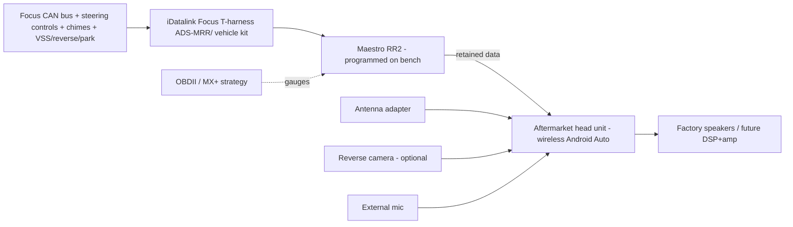
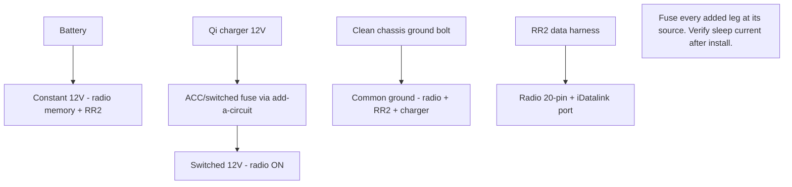

# 🅐 Cockpit Electronics & Trim — Head Unit + Maestro RR2

> The 2030-cabin build. One planned dash/console program: aftermarket head unit with **wireless Android Auto**, integrated through an **iDatalink Maestro RR2** so you keep steering controls, chimes, and vehicle/OBD data — plus the Qi charger, interior LEDs, blue ambient lighting, and shift knob while the dash is open.
> Vehicle: [VEHICLE.md](../VEHICLE.md) · deep reference: FOST → *FFST Knowledge Base* → "08 Electronics, Infotainment & Interior".

**Difficulty:** ●●●●○ (integration + wiring) · **Time:** 6–10 h incl. bench prep · **Reversibility:** high if you keep the OEM harness intact.

---

## Why RR2 (not a bare radio)

The ST1 runs **4" SYNC 1**. A plain aftermarket radio loses steering-wheel controls, warning chimes, and vehicle info. The **Maestro RR2** sits between the car and the new radio, translating the CAN data so those functions survive — and it can feed **OBD gauges** (boost, temps) onto the radio screen.

> ⚠️ **Build from the current iDatalink compatibility page for your exact radio model + firmware** — not a generic video. RR2 feature availability (which gauges, whether the OBD screen uses its own connection) is radio-, firmware-, and vehicle-specific.

---

## Parts list

| Job | Part | ~Price | Notes / link |
|-----|------|--------|--------------|
| Head unit | Wireless-Android-Auto DD unit (e.g. Kenwood DMX958XR / Pioneer DMH-WT/ Sony XAV) | ~$350–700 | pick one **on iDatalink's RR2 compatibility list** for Focus |
| Integration | **iDatalink Maestro RR2** | ~$130 | [idatalinkmaestro.com](https://www.idatalinkmaestro.com/en) |
| Vehicle harness/kit | iDatalink **Focus (2012–2018) T-harness + dash kit** | ~$100 | exact kit depends on chosen radio |
| Antenna adapter | Ford → aftermarket antenna adapter | ~$10 | |
| Backup camera (optional) | flush/plate cam | ~$40 | RR2 can retain/trigger |
| External mic | quality external microphone | ~$15 | call clarity |
| Wireless charger | INBAY Qi kit (below-stereo slot; phone envelope **164×81 mm**, S23 fits) | ~$60 | eBay/EU sourcing — measure slot first |
| 12V distribution | add-a-circuit fuse taps + inline fuses + Posi-taps + ground lug | ~$20 | one fused distribution, not many random taps |
| Interior LEDs | 194/T10 6000K multipack (shared w/ 🅱) | ~$12 | dome/map/door/footwell |
| Blue ambient | dimmable automotive LED accent kit | ~$40 | footwell/console/door — accent only |
| Shift knob | Cobb/Mishimoto weighted (M12×1.75) | ~$45 | |

**Bundle cost:** ~$530 (radio + RR2 + kit + charger + LEDs) → ~$800 with camera, ambient lighting, nicer radio.

---

## 12V power + data wiring

**Rules (from the vault's electrical standard):**
- Record all module DTCs + as-built **before** disconnecting power; use a battery support supply during RR2 programming.
- **Never** probe SRS/airbag circuits with a test light.
- Fuse every added circuit near its source; size wire for current/length/heat, not connector looks.
- One engineered chassis ground; label both ends of every added wire.
- Qi charger + any always-on accessory on a **switched** feed → no parasitic drain.

---

## Bench plan (do BEFORE dash teardown)
Lock these down first — a dash apart with a wrong harness is the classic failure:
1. Exact **radio model + firmware**; confirm on iDatalink RR2 compatibility for Focus.
2. RR2 **serial + firmware** (program/update on the bench via the Maestro app).
3. Exact **Focus T-harness/dash kit**, antenna adapter, USB retention/replacement.
4. Microphone location; backup-camera plan; speaker/amp architecture (now vs future DSP).
5. OBD strategy: does the radio use RR2's dedicated OBD connection, or share with the MX+? (Don't run two active adapters loading the bus.)
6. Steering-button assignment; which chimes/vehicle-info you want retained.

## Install sequence
1. Battery negative off (wait 5 min). Record DTCs/as-built first.
2. Program RR2 on the bench; label every harness branch.
3. Pull shift knob (CCW) + boot, console surround, then climate/stereo bezel.
4. Remove OEM SYNC unit; connect RR2 + T-harness; verify pin locks + grounds.
5. **Qi charger:** seat coil in below-stereo slot; switched-12V via add-a-circuit; chassis ground; route clear of shifter.
6. Interior LEDs + blue ambient while panels are off (accent zones, dimmable, no bare LEDs, no airbag/regulator interference).
7. Shift knob on (M12×1.75).
8. Dry-fit radio + USB routing; **connect and test before final assembly.**
9. Reconnect battery.

## Verification (the acceptance gate — from the vault)
- Key-on / start / shutdown + retained accessory power.
- **All steering buttons** (incl. long-press if programmed), chimes, vehicle info.
- Wireless Android Auto connect + reconnect; GPS/Wi-Fi/BT coexistence; mic/call quality.
- Reverse camera + trigger; dimmer/illumination.
- Qi charges the S23 **and powers off with the key** (clamp-meter parasitic check).
- **No new U-codes** — full module scan after install; car **sleeps** normally (measure draw after modules sleep vs baseline).
- No loose wiring / sharp attachment; every removed panel refits with no new rattle.

## Related (same cabin, separate docs/phases)
- **Sound treatment + spare-well subwoofer + DSP/amp** — vault "08"; sequence speakers/DSP first, then enclosure (heat/water/cargo/roadside plan). Track as its own project.
- **Seat/steering upgrades** — SRS/occupancy/buckle compatibility gates; never resistor-mask a restraint fault.

## Open items
- **Confirm INBAY kit fits the MK3.5 below-stereo slot** before buying (measure slot; 164×81 phone envelope).
- **Pick the radio off iDatalink's Focus RR2 list** before ordering the harness/dash kit — that choice drives every other part number here.
