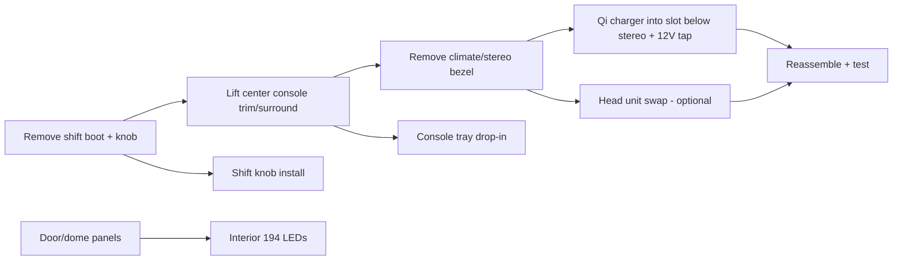
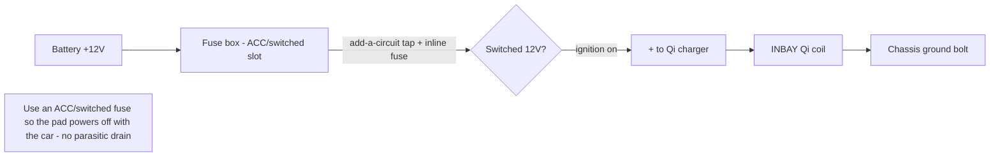

# 🅐 Cockpit Electronics & Trim

> One center-stack / console teardown covers all of these. Pull the trim once, do the wireless charger, tray, LEDs, knob, and (optionally) the head unit together.
> Vehicle: [VEHICLE.md](../VEHICLE.md)

**Includes:** INBAY Qi wireless charger · center console tray (3D print) · interior LED swap · shift knob · head-unit/CarPlay (optional) · SYNC ↔ Galaxy S23 text sync
**Difficulty:** ●●●○○ (the Qi charger 12V tap is the only wiring) · **Time:** 3–5 h

---

## Shared teardown

Because the bezel and console come out for the charger *and* the head unit, sequence them in one sitting. The LEDs and knob are quick adjuncts while panels are off.

---

## Parts list

| Job | Part | ~Price | Link / source |
|-----|------|--------|---------------|
| Wireless charger | **INBAY Qi kit** (fits slot below stereo; max phone **164 × 81 mm** — S23 fits) | ~$60 | US via eBay / EU sourcing |
| 12V tap | Add-a-circuit fuse tap + inline fuse + Posi-taps | ~$12 | [search](https://www.amazon.com/s?k=add-a-circuit+fuse+tap+kit) |
| Console tray | 3D print — **Thingiverse thing:4566871** | filament only | [thingiverse](https://www.thingiverse.com/thing:4566871) |
| Interior LEDs | 194/T10 6000K multipack (shared w/ 🅱) | ~$12 | [search](https://www.amazon.com/s?k=194+LED+interior+kit) |
| Shift knob | Cobb / Mishimoto weighted (**M12×1.75**) | ~$45 | [cobb](https://www.cobbtuning.com) |
| Head unit (optional) | Kenwood DMX7709S (wireless CarPlay) | ~$350 | [search](https://www.amazon.com/s?k=Kenwood+DMX7709S) |
| Head-unit install kit | Metra dash kit + Ford harness + antenna adapter for MK3 Focus | ~$40 | [search](https://www.amazon.com/s?k=Metra+ford+focus+2017+dash+kit) |
| SYNC S23 text sync | software only | $0 | see below |

**Bundle cost:** ~$130 (charger + tray + LEDs + knob) → ~$520 with a CarPlay head unit + kit.

---

## Qi charger 12V wiring (the one real electrical job)

**Key rules:**
- Tap a **switched/ACC** fuse (powers only with ignition) so the pad doesn't drain the battery parked. Use a circuit tester to find one that's dead with the key out.
- Add-a-circuit puts an **inline fuse** on the new leg (1–3 A is plenty for a Qi pad) — never splice unfused into a live circuit.
- Ground to a clean chassis bolt behind the console, not to a random bracket.
- Route wire away from moving console parts and the shifter linkage.

## SYNC ↔ Galaxy S23 text sync (software)
Goal: SMS notifications read/announced through SYNC over Bluetooth.
1. On the S23: **Settings → Connections → Bluetooth →** the SYNC device **→ enable "Contacts sharing" and "Message access / notifications."**
2. On SYNC: **Phone → Text Messages →** allow download; re-pair if the message toggle didn't appear.
3. Android scopes MAP (Message Access Profile) tightly — if texts still won't sync, toggle the Bluetooth permission for messages off/on and re-pair. RCS/Google Messages sometimes needs "SMS" (not chat) for MAP to expose them.
4. If SYNC firmware is old, a SYNC update (APIM) can restore MAP — note in the [FORScan session](forscan-session.md).

---

## Step-by-step (teardown order)
1. Ignition off, **battery negative disconnected** (you'll tap 12V). Wait 5 min.
2. Unscrew shift knob (CCW), lift the shift boot/surround (clips).
3. Lift the console trim/surround, then the climate/stereo bezel (clips + a few screws behind the ashtray/tray).
4. **Qi charger:** seat the coil in the slot below the stereo; run the 12V leg to a switched fuse via add-a-circuit; ground to chassis; tuck and secure wiring.
5. **Head unit (optional):** unplug OEM SYNC, fit Metra kit + Ford harness + antenna adapter, mount new unit.
6. **Console tray:** drop in the printed tray.
7. **Interior LEDs:** swap dome/map/door/footwell 194s while panels are accessible.
8. **Shift knob:** thread on the new M12×1.75 knob.
9. Reconnect battery, test everything before final reassembly.

## Verification
- Qi pad charges the S23 and **powers off with the key** (verify no parasitic draw — quick clamp-meter check if you have one).
- No CEL / no SYNC fault after battery reconnect.
- Bluetooth text sync announces a test SMS.
- All interior lights function; knob torqued snug.

## Notes / open items
- **INBAY fitment** for the below-stereo slot is US-sourcing dependent — confirm the exact kit model fits the MK3.5 slot before buying (measure the slot; 164×81 phone envelope is the constraint).
- If you go CarPlay, the SYNC text-sync project becomes moot — decide head unit first (see the decision list in the setup guide).
