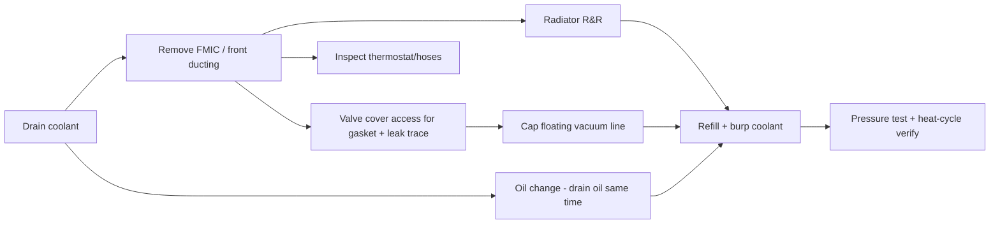
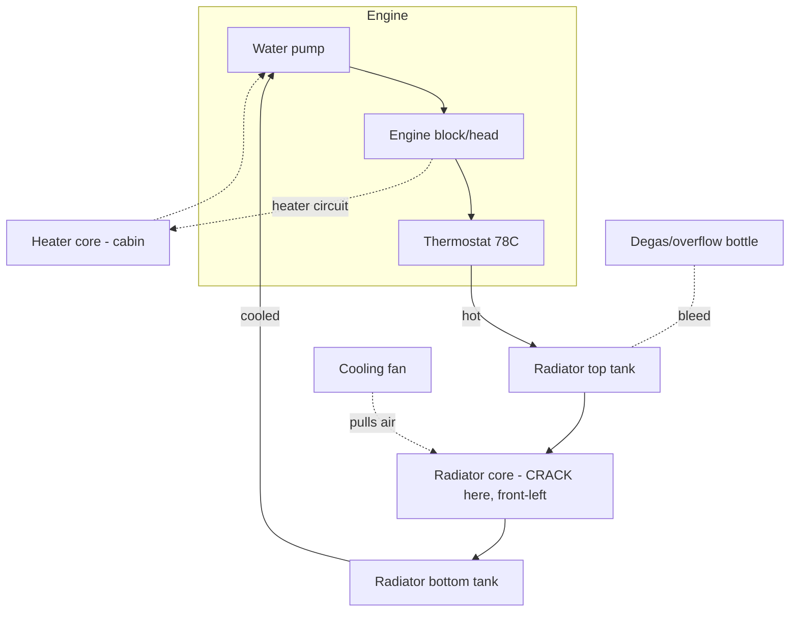

# 🅲 Cooling & Oil-Leak Service

> **Priority 1.** The radiator has a through-hole in the front-left corner of the core. While the cooling system is drained, batch every job that needs the front end open or the same fluids. Phoenix heat makes this the highest-value session on the car.
> Vehicle: [2017 Focus ST · see VEHICLE.md](../VEHICLE.md)

**Bundles:** radiator replacement · coolant flush · valve-cover gasket + oil-leak diagnosis · oil change · cap floating vacuum line · thermostat inspect
**Difficulty:** ●●●○○ (intermediate) · **Time:** 4–6 h · **Coolant capacity:** ~7.4 qt · **Oil:** 5.7 qt

---

## Why bundle these

You're already draining coolant and pulling front ducting for the radiator — that same access gets you the thermostat, hoses, oil-leak inspection, and the uncapped vacuum line. Doing them separately means three more teardowns.

---

## Parts list

| Job | Part | Part # | ~Price | Link |
|-----|------|--------|--------|------|
| **Radiator (decided)** | Mishimoto Aluminum Radiator | MMRAD-FST-13 | ~$350 | [mishimoto](https://www.mishimoto.com/ford-focus-st-aluminum-radiator.html) |
| Radiator (budget alt) | CSF 3805 | 3805 | ~$200 | [CSF](https://www.csfrace.com) |
| Coolant | Motorcraft VC-3-B orange (2 gal) | VC-3-B | ~$36 | [search](https://www.amazon.com/s?k=Motorcraft+VC-3-B) |
| Coolant (alt) | Zerex G-05 | — | ~$16/gal | [search](https://www.amazon.com/s?k=Zerex+G-05+orange) |
| **Valve cover gasket** | Ford OEM VC gasket kit | CJ5Z-6079-K | ~$60 | [search](https://www.amazon.com/s?k=CJ5Z-6079-K) |
| VC gasket (alt top) | Reinz FD722 | FD722 | ~$45 | [search](https://www.amazon.com/s?k=Reinz+FD722) |
| VC gasket (alt bottom) | Reinz FD725 | FD725 | ~$45 | [search](https://www.amazon.com/s?k=Reinz+FD725) |
| Oil | Motorcraft 5W-30 full syn (6 qt) | XO-5W30-QSP | ~$48 | [search](https://www.amazon.com/s?k=Motorcraft+5W-30+full+synthetic) |
| Oil (AZ-heat alt) | Motul 8100 X-clean+ 5W-30 | — | ~$12/qt | [search](https://www.amazon.com/s?k=Motul+8100+X-clean+5W-30) |
| Oil filter | Motorcraft FL-910S | FL-910S | ~$8 | [search](https://www.amazon.com/s?k=Motorcraft+FL-910S) |
| Thermostat (if replacing) | Motorcraft RT-1274 | RT-1274 | ~$20 | [search](https://www.amazon.com/s?k=Motorcraft+RT-1274) |
| Vacuum line cap / hose | assorted silicone caps + clamps | — | ~$10 | [search](https://www.amazon.com/s?k=silicone+vacuum+cap+assortment) |
| Turbo oil lines (if leak) | feed/return lines + gaskets | — | ~$80 | verify source first |
| Oil filter housing gasket | if that's the leak | — | ~$15 | verify source first |

**Session cost:** ~$350 (radiator) + ~$100 (fluids/filter) + ~$60–140 (gaskets, if the leak is confirmed there) = **~$500–600.**

> **AGS is deleted** on this car (motor + blades gone). Nothing to reconnect at the front, but expect slightly slower warm-up and marginally different high-speed cooling airflow — fine for AZ, relevant if you ever track it.

---

## Tools

Torque wrench (0–150 lb-ft), metric sockets/wrenches, T30 Torx, coolant drain pan + oil drain pan (8 qt), funnel + spill-free coolant funnel (for burping), jack + **4 jack stands**, pliers for spring clamps, shop rags, UV dye + light (optional, best oil-leak tracer), gloves.

**Torque:** oil drain plug **20 lb-ft** · wheels **100 lb-ft** · valve cover bolts to spec (small, ~7 lb-ft — don't overtighten, warps cover).

---

## Cooling system map

The failure is at the **front-left of the core** — impact when the car crept forward in gear after shutoff. Aluminum core, not repairable. New radiator drops into the same mounts; transfer the fan shroud if the Mishimoto doesn't include one (it uses the OEM fan).

---

## Step-by-step

### A. Setup
1. Cold engine. Disconnect battery negative (you'll be near electrical + doing an oil-leak trace).
2. Front on jack stands, undertray off.
3. Place both drain pans.

### B. Drain
4. Open the degas bottle cap. Open the radiator lower drain (or pull the lower hose) — catch ~7 qt coolant.
5. While it drains, pull the oil drain plug and drain oil into the second pan. Remove FL-910S filter.

### C. Radiator R&R
6. Remove the FMIC ducting / slam panel as needed for clearance (the Depo "Beast" FMIC is top-mount-clear on this platform; note routing as you go — phone photos).
7. Disconnect upper + lower radiator hoses, fan connector, and fan shroud bolts.
8. Lift out the OEM radiator. **Inspect the old core** and photograph the hole for records.
9. Transfer fan/shroud if needed; drop in the Mishimoto; reconnect hoses with fresh clamps.

### D. Oil-leak inspection (engine bay open — do it now)
10. With the top end accessible, clean the suspected areas and inspect in priority order:
    - **Valve cover gasket** (most common ST oil-weep) → if wet/hardened, replace with CJ5Z-6079-K.
    - **Turbo oil feed/return lines** → check unions for weeping.
    - **Oil filter housing adapter gasket.**
    - **Oil pan** (RTV, not a gasket — last resort).
11. If unclear, add UV dye to the fresh oil and re-inspect after a heat cycle (see verification).
12. Reinstall valve cover to spec if opened — even torque, don't crush the gasket.

### E. Floating vacuum line
13. Trace the uncapped line to its EVAP/emissions origin. If it's a dead leg from the removed OEM airbox, **cap it** with a silicone cap + clamp. No CEL currently, but an open EVAP reference can cause long-term fuel-trim drift — note the routing in MAINTENANCE.md.

### F. Refill & burp
14. New oil filter, refill **5.7 qt** 5W-30.
15. Refill coolant with the spill-free funnel; run the Ford burp procedure: engine to temp with funnel open, heater on max, let thermostat cycle, top off, squeeze upper hose to purge air.
16. Cap degas bottle, remove funnel.

---

## Verification
- **Pressure-test** the cooling system to ~15 psi cold — hold 10 min, zero drop.
- Heat-cycle to full temp, fans should cycle; recheck level cold next day.
- Re-scan for oil weep after the heat cycle (UV light if dye used).
- Confirm no new CEL after capping the vacuum line (OBDLink MX+).
- Log fluids, part numbers, mileage, and cost in MAINTENANCE.md + the master Sheet.

## Notes / risks
- Don't reuse tired spring clamps — worm clamps are fine and re-serviceable.
- Overfilling coolant just pushes to the degas bottle; overfilling oil is worse — measure.
- If the leak turns out to be the oil pan RTV, that's a bigger job (subframe drop on some routes) — get a second opinion before committing; it may be worth a shop.
