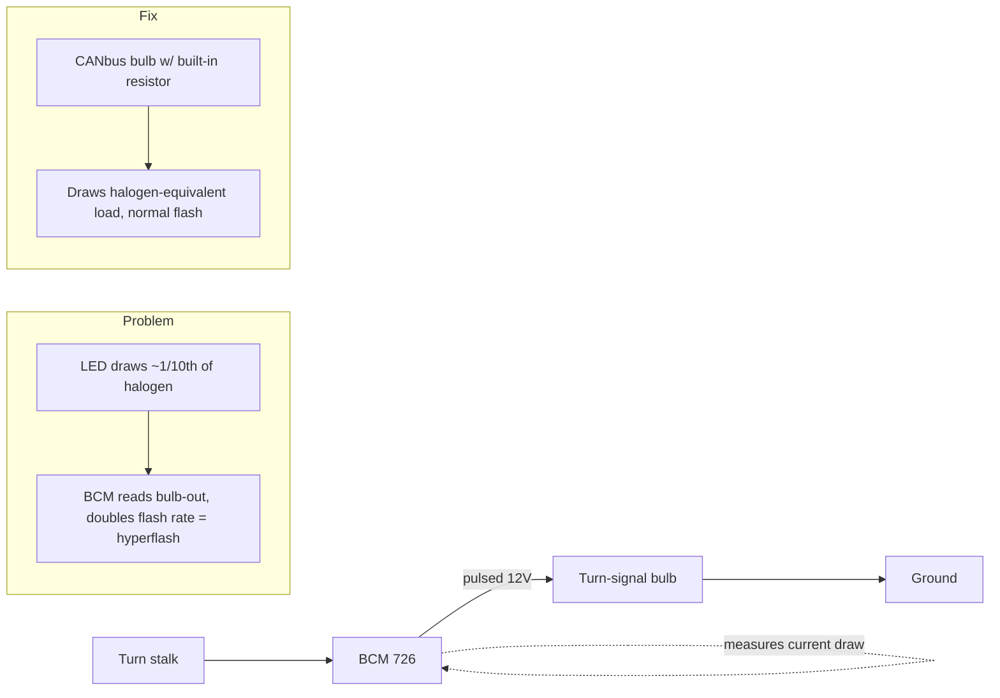
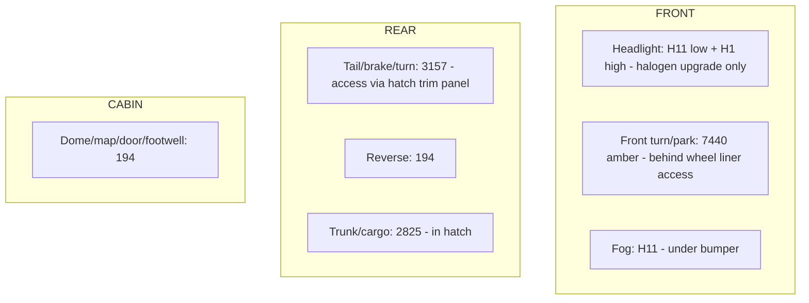

# 🅱 Exterior Lighting (LED conversion)

> ST1-specific, plug-and-play LED conversion. Bulb sizes verified against the ST1 research doc — **do not** use generic "Focus ST" listings (they blend ST2/ST3 specs). Headlights stay **halogen** on purpose (reflector housings scatter LED light — glare + inspection fail).
> Vehicle: [VEHICLE.md](../VEHICLE.md) · pair this with the [FORScan session](forscan-session.md).

**Difficulty:** ●●○○○ · **Time:** 2–4 h · **Tools:** trim picks, gloves (don't touch halogen glass)

---

## Parts list

| Position | Bulb size | Recommended | ~Price | Link |
|----------|-----------|-------------|--------|------|
| Rear tail/turn/brake | **3157** (verify CK vs non-CK socket) | LASFIT T3 CANbus 3157 | ~$25 | [lasfit](https://www.lasfit.com/products/3157-canbus-error-free-ck-socket-switchback-led-bulbs-t3-series) |
| " (alt) | 3157 | AUXITO / Syneticusa CANbus red | ~$18 | [search](https://www.amazon.com/s?k=3157+CANbus+red+LED+anti+hyperflash) |
| Front turn/park | **7440** (7440A amber) | AUXITO / LASFIT / SEALIGHT 7440 CANbus amber | ~$20 | [search](https://www.amazon.com/s?k=7440+LED+CANbus+amber+no+hyperflash) |
| Fog | **H11** (⚠️ verify vs H16 at car) | any reputable H11 LED, "no scatter" projector reviews | ~$30 | [search](https://www.amazon.com/s?k=H11+LED+fog+no+scatter) |
| Interior/dome/map/door | **194 / T10** 6000K | AUXITO 194 24-SMD | ~$12 | [search](https://www.amazon.com/s?k=AUXITO+194+LED+interior) |
| Reverse | **194 / T10** | any error-free T10 | ~$10 | [search](https://www.amazon.com/s?k=194+LED+reverse) |
| Trunk/cargo | **2825** | any 2825 LED | ~$8 | [search](https://www.amazon.com/s?k=2825+LED+bulb) |
| **Headlight low (upgrade, NOT LED)** | **H11** halogen | Osram Night Breaker Laser/200 | ~$30 | [search](https://www.amazon.com/s?k=Osram+Night+Breaker+H11) |
| **Headlight high (upgrade, NOT LED)** | **H1** halogen | Osram Night Breaker / Sylvania SilverStar | ~$25 | [search](https://www.amazon.com/s?k=Osram+Night+Breaker+H1) |

**Bundle cost:** ~$120 (rear+front+interior+reverse+trunk) → ~$210 with fogs + Osram headlight set → ~$260 nicer bulbs.

> Interior 194s overlap with the [Cockpit bundle](cockpit-electronics.md) — buy the 194 multipack once and do both.

---

## Why hyperflash happens (and why CANbus bulbs)

The BCM watches current on each turn circuit to detect a burnt bulb. An LED draws far less, so the BCM thinks the bulb is out and **hyperflashes**. Fix = load-resistor / CANbus bulbs (built-in), which is why every turn position above specifies CANbus. Interior/reverse/trunk aren't flasher-monitored, so plain error-free bulbs are fine.

---

## Bulb locations

---

## Order of operations (biggest impact, lowest risk first)
1. **Rear 3157** (tail/turn/brake) — biggest visual gain, easiest access via the hatch-side trim panels.
2. **Front 7440** (turn/park) — access through the wheel-liner flap; twist-lock socket.
3. **Interior + reverse + trunk** (194/2825) — cheap, no functional risk.
4. **Fogs H11** — confirm bulb size at the car first.
5. **Headlights** — Osram halogen swap only; never LED in these reflectors.

## Step (each position)
1. Ignition off. Access the socket (hatch trim panel rear; wheel-liner flap front; twist bulb holders).
2. Twist out the holder, pull the halogen bulb, seat the LED. **Keep the OEM bulb** until verified.
3. For turn positions: test with ignition on — if it hyperflashes despite CANbus, the socket may be the other CK variant, or add an inline load resistor.
4. For 3157: if it doesn't seat or throws an error, check **CK vs non-CK** socket variant before assuming a bad bulb.
5. Reassemble.

## Verification
- Cycle every function: park, turn (both sides, front+rear), brake, reverse, hazards. **No hyperflash, no dash bulb-out warning.**
- Drive a full day, then recheck for intermittent errors (QC varies batch to batch).
- Fog beam: confirm no scatter into oncoming lanes.

## FORScan pairing (do in the same session — see 🅳)
- **Bambi mode** (fogs stay on with high beams), **DRL config**, **shift-light** — all BCM/IPC edits that make sense while you're already thinking about lights.

## Notes
- Keep every removed OEM bulb bagged/labeled in the trunk kit — instant roadside/inspection fallback.
- Log bulb brands + part numbers in the Sheet; note which socket variant the rear used so re-orders are painless.
