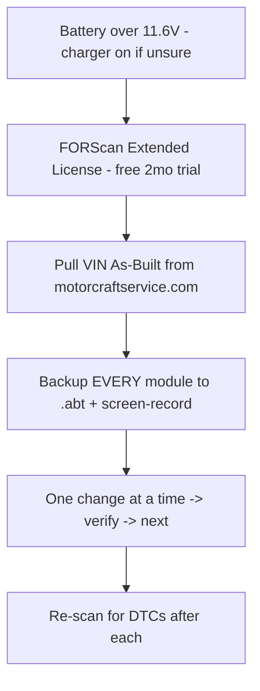

# 🅳 FORScan / Digital Session

> Laptop + OBDLink, no hand tools. Batch every software change, key programming, and MyKey reset into one sitting with fresh module backups. Highest value-per-dollar work on the car.
> Vehicle: [VEHICLE.md](../VEHICLE.md) · adapter owned: **OBDLink MX+** · Reference: [FORScan Master Ref (FOST)](../reference/forscan-master-reference.md)

**Difficulty:** ●●○○○ (careful, not hard) · **Time:** 2–3 h · **Cost:** $0 (trial license) → ~$12/yr

---

## Prerequisites (do in order)

| Item | Detail |
|------|--------|
| Adapter | OBDLink MX+ (owned) — full MS-CAN + HS-CAN |
| License | FORScan **Extended** trial (2 months free, renewable); required for module writes |
| Voltage | keep > 11.6 V — low voltage aborts writes mid-flash (dangerous). Battery tender on. |
| Backups | Save `.abt` for **every** module before editing; screen-record as extra insurance |
| Discipline | **one change, verify, next** — never batch-write blind |

---

## Task list

### 1. MyKey reset (clear the 3 auction MyKeys) — do first
`BdyCM (726) → Service Functions → MyKey Reset`. No admin key needed. Removes the previous owner's MyKey restrictions (speed limiter, volume cap, etc.). **Free.**

### 2. Program a 2nd IA key (PATS) — pairs with 🅕 Key Fob
`PATS → Add Key`. Works with **1 existing key**, bypassing the 2-key dealer requirement. Have the new fob (M3N5WY8609) cut + in hand. See [key-fob-security.md](key-fob-security.md).

| Fob | Part # | ~Price |
|-----|--------|--------|
| Keyless2Go M3N5WY8609 | M3N5WY8609 | ~$30 |
| Strattec | 5921561 | ~$35 |
| Ilco | ILO-A2053 | ~$35 |

### 3. Starter-pack tweaks (BCM 726 / IPC 720)
| Feature | Module | Confirmed on ST? | Notes |
|---------|--------|------------------|-------|
| Double-honk delete | BCM | yes | stops the double lock-honk |
| Global windows (open/close from fob) | BCM | yes | one-touch all windows |
| **Bambi mode** (fogs stay on w/ high beams) | BCM Main | **yes, facelift ST** | pairs with [lighting](exterior-lighting.md) |
| Cornering fogs | BCM Main | platform-confirmed | **engine must be running** to write |
| Shift-light disable | IPC 720 | yes | if you dislike the cluster shift light |
| TPMS → DDS or threshold change | IPC 720 | yes | ⚠️ tire-circumference edits can trigger stuck P160A/P2610 — see risks |
| SYNC 3 boot splash | APIM 7D0 | yes | ST splash on startup |

### 4. Save + document
Export the final config, note every change (module, setting, old→new value) in MAINTENANCE.md + the master Sheet.

---

## Risks (from the FORScan master reference)
- **SBL (secondary bootloader) load** when opening `BdyCM Central Config (Main)` on 2017–2018 cars — proceed exactly per prompts; do not interrupt.
- **Tire size / circumference edit** can trigger a stuck **P160A / P2610** — avoid unless you know the fix.
- The circulated "FORScan Codes for 2017 Focus ST" Google Sheet was **copied from a Super Duty** — its raw As-Built hex is largely unverified for the ST. Prefer FORScan **Module Configuration dropdowns**; cross-reference RS "seniorgeek" values, not F-150 tricks.
- Powertrain/steering tuning is **not** FORScan-editable — that's a COBB/SCT job (see [powertrain.md](powertrain.md)).

## Verification
- After each write: clear + re-scan DTCs, confirm the feature works, confirm no new codes.
- Keep the `.abt` backups in FOST (`_Archive/forscan-backups/`) with the date.
