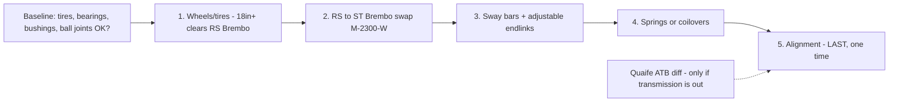
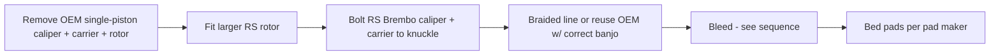

# 🅔 Handling & Brakes — Full Build

> The biggest-spend bundle, grouped because it all needs corner access and shares one alignment at the end. Sequence is strict: **wheels → Brembos → sway bars → springs/coilovers → alignment**. Do not lower or align until worn parts are sorted.
> Vehicle: [VEHICLE.md](../VEHICLE.md) · deep reference: FOST → *FFST Knowledge Base* → "07 Chassis, Brakes, Wheels & Alignment".

**Difficulty:** ●●●●○ · **Total time:** 8–14 h across sub-jobs · **Alignment:** mandatory after any suspension change
**AZ note:** heat-cycle tires and brake fluid harder here — spec accordingly.

---

## Dependency order (why this sequence)

Wheels first because the RS Brembo caliper needs clearance a stock 18" spoke may not give. Alignment last because every suspension change moves camber/toe — pay for one alignment, not four.

---

## Master parts list

| Sub-job | Option (budget → premium) | Part # | ~Price | Link |
|---------|---------------------------|--------|--------|------|
| **Wheels (track)** | Enkei RPF1 17×8 +45 (16.2 lb) | 184-780-6545BK | ~$180 ea | [enkei](https://www.enkei.com) |
| Wheels (budget track) | Konig Hypergram 17×8 +45 | — | ~$130 ea | [konig](https://www.konigwheels.com) |
| Wheels (street) | BBS CH-R 18×8 | — | ~$400 ea | [bbs](https://www.bbs.com) |
| Tires (street/track) | Michelin PS4S 235/40R18 | — | ~$220 ea | [michelin](https://www.michelin.com) |
| Tires (autocross) | Falken RT660 / Bridgestone RE-71RS | — | ~$190–200 ea | — |
| **Brembo swap** | Ford Performance RS Brembo front kit | **M-2300-W** | verify price | [performanceparts.ford.com](https://performanceparts.ford.com) |
| Brake fluid | ATE SL.6 (street) / Motul RBF600 (track) | — | ~$15–20 | — |
| Braided lines | Goodridge stainless | FD0900-4P | ~$100 | [goodridge](https://www.goodridge.com) |
| **Front sway bar** | Whiteline 27 mm adjustable | BSF39Z | ~$200 | [whiteline](https://www.whiteline.com.au) |
| **Rear sway bar** | Whiteline 22 mm adjustable | BSR55XZ | ~$180 | [whiteline](https://www.whiteline.com.au) |
| Endlinks | Whiteline adjustable (required w/ upgraded bars) | KLC180 | ~$80 | [whiteline](https://www.whiteline.com.au) |
| **Springs (drop)** | Eibach Pro-Kit (~25 mm) | E10-35-007-04-22 | ~$250 | [eibach](https://www.eibach.com) |
| Coilover (value) | Fortune Auto 500 | — | ~$1,100 | [fortuneauto](https://www.fortuneauto.com) |
| Coilover (premium) | KW V3 (indep. comp/rebound) | 35220065 | ~$2,100 | [kw](https://www.kwsuspension.com) |
| **Diff** | Quaife ATB / Wavetrac | QDF11J | ~$1,000–1,100 | [quaife](https://www.quaife.co.uk/products/ford-focus-st-atb-differential) |

**Spend:** ~$900 (wheels + bars + springs, budget) → ~$4,000+ (premium coilovers + Brembo + diff).

---

## Tools & torque

Torque wrench (to 150 lb-ft), breaker bar, 32 mm socket (hub nut), T30 Torx (caliper slider), metric sockets/hex, spring compressor **only if reusing OEM struts** (not needed for assembled coilovers/spring kits done as strut-out), brake bleeder (pressure or vacuum) + fresh fluid, torque-to-yield bolts as required, jack + **4 stands**, thread locker where specified.

| Fastener | Torque | Note |
|----------|--------|------|
| Lug nuts | **100 lb-ft** | M12×1.5, clean dry threads |
| Front hub nut | verify Ford spec | often torque-to-yield — replace |
| Caliper bracket / carrier bolts | verify Ford/Brembo spec | safety-critical — do not guess |
| Sway-bar D-mount / endlink | per Whiteline sheet | tighten at ride height |

> ⚠️ Every safety-critical torque (hub, caliper, ball joint, subframe) must come from **current Ford service data or the part maker's sheet** — the vault deliberately does not publish guessed values. Verify before turning the wrench.

---

## 1 · Wheels & tires
1. Confirm fitment math before buying (see box below).
2. Mount/balance; torque lugs to **100 lb-ft** in a star pattern, re-torque after 50 mi.
3. Record size, offset, spacer, load rating, date codes, tread inner/center/outer in the tracker.

**Fitment math (do for any non-OEM wheel):** compare width + offset vs **18×8 +55**; compute inner clearance (strut/spring) and outer (fender/liner) at **full lock and full compression, loaded — not on the lift**; verify **RS Brembo caliper clearance** (spoke profile matters, not just diameter); confirm tire measured width + diameter (speedo/ABS); hub-centric with correct seat type (tapered vs ball); no stacked spacers.

## 2 · RS → ST Brembo swap (M-2300-W)

1. Front on stands, wheels off. Unbolt OEM caliper + carrier, remove rotor.
2. Fit RS rotor; bolt on Brembo carrier + caliper to knuckle at **verified torque**; confirm rotor-to-caliper centering and pad clearance.
3. Connect brake line (braided upgrade recommended); no kinks, correct banjo/crush washers.
4. Confirm the RS front changes front/rear brake **balance** — pair with a matching rear pad and verify ABS behavior in a safe first test.

**Bleed sequence (RWD-style farthest-first for shared reservoir — verify against Ford for ABS):**

Use fresh DOT 4 LV (or Motul RBF600 for track). Bleed until clean fluid + firm pedal; if ABS module trapped air, a FORScan/scan-tool ABS bleed cycle may be needed.

## 3 · Sway bars + endlinks
1. Install rear bar first, front second; use **adjustable endlinks** (required to preload correctly).
2. Set both bars to their **softest** useful hole initially.
3. Torque D-mounts/endlinks at **ride height** (not hanging) to avoid preloading bushings.

## 4 · Springs / coilovers
- **Springs:** verify damper travel/health first; a lowering spring on tired dampers rides badly. Check bump-stop clearance + tire-to-fender after.
- **Coilovers:** set ride height + corner-balance; keep bump travel; don't lower for looks past geometry limits.

## 5 · Alignment (starting targets — NOT Ford spec)
| Use | Front camber | Rear camber | Front toe | Rear toe |
|-----|-------------|-------------|-----------|----------|
| Daily | -1.0 to -1.5° | -1.3 to -1.8° | ~0 / slight in | slight in |
| Fast street/canyon | -1.5 to -2.2° | -1.3 to -1.8° | ~0 | slight in |
| Autocross/track | -2.2 to -3.0° | -1.5 to -2.0° | 0 to slight out | stable slight in |
Equalize side-to-side; save before/after printout with setup + pressures; review tire wear after 1,000 mi. Aggressive front toe-out → tramlining/wear; too much rear rotation → abrupt lift-off.

## Verification
- Lugs re-torqued (50 mi); no rubbing at full lock/compression, loaded.
- Brakes: firm pedal, no leaks, even pad-to-rotor, ABS normal, pads bedded, no pull; recheck fluid + rotor temps after a controlled stop test.
- Sway/suspension: no clunks/binding; ride height equal; alignment sheet on file.
- No new ABS/TPMS codes (OBDLink MX+).

## Notes / open decisions (bring back before ordering)
- **Ride:** street drop (Eibach) vs coilovers vs stay stock height?
- **Look/grip:** 17" track setup vs 18" street?
- **Priority:** Brembo now, or route that money to the [tune](powertrain.md) first? (Stock brakes are fine for street; RS Brembo shines on track/heavy use.)
- **Diff (Quaife):** best single handling mod (kills torque steer) but ~$1,100 + labor — only cost-effective while the transmission is already out.
