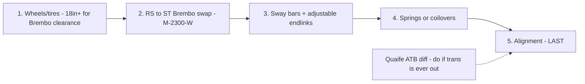

# 🅔 Handling & Brakes

> Biggest-spend bundle. Sequence matters: **wheels before Brembos** (caliper clearance), **alignment last** (after any suspension change). Grouped because it needs corner access, and doing suspension + brakes together saves one alignment.
> Vehicle: [VEHICLE.md](../VEHICLE.md) · **Status: scoped — expand to full build when you commit to a route.**

**Difficulty:** ●●●●○ · **Time:** 8–14 h across sub-jobs · **Alignment:** required after suspension

---

## Dependency order

## Parts (from PARTS.md catalog)

| Job | Option | Part # | ~Price |
|-----|--------|--------|--------|
| Brembo swap | **Ford Performance RS Brembo kit** | M-2300-W | verify current price |
| Wheels (track) | Enkei RPF1 17×8 +45 | 184-780-6545BK | ~$180 ea |
| Wheels (street) | BBS CH-R 18×8 | — | ~$400 ea |
| Front sway | Whiteline 27 mm | BSF39Z | ~$200 |
| Rear sway | Whiteline 22 mm | BSR55XZ | ~$180 |
| Endlinks | Whiteline adjustable | KLC180 | ~$80 |
| Springs (drop) | Eibach Pro-Kit | E10-35-007-04-22 | ~$250 |
| Coilover | Fortune Auto 500 | — | ~$1,100 |
| Coilover (premium) | KW V3 | 35220065 | ~$2,100 |
| Diff | Quaife ATB | QDF11J | ~$1,100 |

> ⚠️ **Brembo clearance:** M-2300-W needs wheels that clear the larger RS caliper — confirm your chosen wheel's caliper clearance before ordering either. This is why wheels come first.

## Open decisions (bring back before full build)
- Street drop (springs) vs coilovers vs stay stock ride height?
- 17" track setup vs 18" street looks?
- Brembo swap now, or budget those funds toward the tune first?

*When you pick a route, this doc expands to a full step-by-step with torque specs, bleed sequence, and alignment targets.*
