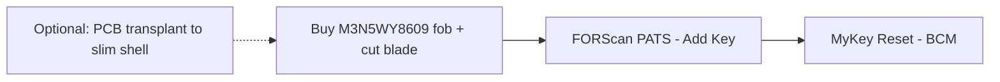

# 🅕 Key Fob & Security

> Ex-auction car came with **0 admin keys / 3 MyKeys**. Get a working spare, clear the MyKeys, and (optional) transplant the fob PCB into a slimmer shell.
> Vehicle: [VEHICLE.md](../VEHICLE.md) · programming overlaps [🅳 FORScan session](forscan-session.md).

**Difficulty:** ●●○○○ · **Time:** 1–2 h · **Cost:** ~$30–70

---

## Tasks

### 1. Spare IA key (push-to-start)
| Fob | Part # | ~Price | Link |
|-----|--------|--------|------|
| Keyless2Go M3N5WY8609 | M3N5WY8609 | ~$30 | [search](https://www.amazon.com/s?k=M3N5WY8609+keyless2go) |
| Strattec | 5921561 | ~$35 | [search](https://www.amazon.com/s?k=Strattec+M3N5WY8609) |
| Ilco | ILO-A2053 | ~$35 | [search](https://www.amazon.com/s?k=Ilco+M3N5WY8609+focus) |
| Fob battery | CR2032 | ~$1 | [search](https://www.amazon.com/s?k=Panasonic+CR2032) |

Program via **FORScan PATS → Add Key** (works with your 1 existing key — no dealer, no 2-key requirement). Cut the emergency blade at a locksmith to the VIN.

### 2. MyKey reset
`BCM → Service Functions → MyKey Reset` — clears the previous owner's restrictions. Free, no admin key. (Same session as key programming.)

### 3. (Optional) Fob PCB transplant → slim shell
- Target shell: **Thingiverse thing:2638706** (Mustang GT 5-button slim, ~8 mm).
- ⚠️ **Fit onto the Focus ST PCB is NOT confirmed.** Verify PCB dimensions + button layout against the shell before committing. Print a test shell first; keep the OEM shell as fallback.

## Verification
- Both keys start the car and lock/unlock remotely.
- MyKey restrictions gone (no speed/volume limits).
- Log key part numbers + cut code in the Sheet (store securely — it's security info).
