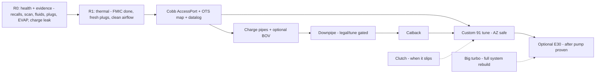
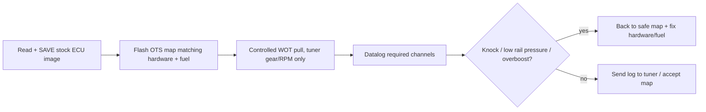

# 🅖 Powertrain / Performance — Full Build

> Tune-gated, reliability-first. The FMIC ("Beast") and intake are already on the car, so the next real gain is a **conservative custom tune** — then supporting hardware in the order that keeps the motor alive. This follows your vault's staged plan: health → thermal → calibrated power → (optional) more power.
> Vehicle: [VEHICLE.md](../VEHICLE.md) · deep reference: FOST → *FFST Knowledge Base* → "06 Powertrain" + "09 Mods & Tuning".

**Difficulty:** ●●●○○ (tune/datalog) → ●●●●○ (clutch/big turbo) · **Cost:** $650 → $3,000+ phased
**Hard gates:** oil leak resolved first · plugs correct · charge-air sealed · AZ-heat-safe calibration.

---

## Stage sequence

**Non-negotiable rule (LSPI):** no full-load pull **below ~3,000 rpm** in a tall gear — downshift before requesting boost. Turbo-DI engines pre-ignite when lugged. Shape the tune's low-RPM torque accordingly.

---

## Parts list

| Step | Part | Part # | ~Price | Link |
|------|------|--------|--------|------|
| Tune | Cobb AccessPort V3 | AP3-FOR-005 | ~$649 | [cobb](https://www.cobbtuning.com/products/ford-focus-st-accessport) |
| Charge pipe | Cobb / Mishimoto aluminum kit | — | ~$150–175 | [mishimoto](https://www.mishimoto.com) |
| BOV (optional) | Turbosmart Kompact / Forge RV | TS-0203-1061 / FMDV14T | ~$130–150 | — |
| Downpipe (street) | Cobb 3" catted | — | ~$500 | [cobb](https://www.cobbtuning.com) |
| Downpipe (track) | Cobb catless (off-road only) | — | ~$425 | [cobb](https://www.cobbtuning.com) |
| Catback | Mountune / Borla ATAK / Milltek | — | ~$700–1,100 | — |
| Plugs (tuned) | Motorcraft SP-537 gapped ~0.025–0.026" (or 1-step colder per tuner) | SP-537 | ~$8 ea | — |
| Clutch (when needed) | Exedy Stage 1 / Clutchmasters FX350 | — | ~$350–550 | — |
| Ethanol tester (E30) | handheld ethanol content tester | — | ~$25 | — |

**Spend:** ~$650 (AP only) → ~$1,500 (AP + pipes + downpipe + custom tune) → $3,000+ (catback + clutch + E30 path).

---

## Tools
Laptop (Windows) + **OBDLink MX+** for datalogging, AccessPort cable (included), basic metric sockets/hex + T-drivers for pipes/downpipe, O2-sensor socket, jack + stands, anti-seize for exhaust threads, torque wrench, battery tender (voltage-stable flashing).

| Fastener | Torque | Note |
|----------|--------|------|
| Spark plugs | ~10 lb-ft | don't over-torque alloy head |
| O2 sensor | per spec + anti-seize | |
| Downpipe / turbo outlet | verify Ford/maker spec | new gaskets, heat-cycle re-check |
| Charge-pipe clamps | per kit | witness-mark after first drive |

---

## 1 · Cobb AccessPort — install + datalog loop

1. Plug in, **read and save the stock image first** (your recovery path).
2. Flash an **OTS map that matches your actual hardware + AZ pump fuel** (FMIC + intake done → an appropriate stage map; a stage label is not universal — match hardware).
3. Verify fuel level/octane twice; battery tender on during flash.
4. Do controlled pulls only in the tuner-prescribed gear/RPM band; datalog every pull.

**Datalog required channels:** RPM, throttle/pedal, commanded vs actual boost, load/torque request, wastegate duty, lambda + STFT/LTFT, commanded vs actual rail pressure, ignition timing + cylinder corrections, coolant + charge-air temp, misfire counters.

**Abort a pull immediately on:** flashing MIL/misfire, actual rail pressure materially below commanded, uncontrolled overboost, abnormal knock outside tuner guidance, overheating, mechanical noise/smoke/fluid warning, or unsafe traffic. **Never** re-run WOT "to see if it clears."

## 2 · Charge pipes + optional BOV
1. Replace OEM plastic charge pipes (known cracking/boost-leak points) with aluminum; fresh O-rings + clamps, aligned without preload.
2. Optional BOV/recirc: preserve correct metering/control behavior (a BOV is sound/response, not power). Plumb-back keeps fueling correct.
3. **Pressure-test** the charge-air tract after; add witness marks; recheck after first heat cycle + 100–250 mi.

## 3 · Downpipe (decision-gated)
- **Catted (street):** high-flow cat, reduces turbine-outlet restriction; still needs a tune + may trip P0420 on a bad cat.
- **Catless (track/off-road only):** emissions-illegal for street in AZ; CEL unless tuned; heat + odor.
- Fit new gaskets, anti-seize, re-torque after a heat cycle; verify O2 wiring clearance. **Define power target + legal status before buying.**

## 4 · Catback
Mostly sound/weight on a stock-turbo street car. Watch drone, hanger alignment, ground clearance, leaks. Buy for tone/packaging, not power.

## 5 · Custom 91 tune (the real target)
Give the tuner the **complete hardware + fuel + maintenance list**. Calibrate a **91-octane AZ-safe** map (calibrated as 91, not 93 assumptions), conservative low-RPM torque, stock-turbo thermal margin. Validate with datalogs before trusting it.

## 6 · Optional E30 (only after pump tune proven)
Fixed-blend E30 ≠ flex fuel. Buy an **ethanol tester**, measure both fuels, calculate the blend, log rail pressure + trims. Never load an E30 map on straight gas or fill full E85 on stock fueling. Stock DI fueling ceiling is commonly cited ~mid-300 whp; aux/HPFP fueling needed toward ~400 whp.

## 7 · Clutch (when it slips, not before)
Stock holds ~280 lb-ft; a Stage tune gets close. Symptoms: rpm rises without proportional acceleration (higher gears first), burning smell hot. Shared reservoir → rule out hydraulic/contamination first. Choose capacity with reasonable margin (drivability + pedal effort), inspect rear main seal while accessible.

## Verification (per stage)
- Stock image saved before any flash; recovery map on the AccessPort.
- Post-flash: clean datalog (no knock, rail pressure tracks command, boost controlled), no new DTCs.
- Charge-air pressure-test holds; no oil mist at joints; witness marks intact after drive.
- Downpipe/exhaust: no leaks, O2 reads correct, re-torqued after heat cycle; emissions-legal for street use if applicable.
- Fuel trims stable; charge-air temp recovers between pulls (AZ heat check).

## Notes / open decisions
- **AccessPort first** — biggest single gain + datalogging protects the motor in AZ heat. Run an OTS map on the existing FMIC + intake before spending on pipes/exhaust.
- **Resolve the oil leak (🅲) before adding power** — don't boost a weeping motor.
- **Street-legal vs track:** decide catted vs catless downpipe before ordering (AZ emissions).
- **Stop-and-think gate before a big turbo:** it's a full system (fuel, clutch, cooling, traction, calibration) — set a whp/response budget first, don't drift into it part-by-part.
