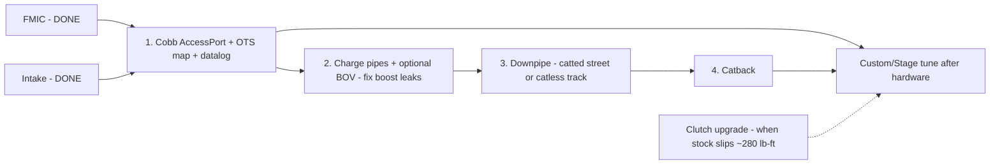

# 🅖 Powertrain / Performance

> Tune-gated path. The FMIC ("Beast") and intake are already done — the next real gain is the **tune**, then supporting hardware in the order that keeps it reliable. Sequenced so the tune lands with hardware to support it.
> Vehicle: [VEHICLE.md](../VEHICLE.md) · **Status: scoped — expand when you commit to the tune.**

**Difficulty:** ●●●○○ → ●●●●○ · **Cost:** $650 → $3,000+ phased

---

## Recommended sequence

## Parts (from PARTS.md catalog)

| Step | Part | Part # | ~Price |
|------|------|--------|--------|
| Tune | Cobb AccessPort V3 | AP3-FOR-005 | ~$649 |
| Charge pipe | Cobb / Mishimoto aluminum kit | — | ~$150–175 |
| BOV (optional) | Turbosmart Kompact / Forge RV | TS-0203-1061 / FMDV14T | ~$130–150 |
| Downpipe (street) | Cobb 3" catted | — | ~$500 |
| Downpipe (track) | Cobb catless | — | ~$425 |
| Catback | Mountune / Borla ATAK / Milltek | — | ~$700–1,100 |
| Clutch (when needed) | Exedy Stage 1 / Clutchmasters FX350 | — | ~$350–550 |

## Notes / open decisions
- **AccessPort first** — it's the single biggest gain and enables datalogging to protect the motor in AZ heat. Run an OTS map on the existing FMIC + intake.
- Charge pipes address known OEM plastic cracking / boost leaks — cheap insurance before chasing more boost.
- Catless downpipe = **off-road/track only** (emissions). Decide street-legal vs track before ordering.
- Watch clutch — stock holds ~280 lb-ft; a Stage tune gets close. Upgrade when it starts slipping, not before.
- **Oil-leak must be resolved first** (see [🅲](cooling-oil-service.md)) — don't add power to a motor that's weeping oil.

*When you commit to the AccessPort, this expands to a full install + datalog-review walkthrough.*
