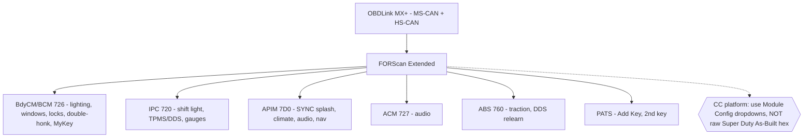

# FORScan Master Reference — 2017 Focus ST (MK3.5, US, Manual, ST1)

> Distilled, version-controlled reference. The **full long-form research doc** (all 9 categories, every As-Built value, all forum sources) lives in FOST → `2017-Ford-Focus-ST/`. This is the working cheat-sheet for the [🅳 FORScan session](../projects/forscan-session.md).

## TL;DR
- FORScan can reconfigure 5 modules: **BdyCM/BCM (726), IPC (720), APIM/SYNC (7D0), ACM (727), ABS (760)**.
- The ST is a **Central Configuration (CC)** car → use FORScan **Module Configuration dropdowns**, *not* raw As-Built hex the way F-150/Super Duty owners do.
- Powertrain/steering tuning is **NOT** FORScan-editable → use COBB/SCT.
- Two biggest risks: **SBL load** when opening `BdyCM Central Config (Main)` on 2017–18 cars, and **tire-circumference edits** that cause a stuck **P160A/P2610**.

## Module map

## Prereqs
- Adapter: OBDLink MX+ (owned) · License: FORScan **Extended** (free 2-mo trial, renewable).
- Battery **> 11.6 V** (charger on). Pull VIN As-Built from **motorcraftservice.com** + save `.abt` of every module. **One change → verify → next.**

## Standard Starter Pack (high value, low risk)
1. **Double-honk delete** — BdyCM As-Built `726-01-01`, subtract `0x80` from first slot. ✅ canonical ST method.
2. **Global windows open/close** — BdyCM Main → "Global Open/Close" (needs SBL). ✅ ST-confirmed.
3. **Bambi mode** (fogs w/ high beams) — BdyCM Main, remove fog restriction. ✅ facelift-ST confirmed.
4. **Shift-light disable** — IPC → "Shift Indication → Without". ✅ confirmed.
5. **TPMS → DDS** (or threshold change) — IPC + ABS relearn (4-step). ✅ confirmed on a 2017 ST.
6. **SYNC 3 ST boot splash** — APIM `7D0-02-01`, `1 → B`. ✅ confirmed.

**Taste-dependent (good):** climate controls on SYNC 3 (`7D0-01-02` `7→3`), disable Sony DSP processing (`7D0-01-02` first digit `A→2` — best audio fix), remove Sirius, auto-lock by speed, seatbelt/door chime off.

## MyKey & Keys (relevant — auction car)
- **MyKey Reset**: `BCM → Service Functions → MyKey Reset` — clears the 3 auction MyKeys, no admin key.
- **Add 2nd key**: `PATS → Add Key` works with 1 existing key. ⚠️ Do **not** attempt PATS with only one key present.

## DO-NOT-DO / Known-bad
| Don't | Why | Fix |
|-------|-----|-----|
| Tire circumference edit (`726-12-01`) | Stuck **P160A/P2610** CEL | revert to factory value; for real tire changes run PCM "Module init/relearn" |
| Open BdyCM Main unprepared (2017–18) | SBL load can fail (ABS light, DTC flood) | pre-download **GV6T-14C097-AA.vbf** to Calibration Files; battery >12 V; if buggy use FORScan 2.3.41 |
| FoCCCus on 2017–18 | doesn't work on MK3.5 facelift | use **FORScan** only |
| Blind Super Duty As-Built hex | wrong module architecture → write fails/DTCs | use CC dropdowns or RS-confirmed values |
| Write with engine running | false "accident" event | follow ACC power-cycle prompts |
| TPMS full delete (`726-02-01=0000…`) | "incompatible configuration" | use DDS conversion or threshold change |
| GT/Lincoln theme/country change | kills Sirius/nav-in-motion | leave APIM country alone |

## Recommended two-session plan
1. **Session 1 (no SBL):** license + backups, then IPC/APIM dropdowns — shift-light off, TPMS config, Sirius removal, Sony DSP off, ST splash, climate on SYNC 3.
2. **Session 2 (BdyCM Main, expect SBL prompt):** global windows + Bambi + auto-lock + double-honk delete. Ignore temporary dash warnings during writes.

## Key sources
- FocusST.org FORScan Mega Thread — https://www.focusst.org/threads/forscan-mega-thread.169995/
- Double-honk delete — https://www.focusst.org/threads/how-to-disable-the-double-honk.50574/
- Switching to DDS — https://www.focusst.org/threads/switching-to-dds-with-forscan.175121/
- FocusRS.org seniorgeek master (best MK3.5 cross-ref) — https://www.focusrs.org/threads/forscan-mods-changes-and-info.103801/
- SBL download guide — https://www.focusst.org/threads/how-to-download-sbl-second-bootloader-for-forscan-2022.170004/

> ⚠️ The circulated "FORScan Codes for 2017 Focus ST" Google Sheet is **Super Duty-derived** — treat its hex as unverified for the ST unless corroborated by the RS thread or an ST-forum report. Always pull your own As-Built baseline before editing; values vary by VIN/build date/SYNC version.
